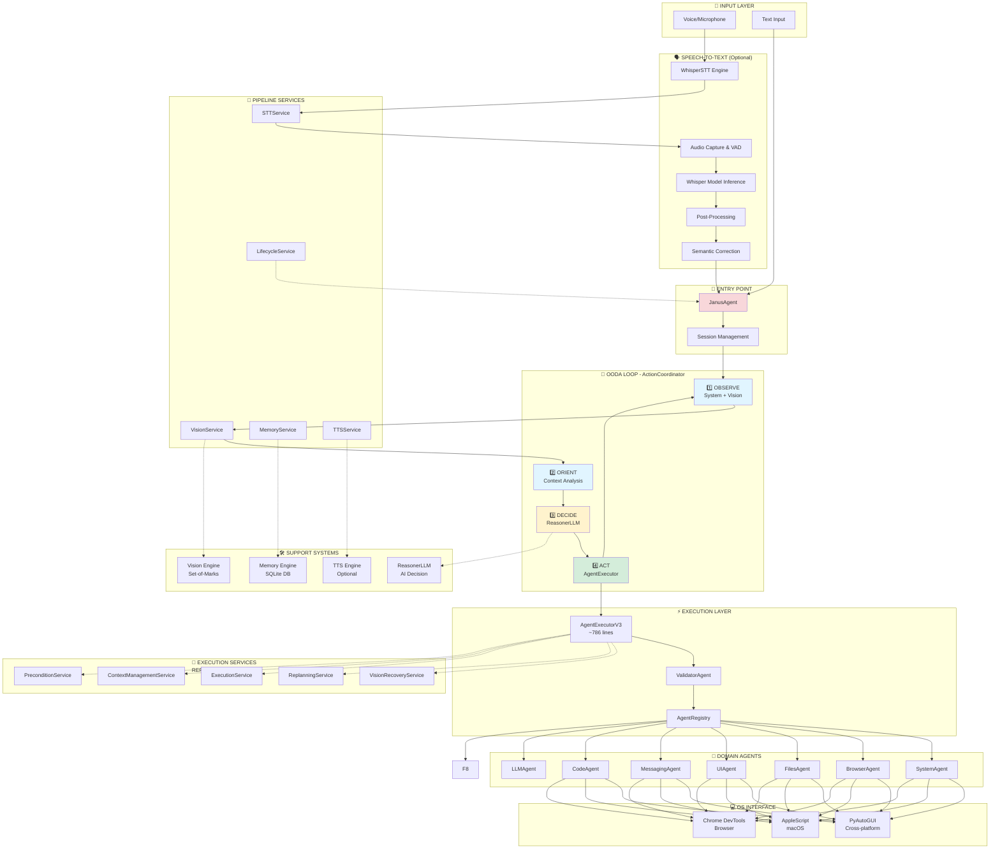
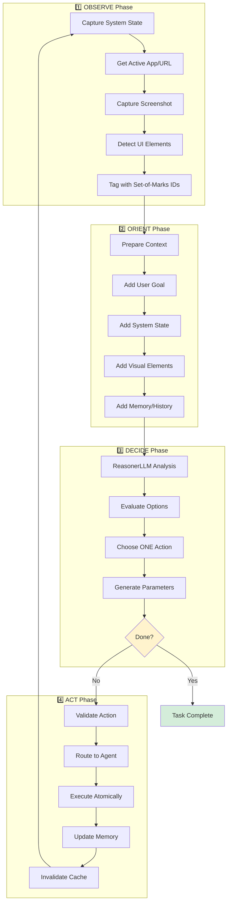
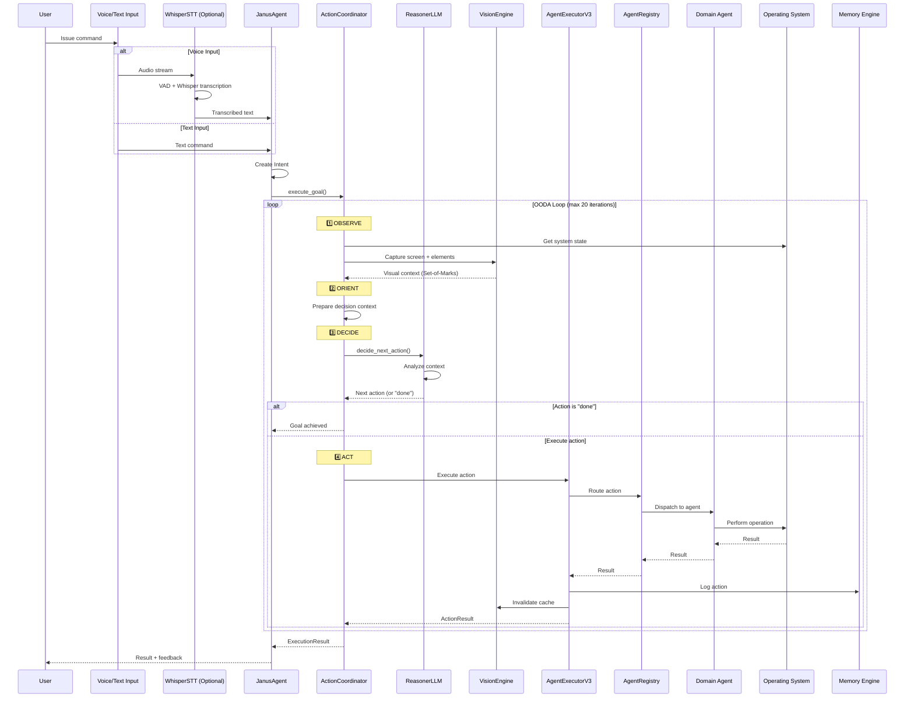

# 01 - Complete System Architecture

> **Last Updated:** December 2024  
> **Architecture Version:** V3 Multi-Layer OODA Loop  
> **Status:** Production-Ready (Score: 8.5/10)

## 🎯 Quick Reference

**Primary Entry Point:** `JanusAgent.execute()` - Single public API for all commands  
**Core Pattern:** OODA Loop (Observe → Orient → Decide → Act) with dynamic adaptation  
**Key Components:**
- **JanusAgent**: Public API and session management
- **ActionCoordinator**: OODA loop orchestration
- **AgentExecutorV3**: Step-by-step execution with validation
- **AgentRegistry**: Action routing to domain agents
- **Domain Agents**: Atomic operations (System, Browser, Files, UI, etc.)

**Execution Model:** Dynamic - ONE action at a time based on current screen state, no static planning

---

## 📋 Table of Contents

1. [System Overview](#system-overview)
2. [Complete Architecture Diagram](#complete-architecture-diagram)
3. [Architecture Layers](#architecture-layers)
4. [Core Components](#core-components)
5. [Execution Flow](#execution-flow)
6. [Data Flow & Contracts](#data-flow--contracts)
7. [Technology Stack](#technology-stack)
8. [Directory Structure](#directory-structure)
9. [Performance Metrics](#performance-metrics)

---

## System Overview

Janus is a **voice-controlled computer automation agent** that uses AI reasoning to control macOS/Linux/Windows systems through natural language commands. It implements a **Dynamic OODA Loop architecture** where the system observes the current state, makes intelligent decisions, and executes actions adaptively.

### Core Design Principles

1. **OODA Loop Architecture**: Dynamic execution cycle - observe, orient, decide, act, repeat
2. **LLM-First Philosophy**: AI reasoning replaces traditional pattern matching and heuristics
3. **Visual Grounding**: Set-of-Marks computer vision for precise element identification
4. **Multi-Layer Execution**: Clear separation between orchestration, execution, and action layers
5. **Modular Agents**: Domain-specific agents handle different types of operations
6. **Privacy-First**: All processing happens locally - no mandatory cloud dependencies
7. **Type Safety**: Strong typing with dataclasses throughout
8. **Graceful Degradation**: Optional features (LLM, Vision, TTS) work independently

---

## Complete Architecture Diagram

### High-Level System Architecture



**Legend:**
- 🔵 Blue: Observation phase
- 🟡 Yellow: Decision phase
- 🟢 Green: Action phase
- 🔴 Red: Entry point
- Dotted lines: Optional/support connections

### Detailed OODA Loop Flow



---

## Execution Flow

### Complete Command Execution Sequence



### Key Execution Patterns

#### Pattern 1: Simple Command Execution
```
User: "open Calculator"
  ↓
OBSERVE: System state captured
  ↓
DECIDE: ReasonerLLM chooses system.open_app(app="Calculator")
  ↓
ACT: SystemAgent launches Calculator
  ↓
OBSERVE: Calculator is now active
  ↓
DECIDE: ReasonerLLM returns "done"
  ↓
Result: Success
```

#### Pattern 2: Multi-Step Goal with Visual Grounding
```
User: "find the Submit button and click it"
  ↓
OBSERVE: Capture screen, detect elements [ID1: Button "Submit" at (100,200)]
  ↓
DECIDE: ReasonerLLM chooses ui.click(element_id="ID1")
  ↓
ACT: UIAgent clicks at (100,200)
  ↓
OBSERVE: Screen changed, new elements detected
  ↓
DECIDE: ReasonerLLM returns "done"
  ↓
Result: Success
```

#### Pattern 3: Error Recovery
```
User: "open the file menu"
  ↓
OBSERVE: App with menu bar visible
  ↓
DECIDE: ReasonerLLM chooses ui.click(target="File")
  ↓
ACT: UIAgent attempts click → FAILS (element not found)
  ↓
OBSERVE: Re-capture screen with Set-of-Marks
  ↓
DECIDE: ReasonerLLM tries alternative (keyboard shortcut)
  ↓
ACT: UIAgent presses Cmd+F
  ↓
Result: Success or escalate error
```

---

## Architecture Layers

Janus is organized into 6 distinct layers, each with clear responsibilities:

```
┌─────────────────────────────────────────────────┐
│  LAYER 1: INPUT (Optional)                      │
│  Voice or Text Command Entry                    │
└─────────────────────────────────────────────────┘
           ↓
┌─────────────────────────────────────────────────┐
│  LAYER 2: SPEECH-TO-TEXT (Optional)             │
│  Whisper Model with VAD and Post-Processing     │
└─────────────────────────────────────────────────┘
           ↓
┌─────────────────────────────────────────────────┐
│  LAYER 3: ORCHESTRATION                         │
│  JanusAgent → ActionCoordinator (OODA Loop)     │
└─────────────────────────────────────────────────┘
           ↓
┌─────────────────────────────────────────────────┐
│  LAYER 4: EXECUTION                             │
│  AgentExecutorV3 → ValidatorAgent → Registry    │
└─────────────────────────────────────────────────┘
           ↓
┌─────────────────────────────────────────────────┐
│  LAYER 5: AGENTS                                │
│  Domain-Specific Agents (System, Browser, etc.) │
└─────────────────────────────────────────────────┘
           ↓
┌─────────────────────────────────────────────────┐
│  LAYER 6: OS INTERFACE                          │
│  PyAutoGUI, AppleScript, Chrome DevTools        │
└─────────────────────────────────────────────────┘
```

### Layer 1: Input Layer (Optional)

**Purpose**: Capture user commands via voice or text

**Components**:
- **Voice Input**: Microphone capture via PyAudio
- **Text Input**: Direct string from CLI, API, or UI
- **Wake Word Detection** (optional): openWakeWord for hands-free activation

**Files**:
- Main entry: `main.py` → `janus/app/` → `janus/cli/`
- Voice: `janus/stt/` (only loaded if voice enabled)

**Key Features**:
- Dual input methods (voice or text)
- Wake word for hands-free mode
- Both flow to same execution path

### Layer 2: Speech-to-Text Layer (Optional)

**Purpose**: Convert audio to accurate text transcription

**Location**: `janus/stt/`

**Core Components**:
```
WhisperSTT (Main Facade)
├── WhisperRecorder: Audio capture
├── NeuralVAD: Voice Activity Detection
├── Whisper Model: faster-whisper or openai-whisper
├── WhisperPostProcessor: Text normalization
├── CorrectionDictionary: Phonetic fixes ("v s cold" → "vscode")
├── SemanticCorrector: LLM-based reformulation (optional)
└── CalibrationManager: Per-user voice adaptation
```

**Key Features**:
- **VAD (Voice Activity Detection)**: Automatic start/stop recording
- **Multi-Model Support**: Whisper v3-turbo, v3-large, base, small
- **Post-Processing**: Filler word removal, punctuation, capitalization
- **Phonetic Correction**: Common misheard phrases fixed
- **Semantic Correction**: LLM reformulates unclear speech
- **Calibration**: 5-phrase personalization for accents
- **Multi-language**: French and English

**Output**: Clean text string → Layer 3

### Layer 3: Orchestration Layer

**Purpose**: Coordinate OODA loop execution and manage agent lifecycle

**Location**: `janus/core/`

**Primary Components**:

#### 3.1 JanusAgent (`janus_agent.py`)
- **Public API** - ONLY entry point for external use
- Single `execute(command)` method
- Session management via MemoryEngine
- Settings and configuration handling
- Lazy-loads ActionCoordinator

**Usage**:
```python
from janus.core import JanusAgent

agent = JanusAgent()
result = await agent.execute("open Calculator")
```

#### 3.2 ActionCoordinator (`action_coordinator.py`)
- **OODA Loop Implementation** - ~375 lines of focused logic
- Unified orchestration architecture
- Four phases per iteration:
  1. **OBSERVE**: Captures system state + visual context (Set-of-Marks)
  2. **ORIENT**: Prepares decision context
  3. **DECIDE**: Calls ReasonerLLM for next action
  4. **ACT**: Executes via AgentExecutorV3
- Loops until goal achieved or max iterations (default: 20)
- **Fail fast**: Escalates unrecoverable errors immediately

#### 3.3 MemoryEngine (`memory_engine.py`)
- **Unified memory system**
- SQLite database for persistence
- Session tracking and command history
- Context memory across iterations
- Reference resolution ("it", "that", "the previous one")

**Key Principle**: ONE action at a time based on current observed state, not static multi-step plans

### Layer 4: Execution Layer

**Purpose**: Validate, route, and execute individual actions

**Location**: `janus/core/`

**Components**:

#### 4.1 AgentExecutorV3 (`agent_executor_v3.py`)
- **Step-by-step execution** with validation
- Maintains global execution context (app, URL, domain, etc.)
- Pre-validates actions via ValidatorAgent
- Handles errors with optional vision-based recovery
- Updates context after each action
- ~91KB of execution logic

**Key Features**:
- Context management across steps
- Vision-based error recovery (optional)
- LLM-based replanning on failures (optional)
- Structured result format

#### 4.2 ValidatorAgent (`agents/validator_agent.py`)
- **Pre-execution validation** to prevent errors
- Checks action parameters
- Verifies preconditions (e.g., app is running)
- Ensures context is appropriate
- Returns validation result with reason

**Example Validations**:
- "Can't click if no app is active"
- "Invalid URL format"
- "File path doesn't exist"

#### 4.3 AgentRegistry (`agent_registry.py`)
- **Central routing** of actions to agents
- Maps action prefixes to agents (e.g., `system.*` → SystemAgent)
- Agent lifecycle management
- Async and sync execution support
- Action discovery and listing

**Action Routing**:
```
system.open_app     → SystemAgent
browser.navigate    → BrowserAgent
files.read          → FilesAgent
ui.click            → UIAgent
messaging.send      → MessagingAgent
code.run_command    → CodeAgent
llm.summarize       → LLMAgent
```

### Layer 5: Agent Layer

**Purpose**: Domain-specific atomic operations

**Location**: `janus/agents/`

**Available Agents** (11 total):

| Agent | File | Responsibilities | Example Actions |
|-------|------|------------------|-----------------|
| **SystemAgent** | `system_agent.py` | System operations | `open_app`, `close_app`, `focus_app` |
| **BrowserAgent** | `browser_agent.py` | Web navigation | `navigate`, `click_link`, `fill_form` |
| **FilesAgent** | `files_agent.py` | File system | `read_file`, `write_file`, `list_dir` |
| **UIAgent** | `ui_agent.py` | Generic UI | `click`, `type`, `press_key`, `hover` |
| **MessagingAgent** | `messaging_agent.py` | Communication | `send_message`, `send_email` |
| **CodeAgent** | `code_agent.py` | Development | `run_command`, `git_command` |
| **LLMAgent** | `llm_agent.py` | AI tasks | `summarize`, `analyze`, `translate` |
| **ValidatorAgent** | `validator_agent.py` | Validation | `validate_action`, `check_preconditions` |
| ~~**PlannerAgent**~~ | ~~`planner_agent.py`~~ | ~~Planning~~ | **REMOVED** (TICKET-REFACTOR-002) - Use ActionCoordinator |
| **BaseAgent** | `base_agent.py` | Base class | Abstract methods for all agents |

**Agent Architecture Principles**:
1. **Atomic Operations Only**: Each method < 20 lines, single responsibility
2. **No Business Logic**: Agents are dumb executors, intelligence in Reasoner
3. **Consistent Interface**: All inherit from BaseAgent
4. **No Fallbacks**: If operation fails, escalate to coordinator
5. **No Retry Logic**: Retries handled by orchestration layer
6. **Structured Results**: Returns dict with status, data, error

**BaseAgent Interface**:
```python
class BaseAgent:
    """Base class for all agents"""
    
    def execute(self, action: str, params: Dict[str, Any]) -> Dict[str, Any]:
        """Execute action with parameters, return structured result"""
        
    def validate_action(self, action: str, params: Dict) -> ValidationResult:
        """Validate action before execution"""
        
    def get_available_actions(self) -> List[str]:
        """List all supported actions"""
```

### Layer 6: OS Interface Layer

**Purpose**: Low-level operating system interactions

**Location**: `janus/automation/`, `janus/os/`

**Core Components**:

#### 6.1 Cross-Platform Automation
```
PyAutoGUI (Primary)
├── Mouse: click, move, drag
├── Keyboard: type, press, hotkey
├── Screen: screenshot, locate
└── Failsafe: Move to corner to abort
```

**Usage**: All platforms (macOS, Linux, Windows)

#### 6.2 macOS-Specific
```
AppleScript Executor (janus/automation/applescript_executor.py)
├── App control via System Events
├── Native app scripting
├── Accessibility API access
└── Window management
```

**Advantages**: More reliable than PyAutoGUI for Mac apps

#### 6.3 Browser Automation
```
Chrome DevTools Protocol (Optional)
├── Direct DOM manipulation
├── JavaScript execution
├── Network interception
└── Advanced debugging
```

**Used by**: BrowserAgent for web automation

#### 6.4 System Information
```
System Info (janus/os/system_info.py)
├── Active app detection
├── Window title/URL capture
├── Process management
└── Display information
```

**Used by**: OBSERVE phase for context

---

## Core Components

### 1. JanusAgent - Public API

**File**: `janus/core/janus_agent.py` (425 lines)

**Purpose**: Single entry point for all Janus functionality

**Key Methods**:
```python
class JanusAgent:
    def __init__(
        self,
        config_path: Optional[str] = None,
        session_id: Optional[str] = None,
        enable_voice: bool = False,
        enable_llm: bool = True,
        enable_vision: bool = True,
        enable_learning: bool = True,
        enable_tts: bool = False,
        **kwargs
    ):
        """Initialize with optional configuration"""
    
    async def execute(
        self,
        command: str,
        request_id: Optional[str] = None,
        extra_context: Optional[Dict] = None,
    ) -> ExecutionResult:
        """
        Execute command via OODA loop
        Returns: ExecutionResult with success status
        """
    
    async def cleanup(self):
        """Release resources"""
```

**Usage Example**:
```python
from janus.core import JanusAgent

# Initialize
agent = JanusAgent(enable_vision=True, enable_llm=True)

# Execute
result = await agent.execute("open Calculator and compute 15 + 27")

# Check result
if result.success:
    print(f"✓ {result.message}")
else:
    print(f"✗ {result.message}")
```

### 2. ActionCoordinator - OODA Loop

**File**: `janus/core/action_coordinator.py` (375 lines)

**Purpose**: Implement Observe-Orient-Decide-Act loop

**Core Method**:
```python
async def execute_goal(
    self,
    user_goal: str,
    intent: Intent,
    session_id: str,
    request_id: str,
    language: str = "fr",
) -> ExecutionResult:
    """
    Execute user goal using OODA loop
    Loops until:
    - Reasoner returns "done"
    - Max iterations reached (default: 20)
    - Unrecoverable error occurs
    """
```

**OODA Loop Methods**:
```python
async def _observe_system_state(self) -> Dict[str, Any]:
    """Capture active app, URL, window title"""

async def _observe_visual_context(self) -> str:
    """Capture screen with Set-of-Marks element detection"""

def _orient(self, user_goal, system_state, visual_context, memory) -> Dict:
    """Prepare context for decision"""

def _decide(self, context: Dict, language: str) -> Dict[str, Any]:
    """Call ReasonerLLM to choose next action"""

async def _act(self, action: Dict, memory: Dict, step_start: float) -> ActionResult:
    """Execute action via AgentRegistry"""
```

### 3. AgentExecutorV3 - Step Execution

**File**: `janus/core/agent_executor_v3.py` (~786 lines)

**Purpose**: Execute static action plans with validation and error recovery

> **TICKET-REFACTOR-003 (Complete)**: AgentExecutorV3 aggressively refactored.
> - Reduced from 2172 to 786 lines (-1386 lines, -64%)
> - Removed undo management (not core to execution)
> - Removed dynamic execution loop (separate concern)
> - Extracted 5 specialized services for complex logic
> - Clean, focused architecture with no legacy code

**Core Responsibilities**:
- ✅ Validation pre-execution via ValidatorAgent
- ✅ Routing actions to agents via AgentRegistry
- ✅ Global context management (app, URL, domain, etc.)

**Services Delegated To** (TICKET-REFACTOR-003):
- **VisionRecoveryService**: Vision-based error recovery
- **ReplanningService**: LLM-based replanning after failures
- **ExecutionService**: Step execution with retry and self-healing
- **ContextManagementService**: Context initialization, validation, updates
- **PreconditionService**: Precondition validation and waiting

### 3.1 Execution Services - Specialized Components (TICKET-REFACTOR-003)

**Location**: `janus/services/`

Five specialized services extracted from AgentExecutorV3 to improve maintainability and testability.

#### VisionRecoveryService
**File**: `vision_recovery_service.py` (112 lines)

Handles vision-based error recovery after action failures.

**Responsibilities:**
- Capture screenshots when actions fail
- Use vision engine to verify actual vs expected state
- Return boolean success indicator for recovery

**Key Method:**
- `attempt_recovery(failed_step, error, context) -> bool`

#### ReplanningService
**File**: `replanning_service.py` (217 lines)

Handles LLM-based replanning when actions fail.

**Responsibilities:**
- Generate alternative action plans via ReasonerLLM
- Validate replanned steps before execution
- Execute replanned steps with proper context updates

**Key Method:**
- `attempt_replanning(failed_step, error, context, executed_steps, result, callbacks) -> bool`

#### ExecutionService
**File**: `execution_service.py` (175 lines)

Handles step execution with retry and self-healing logic.

**Responsibilities:**
- Execute actions via AgentRegistry with retry logic
- Implement self-healing strategies for common errors
- Handle configurable max retry attempts

**Key Methods:**
- `execute_step_with_retry(module, action, args, context, start_time) -> ActionResult`
- `execute_step_with_self_healing(module, action, args, context, start_time, step) -> ActionResult`

#### ContextManagementService
**File**: `context_management_service.py` (127 lines)

Handles execution context initialization, validation, and updates.

**Responsibilities:**
- Initialize global execution context with all V3 fields
- Validate context preconditions before step execution
- Update context based on action results

**Key Methods:**
- `initialize_context() -> Dict[str, Any]`
- `validate_context_preconditions(step_context, global_context) -> Tuple[bool, Optional[str]]`
- `update_global_context(global_context, updates) -> None`

#### PreconditionService
**File**: `precondition_service.py` (184 lines)

Handles precondition validation and waiting for required system states.

**Responsibilities:**
- Validate action preconditions before execution
- Wait for required system states (app launch, page load, etc.)
- Handle target element visibility checks

**Key Methods:**
- `wait_for_step_preconditions(step, context) -> bool`
- `validate_action_preconditions(module, action, args, context) -> Dict[str, Any]`
- `attempt_precondition_recovery(precondition_result, context) -> bool`
- `wait_for_target_element(module, action, args) -> bool`

### 4. ReasonerLLM - LLM Inference Core

**File**: `janus/reasoning/reasoner_llm.py` (~960 lines, 17 methods)

**Purpose**: Pure LLM inference engine

> **TICKET-REFACTOR-002 (Complete)**: ReasonerLLM radically simplified to LLM inference core.
> - Removed 1276 lines of planning logic (-57%)
> - Extracted ReAct logic to ActionCoordinator
> - Removed all deprecated methods
> - NO backward compatibility

**Supported LLM Backends**:
1. **Ollama** (recommended for local): qwen2.5:7b-instruct (default), mistral, llama3.2, phi-3
2. **llama-cpp-python**: Direct GGUF model loading
3. **OpenAI**: GPT-4, GPT-3.5-turbo (cloud API)
4. **Anthropic**: Claude (cloud API)
5. **Mock**: Testing/offline mode

**Core Functionality**:
```python
# LLM Inference (core responsibility)
def run_inference(
    prompt: str, 
    max_tokens: int = 512,
    json_mode: bool = False,
    temperature_override: Optional[float] = None
) -> str:
    """
    Run LLM inference with timeout handling
    This is the ONLY responsibility of ReasonerLLM
    """

# Command Parsing (convenience wrapper)
def parse_command(
    text: str,
    language: str = "fr",
    context: Optional[Dict] = None
) -> Dict[str, Any]:
    """
    Parse natural language to intent
    Uses run_inference() internally
    """

# Vision Recovery (TICKET-407)
def replan_with_vision(
    failed_action: Dict,
    error: str,
    screenshot_description: str,
    language: str = "fr"
) -> Dict[str, Any]:
    """
    Generate corrective steps using vision
    Uses run_inference() internally
    """
```

**Features**:
- **Pure Inference**: Just LLM calls, no decision logic
- **JSON Output**: Structured responses with validation
- **Timeout Handling**: 120s initial, 60s retry
- **Multi-language**: French and English prompts
- **Explicit Errors**: No silent fallbacks

**ReAct Logic Moved to ActionCoordinator**:
- `decide_next_action()` → ActionCoordinator._decide()
- `_build_react_prompt()` → ActionCoordinator._build_react_prompt()
- `_parse_react_response()` → ActionCoordinator._parse_react_response()

**Removed in TICKET-REFACTOR-002** (Complete):
- `generate_plan()` - Old planning system
- `generate_structured_plan()` - V3/V4 planning
- `replan()` - Static replanning
- `decompose_task()` - Hierarchical decomposition
- `decide_next_action()` - Moved to ActionCoordinator
- `decide_reflex_action()` - Moved to ActionCoordinator
- All helper methods for above (~1276 lines total)

### 5. VisionEngine - Set-of-Marks

**Location**: `janus/vision/`

**Purpose**: Screen understanding with element detection

**Core Component**: `set_of_marks.py`

**Set-of-Marks System**:
```
1. Capture screenshot
2. Detect interactive elements (buttons, links, inputs)
3. Tag each with unique ID: [ID1], [ID2], etc.
4. Provide structured list to Reasoner:
   [ID1] Button "Submit" at (100, 200) size: 80x40
   [ID2] Input "Email" at (100, 150) size: 200x30
   [ID3] Link "Forgot password?" at (100, 250)
5. LLM references by ID in actions
6. Executor uses exact coordinates
```

**Additional Vision Components**:
- **OCR Engine** (`ocr_engine.py`): Tesseract and EasyOCR
- **Screenshot Engine** (`screenshot_engine.py`): Multi-platform capture
- **Element Locator** (`element_locator.py`): Find elements by text
- **Vision Cache** (`cache.py`): TTL-based caching (500x-2000x speedup)
- **Post-Action Validator** (`post_action_validator.py`): Verify actions succeeded
- **Async Vision Monitor** (`async_vision_monitor.py`): Background monitoring

**Performance**:
- Capture + detection: 500-1500ms (M-series Mac)
- Cached lookup: 1-2ms
- Smart cache invalidation after actions

### 6. MemoryEngine - Persistence

**File**: `janus/core/memory_engine.py` (27KB)

**Purpose**: Unified memory and persistence system

**Features**:
- **SQLite Database**: All state persisted locally
- **Session Management**: Track user sessions
- **Command History**: All commands and results logged
- **Context Memory**: Remember entities across commands
- **Reference Resolution**: Handle "it", "that", "the previous one"
- **Conversation Tracking**: Multi-turn dialogue support

**Database Tables**:
```sql
sessions         -- User sessions
commands         -- Command history
action_history   -- Individual actions
conversations    -- Multi-turn dialogues
entities         -- Extracted entities (files, URLs, apps)
```

### 7. Support Systems

#### TTS Engine (Optional)
**Location**: `janus/tts/`
- macOS `say` command integration
- Voice feedback for actions
- Configurable verbosity
- Non-blocking audio queue

#### Learning System (Optional)
**Location**: `janus/learning/`
- User correction tracking
- Pattern adaptation (NO heuristics)
- Improves over time

#### Configuration
**Location**: `janus/core/settings.py`, `janus/config/`
- Layered configuration: .env > config.ini > defaults
- Type-safe settings with validation
- Runtime reconfiguration support


---

## Data Flow & Contracts

### Core Data Structures

All data structures are defined in `janus/core/contracts.py` (~30KB) using Python dataclasses for type safety.

#### Intent
```python
@dataclass
class Intent:
    """Represents a parsed user command"""
    action: str                    # Primary action type
    confidence: float              # 0.0 to 1.0
    raw_command: str              # Original command text
    language: Optional[str]        # "fr" or "en"
    context: Optional[Dict]        # Additional context
```

#### ExecutionResult
```python
@dataclass
class ExecutionResult:
    """Result of command execution"""
    intent: Intent                           # Original intent
    success: bool                            # Overall success
    message: Optional[str]                   # Human-readable message
    action_results: List[ActionResult]       # Individual action results
    session_id: str                          # Session identifier
    request_id: str                          # Request identifier
    total_duration_ms: Optional[float]       # Total execution time
    
    def add_result(self, result: ActionResult):
        """Add action result to list"""
```

#### ActionResult
```python
@dataclass
class ActionResult:
    """Result of single action execution"""
    action_type: str                # Action that was executed
    success: bool                   # Action success
    message: Optional[str]          # Result message
    data: Optional[Dict]            # Result data
    error: Optional[str]            # Error if failed
    error_type: Optional[ErrorType] # Error classification
    recoverable: bool               # Can be recovered
    duration_ms: float              # Action duration
```

#### ErrorType (Enum)
```python
class ErrorType(Enum):
    """Classification of errors"""
    VALIDATION_ERROR = "validation_error"      # Invalid parameters
    EXECUTION_ERROR = "execution_error"        # Execution failed
    TIMEOUT_ERROR = "timeout_error"            # Operation timed out
    PERMISSION_ERROR = "permission_error"      # Permission denied
    NOT_FOUND_ERROR = "not_found_error"       # Resource not found
    NETWORK_ERROR = "network_error"            # Network issue
    UNKNOWN_ERROR = "unknown_error"            # Other errors
```

### Data Flow Through System

```
User Command (string)
    ↓
Intent (dataclass)
    ↓
OODA Loop Context (dict)
    ├── user_goal: string
    ├── system_state: dict
    ├── visual_context: JSON string
    └── memory: dict
    ↓
Reasoner Decision (dict)
    ├── action: string
    ├── args: dict
    └── reasoning: string
    ↓
Action Execution
    ↓
ActionResult (dataclass)
    ↓
ExecutionResult (dataclass)
    ↓
User Feedback
```

---

## Technology Stack

### Core Dependencies (Required)

| Technology | Purpose | Version | Size |
|-----------|---------|---------|------|
| **Python** | Main language | 3.8+ | - |
| **PyAutoGUI** | Cross-platform automation | Latest | ~2 MB |
| **PyObjC** | macOS integration | Latest | ~10 MB |
| **SQLite** | Local database | 3.x | Built-in |
| **PyAudio** | Audio capture | Latest | ~1 MB |

### Speech-to-Text Stack (Optional)

| Technology | Purpose | Size | Performance |
|-----------|---------|------|-------------|
| **faster-whisper** | CPU-optimized Whisper | ~500 MB | 500-1500ms (base) |
| **openai-whisper** | Original Whisper | ~500 MB | Fallback |
| **Whisper models** | Speech recognition | 40MB-2.8GB | Varies by model |
| **openWakeWord** | Wake word detection | ~50 MB | Low CPU usage |

**Whisper Model Sizes**:
- tiny: 40 MB (fastest, less accurate)
- base: 140 MB (default, balanced)
- small: 460 MB (better accuracy)
- medium: 1.5 GB (high accuracy)
- large: 2.8 GB (best accuracy, slowest)

### AI/ML Stack (Optional)

| Technology | Purpose | Size | Use Case |
|-----------|---------|------|----------|
| **Ollama** | Local LLM server | - | Recommended for local AI |
| **qwen2.5:7b-instruct** | Reasoning LLM | ~4.7 GB | Default local model (superior reasoning) |
| **llama3.2 (3B)** | Alternative LLM | ~2 GB | Faster but less capable |
| **Mistral 7B Q4** | Alternative LLM | ~4 GB | Good alternative |
| **OpenAI GPT-4** | Cloud LLM API | - | Best quality |
| **Anthropic Claude** | Cloud LLM API | - | Alternative cloud |
| **PyTorch** | Deep learning framework | ~2 GB | Vision models |
| **Transformers** | HuggingFace models | ~500 MB | Model loading |

### Vision Stack (Optional)

| Technology | Purpose | Size | Performance |
|-----------|---------|------|-------------|
| **Tesseract OCR** | Fast text recognition | ~10 MB | 200-1000ms |
| **EasyOCR** | Accurate text recognition | ~100 MB | Slower but better |
| **BLIP-2** | Image captioning | ~3 GB | 500-1500ms |
| **CLIP** | Image-text matching | ~500 MB | 200-500ms |
| **Florence-2** | Visual understanding | ~500 MB | Advanced vision |

### UI & Platform

| Technology | Purpose | Platforms |
|-----------|---------|-----------|
| **PySide6 / Qt** | Configuration UI | All platforms |
| **Tkinter** | Simple dialogs | All platforms |
| **AppleScript** | macOS app control | macOS only |
| **Chrome DevTools Protocol** | Browser automation | Chrome/Edge |

### Installation Profiles

Janus supports modular installation:

| Profile | Components | Size | Features |
|---------|-----------|------|----------|
| **Base** | Core + PyAutoGUI | ~500 MB | Basic automation |
| **+ STT** | + Whisper base | ~1 GB | Voice control |
| **+ LLM** | + Ollama + Qwen2.5 7B | ~5.5 GB | AI reasoning (superior) |
| **+ Vision** | + OCR + AI vision | ~6 GB | Visual grounding |
| **Full** | All components | ~12-18 GB | All features |

---

## Directory Structure

Current codebase organization (194 Python files across 30+ modules):

```
janus/
├── core/                    # Core orchestration and execution
│   ├── janus_agent.py      # 🚪 PUBLIC API - Single entry point
│   ├── action_coordinator.py  # OODA loop implementation (~333 lines)
│   ├── agent_executor_v3.py   # Step execution engine
│   ├── agent_registry.py      # Action routing
│   ├── memory_engine.py       # Unified memory system
│   ├── contracts.py           # Data structures
│   ├── settings.py            # Configuration
│   ├── pipeline.py            # Pipeline coordinator (292 lines)
│   ├── _pipeline_impl.py      # Pipeline implementation (871 lines)
│   └── _pipeline_properties.py # Pipeline properties (397 lines)
│
├── services/                # Extracted pipeline services
│   ├── stt_service.py      # Speech-to-text processing
│   ├── vision_service.py   # Vision and screen capture
│   ├── memory_service_wrapper.py # Memory context management
│   ├── tts_service.py      # Text-to-speech feedback
│   └── lifecycle_service.py # Init, cleanup, warmup, monitoring
│
├── agents/                  # Domain-specific agents
│   ├── base_agent.py       # Base class for all agents
│   ├── system_agent.py     # System operations
│   ├── browser_agent.py    # Web automation
│   ├── files_agent.py      # File operations
│   ├── ui_agent.py         # Generic UI interaction
│   ├── messaging_agent.py  # Communication
│   ├── code_agent.py       # Development tools
│   ├── llm_agent.py        # AI-powered tasks
│   ├── planner_agent.py    # Planning assistance
│   └── validator_agent.py  # Pre-execution validation
│
├── reasoning/               # AI decision making
│   ├── reasoner_llm.py     # LLM reasoning engine
│   ├── prompt_loader.py    # Prompt management
│   ├── context_router.py   # Context injection
│   └── semantic_router.py  # Intent routing
│
├── vision/                  # Computer vision
│   ├── set_of_marks.py     # Element detection & tagging
│   ├── screenshot_engine.py # Screen capture
│   ├── ocr_engine.py       # Text recognition
│   ├── element_locator.py  # Element finding
│   ├── cache.py            # Vision caching
│   ├── post_action_validator.py # Action verification
│   └── async_vision_monitor.py # Background monitoring
│
├── stt/                     # Speech-to-Text
│   ├── whisper_stt.py      # Main STT engine
│   ├── neural_vad.py       # Voice activity detection
│   ├── correction_dictionary.py # Phonetic fixes
│   ├── semantic_corrector.py # LLM-based correction
│   ├── calibration_manager.py # User adaptation
│   └── audio_logger.py     # Audio logging
│
├── automation/              # Low-level automation
│   ├── action_executor.py  # Action executor
│   ├── applescript_executor.py # macOS scripting
│   ├── os_interface.py     # OS abstraction
│   ├── ui_executor.py      # UI automation
│   └── window_manager.py   # Window management
│
├── memory/                  # Advanced memory systems
│   ├── action_memory.py    # Action history
│   ├── session_context.py  # Session tracking
│   ├── context_analyzer.py # Context analysis
│   └── enhanced_multi_session.py # Multi-session support
│
├── learning/                # Learning system
│   └── [Learning components for adaptation]
│
├── tts/                     # Text-to-Speech
│   └── [TTS engine for voice feedback]
│
├── ui/                      # User interfaces
│   └── [UI components and overlays]
│
├── config/                  # Configuration
│   ├── model_paths.py      # Model location setup
│   └── [Configuration files]
│
├── os/                      # OS-specific utilities
│   ├── system_info.py      # System information
│   └── [Platform-specific code]
│
├── api/                     # API layer
├── app/                     # Application shell
├── cli/                     # Command-line interface
├── clipboard/               # Clipboard management
├── i18n/                    # Internationalization
├── logging/                 # Logging system
├── modes/                   # Operation modes
├── parser/                  # Parser utilities
├── persistence/             # Data persistence
├── resources/               # Resources (prompts, locales)
├── sandbox/                 # Sandboxed execution
├── scripts/                 # Utility scripts
├── tools/                   # Additional tools
├── utils/                   # Utilities
└── validation/              # Validation utilities

Root Files:
├── main.py                  # Entry point
├── config.ini               # Configuration
├── requirements.txt         # Base dependencies
├── requirements-llm.txt     # LLM dependencies
├── requirements-vision.txt  # Vision dependencies
└── requirements-test.txt    # Test dependencies
```

**Key Directories**:
- **core/**: Heart of the system - orchestration and execution
- **agents/**: Domain-specific action implementations
- **reasoning/**: AI decision-making
- **vision/**: Computer vision and Set-of-Marks
- **stt/**: Speech recognition

---

## Performance Metrics

### Typical Latencies (Apple Silicon M1/M2/M3)

| Operation | Latency | Notes |
|----------|---------|-------|
| **Voice → Text** (Whisper base) | 500-1500ms | Depends on audio length (1-5s audio) |
| **Voice → Text** (Whisper tiny) | 200-500ms | Faster but less accurate |
| **LLM Decision** (Ollama Qwen2.5 7B) | 1500-4000ms | Local reasoning, superior quality |
| **LLM Decision** (Ollama Llama3.2) | 1000-3000ms | Faster but less capable |
| **LLM Decision** (OpenAI GPT-4) | 2000-5000ms | Cloud API, most accurate |
| **Vision Capture** (Set-of-Marks) | 500-1500ms | Screenshot + element detection |
| **Vision Cached** | 1-2ms | Cache hit (TTL: 2s) |
| **OCR** (uncached) | 200-1000ms | Full screen text extraction |
| **OCR** (cached) | 1-2ms | Hash-based cache |
| **Action Execution** | 50-500ms | Per action (click, type, etc.) |
| **Full OODA Iteration** | 2-5s | Observe + Decide + Act |

### Memory Usage

| Configuration | RAM Usage | Details |
|--------------|-----------|---------|
| **Minimal** (no AI) | 100-200 MB | Base automation only |
| **+ STT** | +500 MB | Whisper base model |
| **+ LLM** | +4-5 GB | Ollama Qwen2.5 7B Instruct |
| **+ Vision** | +2-4 GB | BLIP-2, CLIP models |
| **Full System** | **7-10 GB** | All features active |
| **Peak Usage** | **10-12 GB** | During intensive operations |

### Throughput & Scalability

| Metric | Value | Notes |
|--------|-------|-------|
| **OODA Iterations/Min** | 10-20 | Depends on complexity |
| **Actions/Min** | 20-40 | Simple actions |
| **Vision Cache Hit Rate** | 70-90% | With 2s TTL |
| **Max Concurrent Sessions** | 10+ | Memory permitting |
| **Database Performance** | 1000+ ops/s | SQLite WAL mode |

### Optimization Strategies

1. **Lazy Loading**
   - STT, Vision, LLM loaded only when first used
   - Reduces startup time and memory footprint

2. **Smart Caching**
   - Vision cache (TTL: 2s) - 500x-2000x speedup
   - OCR cache by screenshot hash
   - Invalidation after actions

3. **Model Optimization**
   - Q4 quantized LLMs (~4x smaller, <5% quality loss)
   - faster-whisper (CPU-optimized Whisper)
   - MPS (Metal) acceleration on Apple Silicon

4. **Async Operations**
   - Non-blocking OODA loop iterations
   - Parallel vision capture and LLM reasoning
   - Async database operations

5. **Resource Management**
   - Connection pooling for Ollama
   - Model unloading when idle (optional)
   - Automatic cache cleanup

### Performance Tips

**For Speed**:
- Use Whisper tiny model (3-5x faster)
- Use Ollama with Llama3.2 3B (faster but less capable)
- Enable vision caching
- Lower OODA max iterations if needed

**For Accuracy**:
- Use Whisper base or small model
- Use Qwen2.5 7B Instruct (default) or GPT-4 for best reasoning
- Use higher confidence thresholds
- Enable semantic correction

**Balanced (Recommended)**:
- Whisper base + Qwen2.5 7B Instruct
- Vision caching enabled
- Default OODA settings (max 20 iterations)

**For Low Resource**:
- Disable vision (enable_vision=False)
- Use mock reasoner (no LLM)
- Use Whisper tiny model
- Reduce cache sizes

---

## Related Documentation

- **[02-unified-pipeline.md](02-unified-pipeline.md)** - OODA Loop deep dive
- **[03-llm-first-principle.md](03-llm-first-principle.md)** - LLM-first philosophy
- **[04-agent-architecture.md](04-agent-architecture.md)** - Agent system design
- **[05-data-flow.md](05-data-flow.md)** - Data flow patterns
- **[15-janus-agent-api.md](15-janus-agent-api.md)** - JanusAgent API reference
- **[17-memory-engine.md](17-memory-engine.md)** - Memory system
- **[18-proactive-vision-integration.md](18-proactive-vision-integration.md)** - Set-of-Marks vision
- **[19-system-bridge.md](19-system-bridge.md)** - OS abstraction

---

**Document Version:** 2.0  
**Last Updated:** December 2024  
**Verified Against:** Janus codebase commit [current]
