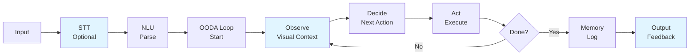
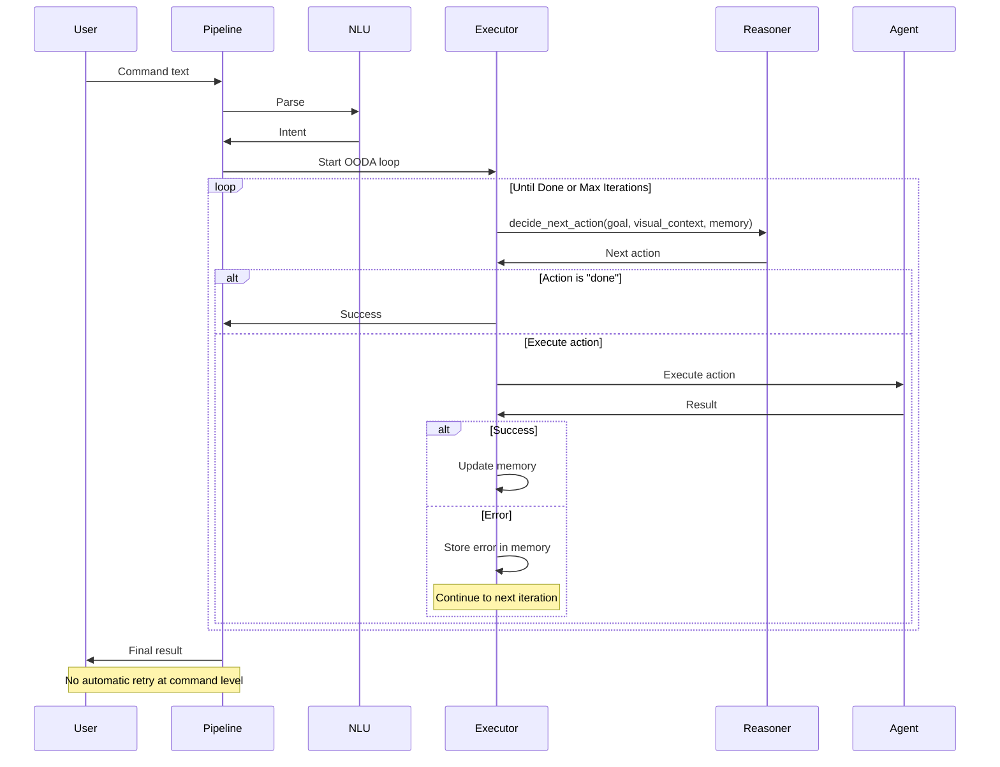
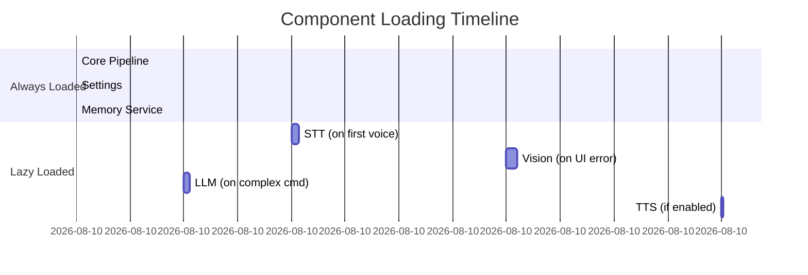
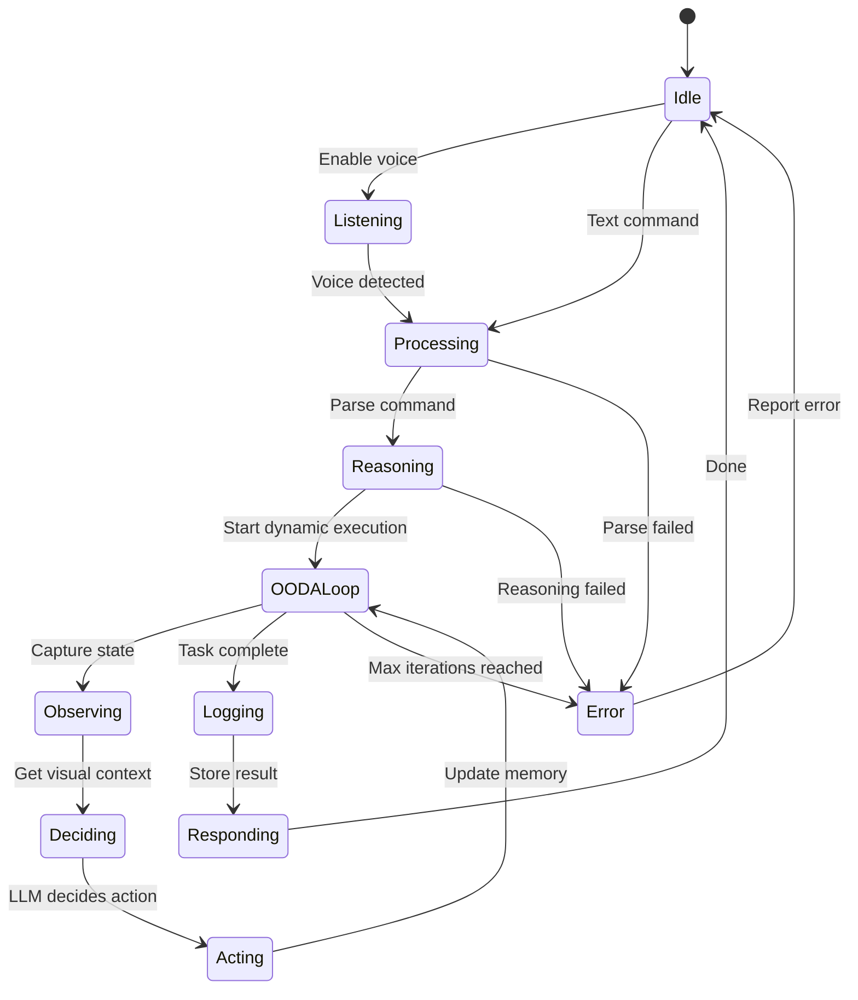

# Unified Async Pipeline - Dynamic Agentic Loop (OODA)

> **Architecture**: See [Complete System Architecture](./01-complete-system-architecture.md) for V3 Multi-Layer OODA Loop overview.

---


Deep dive into Janus's unified async pipeline with the **Dynamic OODA Loop**: **Observe → Orient → Decide → Act**

## 📋 Table of Contents

1. [Overview](#overview)
2. [Pipeline Philosophy](#pipeline-philosophy)
3. [The OODA Loop Explained](#the-ooda-loop-explained)
4. [Set-of-Marks Visual Grounding](#set-of-marks-visual-grounding)
5. [System Prompts and Context Injection](#system-prompts-and-context-injection)
6. [Dynamic ReAct Loop Execution](#dynamic-react-loop-execution)
7. [Component Lazy Loading](#component-lazy-loading)
8. [Pipeline State Management](#pipeline-state-management)
9. [Error Handling and Recovery](#error-handling-and-recovery)
10. [Performance Optimizations](#performance-optimizations)
11. [Pipeline Extensions](#pipeline-extensions)

## Overview

The **Unified Async Pipeline** is the core architectural pattern that makes Janus simple, maintainable, and reliable. All commands—whether from voice or text input—flow through a single, clean execution path with **Dynamic ReAct Loop** instead of static planning.

### Key Design Goals

1. **Dynamic Execution**: OODA loop decides next action based on current state
2. **Async-First**: Non-blocking operations throughout
3. **Type-Safe**: Strong contracts at each stage
4. **Observable**: Clear logging and state tracking
5. **Composable**: Easy to add new stages or features
6. **Generic**: No site-specific logic - works on any interface

### Pipeline Stages



**Legend**: Blue stages are optional/conditional

## Pipeline Philosophy

### Why Dynamic Execution?

Traditional automation systems predict all steps upfront and execute blindly. This approach fails when interfaces change or unexpected states occur.

**Limitations of Static Planning:**
- **Brittle**: Breaks when UI differs from expectations
- **Rigid**: Cannot adapt to intermediate results  
- **Blind**: Doesn't see actual screen state
- **Site-specific**: Requires hardcoded rules per website
- **No recovery**: Single failure stops execution

### The OODA/ReAct Loop Approach

```python
# Dynamic OODA/ReAct Loop
async def execute_goal(user_goal: str):
    context = {}
    memory = {}
    
    while not task_completed and iterations < max_limit:
        # 1. Observe: Capture current state
        screenshot = vision.capture()
        elements = vision.detect_elements(screenshot)
        system_state = get_system_state()
        
        # 2. Orient & Decide: Ask LLM for next action
        action = reasoner.decide_next_action(
            user_goal=user_goal,
            system_state=system_state,
            visual_context=elements,
            memory=memory
        )
        
        # 3. Act: Execute the action
        result = adapter.execute(action)
        
        # 4. Update memory and check completion
        if action["action"] == "done":
            break
        
        if result.success:
            memory.update(result.data)
        else:
            # Don't stop - LLM will see error and adapt
            memory["last_error"] = result.error
```

**Advantages**
- **Adaptive**: Decides based on current screen state, not assumptions
- **Visual**: Uses actual visible elements
- **Generic**: Zero site-specific logic
- **Recoverable**: Handles errors gracefully
- **Self-correcting**: LLM sees errors and adjusts strategy

### OODA Loop vs Static Planning

| Aspect | Static Planning | OODA Loop |
|--------|----------------|-----------|
| **Planning** | All steps upfront | One step at a time |
| **Adaptability** | Fails on unexpected UI | Adapts to any UI |
| **Vision** | Optional verification | Core decision input |
| **Errors** | Stop execution | Continue with adjustment |
| **Site Logic** | Hardcoded patterns | Generic for all sites |
| **Maintenance** | Add rules for each site | Zero maintenance |

## The OODA Loop Explained

The **OODA Loop** (Observe, Orient, Decide, Act) is a decision-making framework originally developed for military strategy, now applied to Janus's dynamic execution model.

### Four Phases of the Loop

#### 1. **Observe** 🔍
**Purpose**: Capture the current state of the system and environment.

**What happens**
- Take screenshot of active application
- Detect interactive elements using computer vision
- Tag elements with unique IDs (Set-of-Marks system)
- Capture system state (active app, URL, window title)
- Read current memory/context

**Output**: Structured visual context with tagged elements
```json
{
  "elements": [
    {"id": "elem_1", "type": "button", "text": "Search", "coords": [100, 200]},
    {"id": "elem_2", "type": "input", "text": "", "coords": [150, 180]}
  ],
  "system_state": {
    "active_app": "Safari",
    "url": "https://example.com",
    "window_title": "Example - Homepage"
  }
}
```

#### 2. **Orient** 🧭
**Purpose**: Analyze the observed data and understand the situation.

**What happens**
- Contextualize observations with user goal
- Review memory of previous actions
- Identify relevant elements for the task
- Understand current progress toward goal
- Detect errors or obstacles

**Key insight**: This is where the system "makes sense" of what it sees, connecting visual state to user intent.

#### 3. **Decide** 💡
**Purpose**: Determine the next action based on understanding.

**What happens**
- LLM analyzes: user goal + visual context + memory
- Reasons about what action moves toward goal
- Selects ONE specific action to perform
- References elements by their Set-of-Marks IDs
- Explains reasoning for transparency

**Output**: Single action decision
```python
{
  "action": "click",
  "args": {"element_id": "elem_1"},
  "reasoning": "Need to activate search. Clicking search button."
}
```

#### 4. **Act** ⚡
**Purpose**: Execute the decided action.

**What happens**
- Route action to appropriate agent (browser, system, UI, etc.)
- Execute with appropriate automation tool (PyAutoGUI, AppleScript, etc.)
- Capture result (success/failure)
- Update memory with any extracted data
- Store errors for next iteration

**Output**: Action result that feeds back into next Observe phase

### The Loop Continues

Following the Act phase, the system returns to Observe to see the outcome of the action:
- Did the page change as expected?
- Did new elements appear?
- Are we closer to the goal?

This creates a **continuous feedback loop** that adapts to any situation.

### Why OODA Works for Automation

1. **Handles Dynamic UIs**: Observes actual state, not assumptions
2. **Self-Correcting**: If action fails, next Orient phase sees the error
3. **No Hardcoding**: Works on any site/app because it observes reality
4. **Explainable**: Each decision includes reasoning
5. **Resilient**: Popups, delays, unexpected states are just new observations

## Set-of-Marks Visual Grounding

The **Set-of-Marks** system is how Janus tags and references visual elements precisely.

### The Problem Without Set-of-Marks

Traditional approaches struggle with element identification
- ❌ CSS selectors: Change frequently, site-specific
- ❌ XPath: Brittle, breaks with UI updates
- ❌ Text matching: Ambiguous when multiple elements have same text
- ❌ LLM hallucination: LLM invents selectors that don't exist

### The Set-of-Marks Solution

**Set-of-Marks** assigns unique IDs to every interactive element visible on screen

```
Original Screen:          With Set-of-Marks:
┌─────────────────┐      ┌─────────────────┐
│  [Search...]    │      │ [1] [Search...] │
│                 │      │                  │
│  (Submit)       │  →   │ [2] (Submit)    │
│                 │      │                  │
│  View Results   │      │ [3] View Results│
└─────────────────┘      └─────────────────┘
```

### How It Works

1. **Detection**: Computer vision identifies interactive elements
 - Buttons, links, inputs, dropdowns, etc.
 - Uses OCR + element detection algorithms

2. **Tagging**: Each element gets a unique ID
   ```python
   {
     "id": "elem_1",
     "type": "button",
     "text": "Search",
     "coordinates": {"x": 100, "y": 200, "width": 80, "height": 30}
   }
   ```

3. **Injection into Prompt**: LLM receives structured list
   ```
   Available elements on screen:
   [1] Button "Search" at (100, 200)
   [2] Input field (empty) at (150, 180)
   [3] Link "Help" at (50, 300)
   ```

4. **LLM References by ID**: In its decision
   ```json
   {
     "action": "click",
     "args": {"element_id": "elem_1"},
     "reasoning": "Clicking search button (element 1)"
   }
   ```

5. **Execution**: System uses coordinates from tagged element
 - No CSS selector needed
 - No XPath traversal
 - Direct coordinate-based click

### Benefits

✅ **No Hallucination**: LLM can only reference real, visible elements
✅ **Site-Agnostic**: Works on any website/app with no customization
✅ **Precise**: Uses exact coordinates from detection
✅ **Explainable**: Clear mapping from decision to UI element
✅ **Robust**: If element moves, re-detection updates coordinates

### Proactive vs Reactive Vision

**Old Approach (Reactive)**
1. Try action with assumed selector
2. Action fails
3. Take screenshot to see what went wrong
4. Generate recovery plan

**New Approach (Proactive with Set-of-Marks)**
1. Take screenshot BEFORE action
2. Detect all interactive elements
3. LLM decides based on what's actually there
4. Execute with precise coordinates

This prevents errors rather than recovering from them.

## System Prompts and Context Injection

System prompts are how we inject vision and context into the LLM's decision-making process.

### Prompt Structure

Each LLM call includes

1. **System Prompt**: Defines the LLM's role and capabilities
2. **Visual Context**: Set-of-Marks element list
3. **System State**: Active app, URL, window title
4. **User Goal**: What the user wants to accomplish
5. **Memory**: Data collected so far
6. **Action Format**: Expected JSON structure for response

### Example Prompt Template (Jinja2)

The following shows the structure of a typical system prompt template used for the OODA Loop

```jinja2
You are an intelligent automation agent using the OODA Loop.

CURRENT OBSERVATION:
- Active Application: {{ system_state.active_app }}
- URL: {{ system_state.url }}
- Window: {{ system_state.window_title }}

VISIBLE ELEMENTS (Set-of-Marks):

[{{ element.id }}] {{ element.type }} "{{ element.text }}" at ({{ element.x }}, {{ element.y }})


USER GOAL: {{ user_goal }}

MEMORY (data collected):
{{ memory | tojson }}

ORIENT: Analyze the situation
- What progress have we made toward the goal?
- Which visible element(s) are relevant?
- What is the next logical step?

DECIDE: Choose ONE action from:
- click: {"element_id": "elem_X"}
- type_text: {"element_id": "elem_X", "text": "..."}
- scroll: {"direction": "up|down"}
- extract_data: {"element_id": "elem_X", "data_name": "..."}
- done: {} (goal achieved)

Return JSON:
{
  "action": "...",
  "args": {...},
  "reasoning": "..."
}
```

### Context Injection Flow

```
User Goal: "Find CEO of Acme Corp"
         ↓
Take Screenshot → Detect Elements → Tag with IDs
         ↓
System State: {app: "Safari", url: "acme.com/about"}
         ↓
Combine into Prompt:
- "You see these elements: [1] Text 'John Smith, CEO'..."
- "You are on acme.com/about page"
- "User wants to find CEO name"
         ↓
LLM Reasoning:
- "I see element [1] contains 'John Smith, CEO'"
- "This matches the user goal"
         ↓
Decision:
{
  "action": "extract_data",
  "args": {"element_id": "elem_1", "data_name": "CEO_name"},
  "reasoning": "Found CEO name in element 1"
}
```

### Grounding Through Context

The system prompt **grounds** the LLM in reality by
- ✅ Providing actual screen state (not assumptions)
- ✅ Listing only real, detectable elements (no hallucination)
- ✅ Including system context (app, URL) for understanding
- ✅ Tracking memory to avoid repeating actions
- ✅ Showing previous errors so LLM can adapt

## Dynamic ReAct Loop Execution

The **Dynamic ReAct Loop** is the NEW execution model .

### OODA Loop Flow

```
┌─────────────────────────────────────────────────────────────┐
│                        User Goal                            │
│                  "Find CEO of Acme Corp"                    │
└──────────────────────┬──────────────────────────────────────┘
                       │
                       ▼
            ┌──────────────────────┐
            │   1. OBSERVE         │
            │   Capture Screen     │◄──────────┐
            │   Get System State   │           │
            └──────────┬───────────┘           │
                       │                        │
                       ▼                        │
            ┌──────────────────────┐           │
            │   2. ORIENT          │           │
            │   Analyze Context    │           │
            └──────────┬───────────┘           │
                       │                        │
                       ▼                        │
            ┌──────────────────────┐           │
            │   3. DECIDE          │           │
            │   LLM picks next     │           │
            │   action based on    │           │
            │   visual state       │           │
            └──────────┬───────────┘           │
                       │                        │
                       ▼                        │
            ┌──────────────────────┐           │
            │   4. ACT             │           │
            │   Execute action     │           │
            │   Update memory      │           │
            └──────────┬───────────┘           │
                       │                        │
                       ▼                        │
                   Goal achieved?               │
                       │                        │
           ┌───────────┴───────────┐           │
           │                       │           │
          Yes                     No           │
           │                       │           │
           ▼                       └───────────┘
        DONE                    Loop back
```

### Async-First Design

All I/O operations are async to prevent blocking

```python
class JanusPipeline:
    async def process_command(self, text: str) -> ExecutionResult:
        # All I/O operations use async/await
        intent = await self.nlu.parse_async(text)
        
        # Execute using OODA loop
        result = await self.executor.execute_dynamic_loop(
            user_goal=intent.command,
            intent=intent,
            session_id=session_id,
            request_id=request_id,
            max_iterations=20
        )
        
        await self.memory.log_async(result)
        return result
```

**Benefits**
- Non-blocking UI
- Parallel vision processing
- Concurrent action execution
- Better resource utilization

### Key Components

#### 1. Visual Context

The system provides a list of interactive elements visible on screen

```json
[
  {"id": "search_box_1", "type": "input", "label": "Search"},
  {"id": "ceo_name_7", "type": "text", "content": "John Smith"},
  {"id": "submit_btn_3", "type": "button", "label": "Submit"}
]
```

#### 2. System State

Current application state

```python
{
  "active_app": "Safari",
  "url": "https://acme.com/about",
  "domain": "acme.com",
  "clipboard": ""
}
```

#### 3. Memory

Data extracted during previous iterations

```python
{
  "CEO_name": "John Smith",
  "company": "Acme Corp",
  "last_error": None  # Stores errors for LLM to see
}
```

#### 4. Next Action

The reasoner returns a single action

```python
{
  "action": "extract_data",  # or "click", "type_text", "scroll", "done"
  "args": {"element_id": "ceo_name_7", "data_name": "CEO_name"},
  "reasoning": "I found the CEO name on the page. Extracting it."
}
```

### Available Actions

- **click**: Click on an element
- **type_text**: Type text into an input field
- **scroll**: Scroll the page
- **open_app**: Open an application
- **open_url**: Navigate to URL
- **press_key**: Press a keyboard key
- **extract_data**: Extract data from element to memory
- **done**: Goal achieved

### Example: Web Search Without Site-Specific Logic

**Goal**: "Find videos about Italian cooking"

**Iteration 1:**
```python
# Visual: Video site homepage with search box
action = {
  "action": "type_text",
  "args": {"element_id": "search_box_1", "text": "Italian cooking"},
  "reasoning": "I see a search box. Entering the search query."
}
# Note: No hardcoded "youtube" logic - works on any video site!
```

**Iteration 2:**
```python
# Visual: Search results page with video thumbnails
action = {
  "action": "click",
  "args": {"element_id": "video_result_1"},
  "reasoning": "I see video results. Clicking the first relevant one."
}
```

**Iteration 3:**
```python
# Visual: Video playing
action = {
  "action": "done",
  "reasoning": "Video is now playing. Goal achieved."
}
```

### Error Handling: Non-Blocking Execution

Unlike static planning, the OODA loop **continues on errors**

```python
# Iteration N: Click fails (popup appeared)
result = execute(action)
if not result.success:
    memory["last_error"] = result.error
    # DON'T STOP - continue to next iteration

# Iteration N+1: LLM sees the error and adapts
# Visual: Popup blocking the page
action = {
  "action": "click",
  "args": {"element_id": "close_popup_btn"},
  "reasoning": "Previous action failed. I see a popup. Closing it first."
}
```

**Benefits**
- Handles popups automatically
- Adapts to unexpected states
- Self-correcting behavior
- No manual error recovery code needed

## Single-Shot Execution Model

Janus uses a **single-shot execution model** - each command is parsed once and executed once, with no automatic retries or replanning.

### Why Single-Shot?

1. **Predictability**: User knows exactly what will happen
2. **Speed**: No retry delays
3. **Clarity**: Clear success or failure
4. **Safety**: No unintended repeated actions

### Execution Flow



### Handling Failures

Instead of automatic command-level retries, Janus provides

1. **Clear Error Messages**: User knows what went wrong
2. **Loop-Level Recovery**: OODA loop adapts to errors within execution
3. **Suggested Corrections**: LLM can suggest rephrasing
4. **Manual Retry**: User can refine and retry command

**Example**
```
User: "open nonexistent app"
Janus: [Error] "Application 'nonexistent' not found"
       "Did you mean: VSCode, Safari, or Chrome?"
```

## Component Lazy Loading

All optional components use lazy loading to minimize startup time and memory usage.

### Lazy Loading Pattern

```python
class JanusPipeline:
    def __init__(self):
        # Don't load anything heavy at init
        self._stt = None
        self._vision = None
        self._llm = None
        self._tts = None
        
    @property
    def stt(self) -> WhisperSTT:
        """Load STT only when first accessed"""
        if self._stt is None:
            logger.info("Loading Whisper STT model...")
            self._stt = WhisperSTT(self.settings)
        return self._stt
    
    @property
    def vision(self) -> VisionEngine:
        """Load vision only when first accessed"""
        if self._vision is None:
            if self.settings.enable_vision:
                logger.info("Loading vision models...")
                self._vision = VisionEngine(self.settings)
            else:
                logger.info("Vision disabled, using stub")
                self._vision = VisionStub()
        return self._vision
```

### Component Loading Timeline



### Graceful Degradation

When optional components are unavailable

```python
# Vision unavailable
if not self.vision.available:
    logger.warning("Vision unavailable, skipping verification")
    return result  # Continue without vision
    
# LLM unavailable
if not self.llm.available:
    logger.warning("LLM unavailable, using deterministic parser")
    intent = self.deterministic_nlu.parse(text)  # Fallback
```

**Degradation Hierarchy**
1. **Full featured**: STT + LLM + Vision + TTS
2. **No vision**: STT + LLM + TTS (no UI recovery)
3. **No LLM**: STT + Deterministic parser + Vision + TTS
4. **Minimal**: Deterministic parser only (text commands)

## Pipeline State Management

### Pipeline States



### State Tracking

```python
from enum import Enum

class PipelineState(Enum):
    IDLE = "idle"
    LISTENING = "listening"
    PROCESSING = "processing"
    REASONING = "reasoning"
    OODA_LOOP = "ooda_loop"
    OBSERVING = "observing"
    DECIDING = "deciding"
    ACTING = "acting"
    LOGGING = "logging"
    RESPONDING = "responding"
    ERROR = "error"

class JanusPipeline:
    def __init__(self):
        self.state = PipelineState.IDLE
        self.state_callbacks = []
        
    def _set_state(self, new_state: PipelineState):
        """Update state and notify observers"""
        logger.info(f"Pipeline state: {self.state} → {new_state}")
        self.state = new_state
        for callback in self.state_callbacks:
            callback(new_state)
```

### Observable Pipeline

UI can observe pipeline state for feedback

```python
# In overlay UI
def on_pipeline_state_change(state: PipelineState):
    if state == PipelineState.LISTENING:
        overlay.show("🎤 Listening...", OverlayStatus.LISTENING)
    elif state == PipelineState.REASONING:
        overlay.show("🧠 Thinking...", OverlayStatus.THINKING)
    elif state == PipelineState.OODA_LOOP:
        overlay.show("🔄 Executing...", OverlayStatus.EXECUTING)
    elif state == PipelineState.ERROR:
        overlay.show("❌ Error", OverlayStatus.ERROR)

pipeline.state_callbacks.append(on_pipeline_state_change)
```

## Error Handling and Recovery

### Error Handling Strategy

The OODA loop provides built-in error recovery - errors don't stop execution

```python
async def execute_dynamic_loop(self, user_goal: str):
    context = {}
    memory = {}
    
    while not task_completed and iteration < max_iterations:
        try:
            # Observe current state
            visual_context = await self._capture_visual_context()
            system_state = await self._capture_system_state(context)
            
            # Decide next action
            action = self.reasoner.decide_next_action(
                user_goal=user_goal,
                system_state=system_state,
                visual_context=visual_context,
                memory=memory
            )
            
            # Check if done
            if action["action"] == "done":
                return ExecutionResult(success=True, data=memory)
            
            # Execute action
            result = await self._execute_dynamic_action(action, context, memory)
            
            if result.success:
                # Update memory with extracted data
                memory.update(result.data)
            else:
                # DON'T STOP - store error and continue
                # LLM will see the error in next iteration and adapt
                memory["last_error"] = result.error
                logger.warning(f"Action failed: {result.error}. Continuing...")
                
        except Exception as e:
            # Even exceptions don't stop the loop
            logger.error(f"Iteration error: {e}")
            memory["last_error"] = str(e)
            continue
    
    return ExecutionResult(
        success=task_completed,
        data=memory,
        error="Max iterations reached" if not task_completed else None
    )
```

 # Step 4: Log
 await self._safe_log(result)

 return result

 except Exception as e:
 # Convert all exceptions to ExecutionResult
 logger.error(f"Pipeline error: {e}", exc_info=True)
 return ExecutionResult(
 success=False,
 error=CommandError(
 type=ErrorType.PIPELINE_ERROR,
 message=str(e),
 recoverable=False
 )
 )
```

### Error Types

```python
class ErrorType(Enum)
 # Parse errors
 PARSE_ERROR = "parse_error" # Couldn't understand command
 INVALID_INTENT = "invalid_intent" # Intent structure invalid

 # Execution errors (OODA loop)
 ACTION_NOT_FOUND = "action_not_found" # Unknown action
 PERMISSION_DENIED = "permission_denied" # Not allowed
 EXECUTION_FAILED = "execution_failed" # Action failed
 ELEMENT_NOT_FOUND = "element_not_found" # UI element not found

 # System errors
 TIMEOUT = "timeout" # Operation timed out
 MAX_ITERATIONS = "max_iterations" # Reached iteration limit
 PIPELINE_ERROR = "pipeline_error" # Internal error
```

### Built-In Error Recovery (OODA Loop)

The OODA loop provides automatic error recovery without stopping:

**Example: Handling Popup**
```python
# Iteration 1: Try to click button
action = {"action": "click", "args": {"element_id": "submit_btn"}}
result = execute(action) # FAILS - popup is blocking

# Iteration 2: LLM sees error and adapts
# memory["last_error"] = "Element not found"
# visual_context shows popup
action = {"action": "click", "args": {"element_id": "close_popup_btn"}}
result = execute(action) # SUCCESS - popup closed

# Iteration 3: Retry original action
action = {"action": "click", "args": {"element_id": "submit_btn"}}
result = execute(action) # SUCCESS - now button is accessible
```

**Benefits**:
- No hardcoded popup detection
- Works on any website
- Self-correcting behavior
- Zero maintenance

### Visual Analysis Replaces Sleeps

**OLD Approach (Hardcoded waits):**
```python
# Superseded: Site-specific wait logic
if "youtube" in url
 await asyncio.sleep(3) # Wait for video page
elif "google" in url
 await asyncio.sleep(1) # Wait for search results
```

**NEW Approach (Visual analysis):**
```python
# ✅ OODA Loop: Vision-based detection
# No sleep needed - LLM sees actual elements
visual_context = capture_screen_elements()
# Returns: [{"id": "video_player", "type": "iframe"}, ...]

action = reasoner.decide_next_action(
 user_goal="play video",
 visual_context=visual_context,
 memory=memory
)
# LLM decides to click play button when it sees it
# No hardcoded wait time needed
```

## Performance Optimizations

### 1. Connection Pooling

Reuse HTTP connections to Ollama/LLM services:

```python
class ReasonerLLM
 def __init__(self)
 # Reuse session for all requests
 self.session = aiohttp.ClientSession()

 async def decide_next_action(
 self,
 user_goal: str,
 system_state: Dict,
 visual_context: str,
 memory: Dict
 ) -> Dict
 # Connection is reused
 async with self.session.post(
 self.ollama_url,
 json=payload
 ) as resp
 return await resp.json()
```

### 2. Vision Caching

Cache OCR and element detection results:

```python
# OCR result cache (by screenshot hash)
@lru_cache(maxsize=100)
def ocr_cached(screenshot_hash: str) -> str
 return self.ocr_engine.extract_text(screenshot)

# Element location cache (by text + screen region)
@lru_cache(maxsize=200)
def element_location_cached(text: str, region_hash: str) -> Coordinates
 return self.vision.find_element(text, region)
```

### 3. Streaming Responses

Stream LLM tokens for faster perceived latency:

```python
async def decide_next_action_streaming(
 self,
 user_goal: str,
 system_state: Dict,
 visual_context: str,
 memory: Dict
) -> AsyncIterator[str]
 """Stream LLM response tokens as they arrive"""
 async with self.session.post(
 self.ollama_url,
 json={"stream": True, ...}
 ) as resp
 async for line in resp.content
 token = json.loads(line)["response"]
 yield token

# UI can show progress
async for token in reasoner.decide_next_action_streaming(...)
 overlay.append_text(token) # Show thinking process
```

### 4. Efficient OODA Loop

The OODA loop is optimized for minimal overhead:

- **Vision capture**: Only when needed (not every iteration)
- **LLM calls**: Single request per iteration
- **Memory updates**: In-place updates, no copying
- **Early termination**: Stops as soon as "done" action received

```python
# Optimized OODA loop
while not done and iteration < max_iterations
 iteration += 1

 # Fast: Capture only what's needed
 visual_context = await self._capture_visual_context() # ~50ms

 # Fast: Single LLM call
 action = await reasoner.decide_next_action(...) # ~500ms

 # Fast: Direct execution
 result = await execute(action) # Variable

 # Fast: In-place update
 if result.success
 memory.update(result.data) # ~1ms
```

## Pipeline Extensions

### Adding Actions to OODA Loop

To add a new action type to the OODA loop:

1. **Add action mapping**:
```python
# In janus/core/agent_executor_v3.py
async def _execute_dynamic_action(self, action: Dict, context: Dict, memory: Dict)
 action_mapping = {
 "click": ("browser", "click"),
 "type_text": ("browser", "type"),
 "scroll": ("browser", "scroll"),
 "open_app": ("system", "open_application"),
 "open_url": ("browser", "open_url"),
 "press_key": ("keyboard", "press_key"),
 "extract_data": ("vision", "extract_text"),
 # Add new action here
 "copy_text": ("clipboard", "copy"),
 }
```

2. **Update reasoner prompt**:
```python
# In janus/reasoning/templates/reasoner_react_system_fr.jinja2
# Add to available actions list
- copy_text: Copy text from element to clipboard
 args: {"element_id": "text_123"}
```

3. **Test the new action**:
```python
# The OODA loop automatically picks it up
action = reasoner.decide_next_action(
 user_goal="Copy CEO name",
 system_state=...,
 visual_context=...,
 memory={}
)
# Returns: {"action": "copy_text", "args": {"element_id": "..."}}
```

### Custom Pipeline Variations

Create specialized executors by subclassing:

```python
class FastExecutor(AgentExecutorV3)
 """Optimized executor for simple tasks"""

 async def execute_dynamic_loop(self, user_goal: str, intent: Intent, ...)
 # Reduce max iterations for faster execution
 return await super().execute_dynamic_loop(
 user_goal=user_goal,
 intent=intent,
 max_iterations=10, # Faster timeout
 ...
 )
 """Optimized pipeline for low-latency commands"""

 def __init__(self, *args, **kwargs)
 super().__init__(*args, **kwargs)
 # Disable optional features
 self.settings.enable_vision = False
 self.settings.enable_learning = False

 async def process_command(self, text: str) -> ExecutionResult
 # Skip LLM reasoning for fast path
 intent = self.deterministic_nlu.parse(text)
 plan = self.planner.create_plan(intent)
 result = await self.executor.execute_plan(plan)
 return result

class VisionFirstExecutor(AgentExecutorV3)
 """Executor that prioritizes vision-based decisions"""

 async def _capture_visual_context(self) -> str
 # Use more detailed vision analysis
 # Capture more elements, higher resolution
 return await super()._capture_visual_context()
```

### OODA Loop Metrics

Track OODA loop performance:

```python
class OODAMetrics
 def __init__(self)
 self.iteration_times = []
 self.action_counts = {}
 self.errors = []

 def record_iteration(self, iteration: int, duration: float, action: str)
 """Record iteration metrics"""
 self.iteration_times.append(duration)
 self.action_counts[action] = self.action_counts.get(action, 0) + 1

 def record_error(self, error: str)
 """Record error for analysis"""
 self.errors.append(error)

 def report(self) -> Dict[str, Any]
 """Generate OODA loop performance report"""
 return {
 "total_iterations": len(self.iteration_times),
 "avg_iteration_time": sum(self.iteration_times) / len(self.iteration_times),
 "action_distribution": self.action_counts,
 "error_count": len(self.errors),
 "errors": self.errors,
 }

# Usage in OODA loop
metrics = OODAMetrics()

while not done and iteration < max_iterations
 start = time.time()
 action = reasoner.decide_next_action(...)
 result = execute(action)

 metrics.record_iteration(
 iteration=iteration,
 duration=time.time() - start,
 action=action["action"]
 )

 if not result.success
 metrics.record_error(result.error)

# View metrics
print(metrics.report())
# {
# "total_iterations": 5,
# "avg_iteration_time": 0.8,
# "action_distribution": {"click": 2, "type_text": 1, "extract_data": 1, "done": 1},
# "error_count": 0,
# "errors": []
# }
# }
```

---

## Summary

The **Unified Async Pipeline with Dynamic OODA/ReAct Loop** provides:

1. **Generic Architecture**: Zero site-specific logic - works on any interface
2. **Adaptive Execution**: Decides actions based on current visual state
3. **Built-in Recovery**: Errors don't stop execution - LLM adapts
4. **Visual Grounding**: Uses actual screen elements, not assumptions
5. **Zero Maintenance**: No hardcoded patterns to maintain
6. **Self-Correcting**: Handles popups, errors, and unexpected states automatically

**Key Difference from Static Planning:**

| Old (Static Planning) | New (OODA Loop) |
|----------------------|-----------------|
| Plan all steps upfront | Decide one step at a time |
| Blind to actual UI | Sees what's on screen |
| Fails on unexpected states | Adapts to any state |
| Site-specific logic | Generic for all sites |
| Stops on error | Continues and adapts |

---

**Next**: [03-llm-first-principle.md](03-llm-first-principle.md) - Understanding the LLM-First philosophy

**See Also**: [13-dynamic-react-loop.md](13-dynamic-react-loop.md) - Detailed OODA/ReAct loop documentation

## See Also

- [Complete System Architecture](./01-complete-system-architecture.md) - Full system overview
- [LLM-First Principle](./03-llm-first-principle.md) - Why LLM decisions, not heuristics
- [Dynamic ReAct Loop](./13-dynamic-react-loop.md) - Detailed OODA loop explanation
- [Action Coordinator](./14-action-coordinator.md) - OODA loop implementation
- [Vision Integration](./18-proactive-vision-integration.md) - Set-of-Marks system
