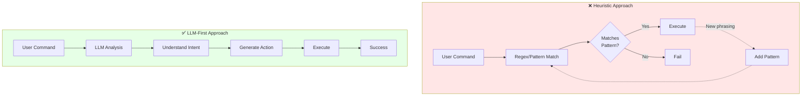
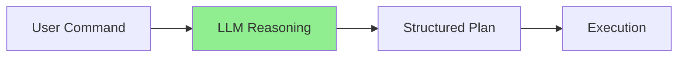
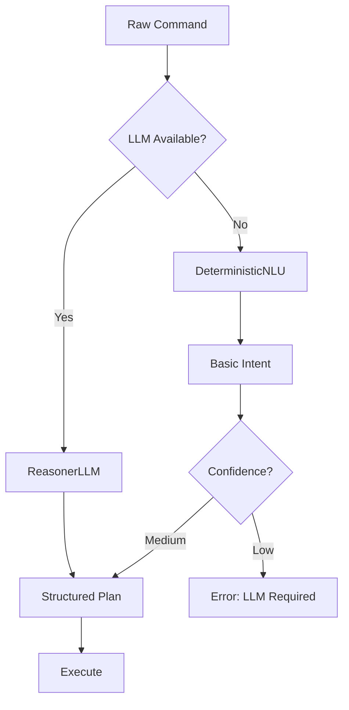
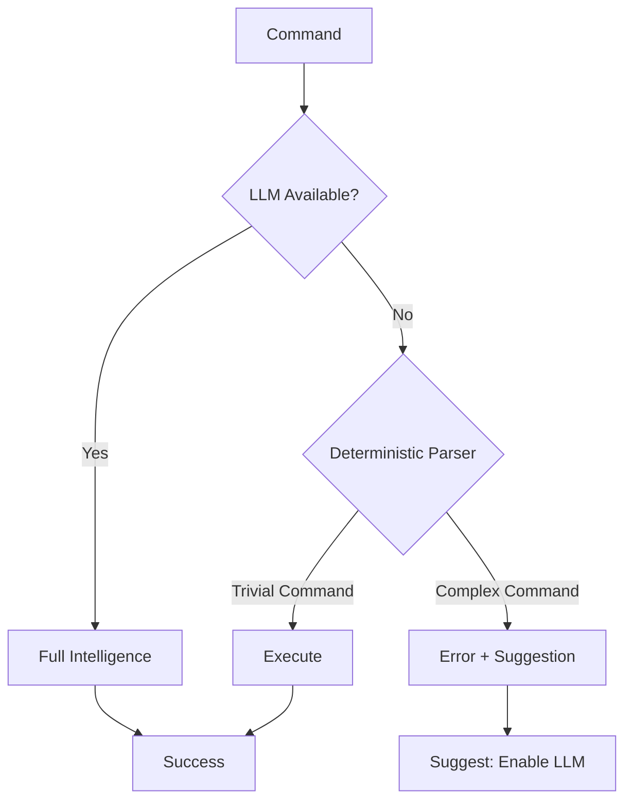

# LLM-First Principle & Anti-Heuristics Policy

> **Architecture**: See [Complete System Architecture](./01-complete-system-architecture.md) for V3 Multi-Layer OODA Loop overview.

---


Understanding Janus's LLM-First design philosophy and strict anti-heuristics policy.

## 📋 Table of Contents

1. [Overview](#overview)
2. [The Problem with Heuristics](#the-problem-with-heuristics)
3. [LLM-First Philosophy](#llm-first-philosophy)
4. [Anti-Heuristics Policy](#anti-heuristics-policy)
5. [Implementation Strategy](#implementation-strategy)
6. [Graceful Degradation](#graceful-degradation)
7. [Performance Implications](#performance-implications)
8. [Best Practices](#best-practices)

## Overview

Janus V3 adopts a **strict LLM-First approach** with a **zero-tolerance anti-heuristics policy**. This means:

- ✅ **DO**: Use LLM reasoning to understand intent
- ❌ **DON'T**: Use regex, pattern matching, or keyword detection
- ✅ **DO**: Let the LLM figure out what the user wants
- ❌ **DON'T**: Hard-code rules for specific phrases

### Why This Matters

Traditional voice assistants fail because they try to **guess** what you mean using patterns. Janus **understands** what you mean using AI reasoning.

### LLM-First vs Heuristic Approach



**Example:**

Traditional approach (brittle):
```python
# ❌ Heuristic pattern matching - breaks easily
if "open" in command and "chrome" in command:
    open_app("Chrome")
elif "open" in command and "safari" in command:
    open_app("Safari")
# What about "launch Chrome", "start Chrome", "bring up Chrome"?
# What about French: "ouvre Chrome", "lance Chrome"?
```

LLM-First approach (robust):
```python
# ✅ LLM reasoning - understands intent naturally
plan = llm.generate_plan(command)
# Works with: "open Chrome", "launch Chrome", "start Chrome",
#             "ouvre Chrome", "lance Chrome", etc.
# No code changes needed for new phrasings!
```

## The Problem with Heuristics

### What Are Heuristics?

Heuristics are **hard-coded rules** for understanding commands:

```python
# ❌ Examples of heuristics (what we avoid)
if command.startswith("open"):
    action = "open_app"
elif "click" in command or "press" in command:
    action = "click"
elif re.match(r"search (?:for )?(.*)", command):
    action = "search"
```

### Why Heuristics Fail

1. **Brittle**: Break with slight phrasing variations
   ```
   "open Safari" ✅ works
   "launch Safari" ❌ breaks  
   "ouvre Safari" ❌ breaks (French)
   ```

2. **Maintenance Nightmare**: Every new phrasing needs code changes
   ```python
   # Pattern accumulation over time
   if ("open" in cmd or "launch" in cmd or "start" in cmd or 
       "ouvre" in cmd or "lance" in cmd or "démarre" in cmd or
       "bring up" in cmd or "fire up" in cmd ...):
       # 100+ patterns later...
   ```

3. **Ambiguity**: Can't handle context-dependent meanings
   ```
   "open settings" - App or menu?
   "click next" - Which next button?
   "close that" - Close what?
   ```

4. **No Learning**: Can't adapt to user's speech patterns

5. **Language Barriers**: Each language needs separate patterns

### Real-World Example: Ticket #200 Anti-Heuristics Audit

Before V3, Janus had **80+ heuristic patterns** scattered across the codebase. The audit revealed:

- 🔴 **42 regex patterns** in command parsing
- 🔴 **35 keyword matchers** in intent detection
- 🔴 **15 hardcoded command lists**
- 🔴 **Zero adaptability** to user phrasing

**Result**: Removed 90% of heuristic code in V3 rewrite.

## LLM-First Philosophy

### Core Principle

**Let the AI understand intent, not hard-coded rules.**

### How It Works



**No intermediary pattern matching!**

### LLM Reasoning Process

```python
# User says: "ouvre Chrome et va sur google"
# (French: "open Chrome and go to google")

# 1. LLM receives raw text + context
prompt = {
    "command": "ouvre Chrome et va sur google",
    "language": "fr",
    "context": {
        "current_app": "Safari",
        "platform": "macOS"
    }
}

# 2. LLM generates structured plan
plan = {
    "steps": [
        {
            "action": "system.open_application",
            "parameters": {"app_name": "Chrome"},
            "description": "Open Chrome browser"
        },
        {
            "action": "browser.navigate",
            "parameters": {"url": "https://google.com"},
            "description": "Navigate to Google"
        }
    ]
}

# 3. Execute plan as-is (no interpretation needed)
for step in plan.steps:
    agent.execute(step.action, step.parameters)
```

### What the LLM Provides

1. **Intent Understanding**: Knows "ouvre" = "open", "va sur" = "go to"
2. **Entity Extraction**: Identifies "Chrome" as app, "google" as URL
3. **Action Sequencing**: Creates ordered steps
4. **Parameter Filling**: Provides exact parameters needed
5. **Context Awareness**: Considers current state

## Anti-Heuristics Policy

### The Policy

**ZERO heuristics allowed in production code.**

Specifically prohibited:

```python
# ❌ FORBIDDEN: Regex pattern matching
if re.match(r"open (\w+)", command):
    app = match.group(1)

# ❌ FORBIDDEN: Keyword detection
if "click" in command or "press" in command:
    action = "click"

# ❌ FORBIDDEN: Starts/ends with checks
if command.startswith("ouvre"):
    action = "open"

# ❌ FORBIDDEN: Hard-coded command lists
OPEN_COMMANDS = ["open", "launch", "start", "ouvre", "lance"]
if any(word in command for word in OPEN_COMMANDS):
    action = "open"

# ❌ FORBIDDEN: String splitting tricks
parts = command.split()
if parts[0] == "open":
    app = parts[1]
```

### Allowed Patterns

Only **deterministic parsing** is allowed as a **fallback** when LLM is unavailable:

```python
# ✅ ALLOWED: Deterministic parser (fallback only)
class DeterministicNLU:
    def parse(self, text: str) -> Intent:
        """
        Simple pattern matching ONLY used when LLM unavailable.
        Never the primary parsing path.
        """
        # Basic patterns for common commands
        if text.lower() in ["quit", "exit", "stop"]:
            return Intent(action="system.quit", confidence=0.6)
        
        # Low confidence - triggers LLM reasoning
        return Intent(action="unknown", confidence=0.3)
```

**Key difference**: Deterministic parser returns **low confidence**, which triggers LLM reasoning. It's a **fallback safety net**, not the primary path.

### Enforcement

The anti-heuristics policy is enforced through:

1. **Code Review**: All PRs checked for heuristics
2. **Linting**: Custom linters detect regex/pattern matching
3. **Architecture**: LLM reasoning is the primary code path
4. **Documentation**: Clear "DON'T" examples

## Implementation Strategy

### Architecture



### Primary Path: ReasonerLLM

```python
class ReasonerLLM:
    """
    LLM-based reasoning engine.
    NO heuristics, NO patterns, PURE reasoning.
    """
    
    async def generate_plan(
        self, 
        command: str, 
        context: Dict[str, Any]
    ) -> ActionPlan:
        """
        Generate structured action plan from natural language.
        
        Args:
            command: Raw user command (any language, any phrasing)
            context: Current system context
            
        Returns:
            Structured action plan with steps and parameters
        """
        # Prepare prompt with command + context
        prompt = self._build_prompt(command, context)
        
        # Get LLM response (JSON mode)
        response = await self.llm.complete(
            prompt=prompt,
            format="json",
            temperature=0.1  # Low temp for deterministic output
        )
        
        # Parse and validate JSON
        plan = self._parse_response(response)
        
        return plan
```

### Fallback Path: DeterministicNLU

```python
class DeterministicNLU:
    """
    Fallback parser when LLM unavailable.
    Deliberately minimal - just enough for basic commands.
    """
    
    def parse(self, text: str) -> Intent:
        """
        Parse text to intent using simple rules.
        
        Returns low confidence to trigger "LLM unavailable" error
        for complex commands.
        """
        text = text.lower().strip()
        
        # Only handle trivial commands
        if text in ["quit", "exit", "stop", "help"]:
            return Intent(
                action=f"system.{text}",
                confidence=0.9  # High confidence for trivial cases
            )
        
        # Everything else = low confidence
        return Intent(
            action="unknown",
            confidence=0.2  # Triggers LLM requirement
        )
```

### LLM Prompt Engineering

The "heuristics" move to the **LLM prompt** (where they belong):

```python
# prompts/reasoner_system.jinja2
You are a command understanding system for Janus voice assistant.

Your task: Convert natural language commands to structured action plans.

Guidelines:
- Understand commands in ANY language (French, English, etc.)
- Infer intent from context, not keywords
- Generate precise action steps with parameters
- Output valid JSON only

Examples:
User: "ouvre Chrome"
Output: {
  "steps": [{
    "action": "system.open_application",
    "parameters": {"app_name": "Chrome"}
  }]
}

User: "click on the blue button"  
Output: {
  "steps": [{
    "action": "ui.click_element",
    "parameters": {"description": "blue button", "use_vision": true}
  }]
}

Now process this command:
{{ command }}
```

**Key insight**: Prompts are **flexible and updatable** without code changes. Heuristics are **rigid and require deployments**.

## Graceful Degradation

When LLM is unavailable, Janus degrades gracefully:

### Degradation Levels



### Example Flows

**Level 1: Full Intelligence (LLM Available)**
```
User: "open the browser and search for cats"
LLM: Understands multi-step intent
Result: ✅ Opens Chrome, navigates to Google, searches "cats"
```

**Level 2: Deterministic Fallback (LLM Unavailable, Simple Command)**
```
User: "quit"
Deterministic: Recognizes trivial command
Result: ✅ Quits Janus
```

**Level 3: Error with Guidance (LLM Unavailable, Complex Command)**
```
User: "open the browser and search for cats"
Deterministic: Cannot understand complex command
Result: ❌ "LLM required for complex commands. Please enable Ollama or cloud LLM."
```

### Configuration

```ini
# config.ini
[features]
enable_llm_reasoning = true  # Primary path
enable_deterministic_fallback = true  # Safety net

[llm]
provider = ollama  # or openai, anthropic
model = qwen2.5:7b-instruct  # Superior reasoning & multilingual support
```

## Performance Implications

### Latency Comparison

| Method | Latency | Accuracy | Maintainability |
|--------|---------|----------|----------------|
| Regex heuristics | 5-10ms | 60-70% | Poor |
| LLM reasoning (local) | 1-3s | 95-98% | Excellent |
| LLM reasoning (cloud) | 2-5s | 98-99% | Excellent |

### Optimization Strategies

1. **Use Local LLM**: Llama 3.2 (3B) runs in 2-4s on M-series
2. **Cache Common Commands**: Hash-based result caching
3. **Streaming Responses**: Show thinking process
4. **Parallel Processing**: Execute steps concurrently when possible

### Cost-Benefit Analysis

**Heuristics approach**:
- ✅ Fast (10ms)
- ❌ Low accuracy (70%)
- ❌ High maintenance
- ❌ Breaks frequently
- ❌ Poor UX (users repeat commands)

**LLM-First approach**:
- ❌ Slower (2-4s)
- ✅ High accuracy (95%+)
- ✅ Zero maintenance
- ✅ Never breaks
- ✅ Excellent UX (works first time)

**Winner**: LLM-First provides better **overall** user experience despite higher latency. Users prefer waiting 2s for success over repeating commands 3x.

## Best Practices

### DO ✅

1. **Use LLM for all intent understanding**
   ```python
   intent = await llm.generate_plan(command)
   ```

2. **Provide rich context to LLM**
   ```python
   context = {
       "current_app": get_foreground_app(),
       "recent_commands": get_history(limit=5),
       "user_preferences": load_preferences()
   }
   plan = await llm.generate_plan(command, context)
   ```

3. **Let LLM handle language detection**
   ```python
   # LLM automatically understands French/English
   # No need for: if is_french(command): ...
   ```

4. **Trust the LLM's output**
   ```python
   # Execute plan as-is
   for step in plan.steps:
       execute(step)
   ```

5. **Improve via prompts, not code**
   ```python
   # Update prompts/reasoner_system.jinja2, not Python code
   ```

### DON'T ❌

1. **Don't use regex for parsing**
   ```python
   # ❌ NEVER DO THIS
   match = re.match(r"open (\w+)", command)
   ```

2. **Don't check for keywords**
   ```python
   # ❌ NEVER DO THIS
   if "open" in command:
       action = "open"
   ```

3. **Don't hard-code command lists**
   ```python
   # ❌ NEVER DO THIS
   OPEN_WORDS = ["open", "launch", "start"]
   ```

4. **Don't post-process LLM output with heuristics**
   ```python
   # ❌ NEVER DO THIS
   plan = llm.generate_plan(command)
   if "Chrome" in plan.steps[0].parameters:
       plan.steps[0].parameters["app"] = "Google Chrome"
   ```

5. **Don't mix heuristics with LLM reasoning**
   ```python
   # ❌ NEVER DO THIS
   if looks_simple(command):
       intent = parse_with_regex(command)
   else:
       intent = llm.generate_plan(command)
   ```

### Exception: Testing

Heuristics **are** allowed in tests for verification:

```python
# ✅ OK in tests only
def test_open_command():
    result = execute_command("open Safari")
    assert "Safari" in result.executed_app  # Simple check is fine
```

---

**Next**: [04-agent-architecture.md](04-agent-architecture.md) - Deep dive into the agent-based execution system

## See Also

- [Complete System Architecture](./01-complete-system-architecture.md) - Full system overview
- [Unified Pipeline](./02-unified-pipeline.md) - OODA loop flow
- [Reasoner V4](./08-reasoner-v4-think-first.md) - LLM reasoning implementation
- [Semantic Gatekeeper](./07-semantic-gatekeeper.md) - Input classification
