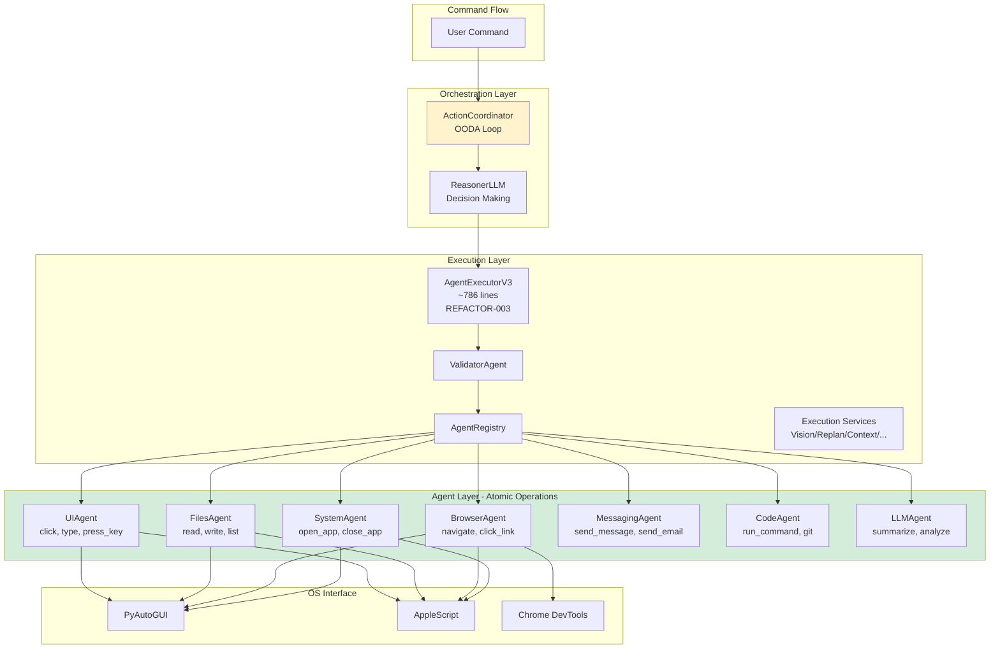
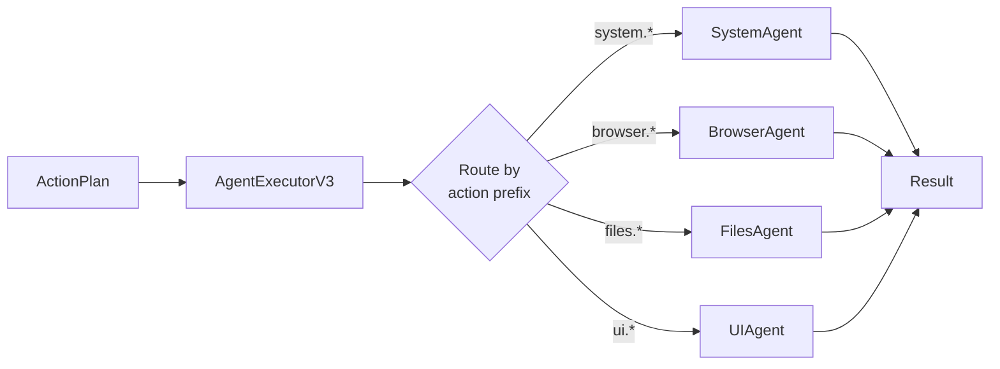

# Agent-Based Architecture (V3) - Atomic Operations Only

> **Architecture**: See [Complete System Architecture](./01-complete-system-architecture.md) for V3 Multi-Layer OODA Loop overview.

---


**UPDATE**: Simplified to single-layer architecture with atomic operations only.

Complete guide to Janus's agent-based execution system with atomic operations principle.

## 📋 Table of Contents

1. [Overview](#overview)
2. [Agent System Design](#agent-system-design)
3. [Available Agents](#available-agents)
4. [Agent Lifecycle](#agent-lifecycle)
5. [Action Routing](#action-routing)
6. [Creating New Agents](#creating-new-agents)

## Overview

Janus V3 uses a **simplified single-layer agent architecture** where agents provide ONLY atomic operations. All complex logic, fallbacks, and intelligence reside in the Reasoner/Orchestrator.

Key principles
- **Atomic Operations Only**: Each operation < 20 lines, no business logic
- **No Adapter Layer**: Adapters merged into agents - single concept
- **Dumb Execution**: Agents are mechanical executors, Reasoner provides intelligence
- **Clear Boundaries**: Each agent owns a domain (system, browser, files, etc.)
- **No Fallbacks**: If operation fails, escalate to Reasoner for alternative strategy
- **No Retry Logic**: Orchestrator handles retries, not agents
- **Consistent Results**: Structured return values

### Agent Architecture Overview



### Agent Pattern



## Agent System Design

### Atomic Operations Principle

**Key Change**: Eliminated agent/adapter confusion by merging adapters into agents and enforcing atomic operations only.

Previous approach (Problematic)
- Agents + Adapters = Unclear responsibility split
- ChromeAdapter: 2609 lines of complex logic
- FinderAdapter: 1584 lines with multi-step workflows
- Business logic scattered between agent and adapter
- Retry loops and fallbacks in adapters

Current approach (Simplified)
- Single agent layer with atomic operations only
- BrowserAgent: 440 lines, 6 atomic operations (TICKET-APP-002: +reader mode)
- FilesAgent: 265 lines, 7 atomic operations
- Zero business logic in agents
- All intelligence in Reasoner

**Atomic Operation Rules**
1. Each operation < 20 lines of actual logic
2. No retry loops (Orchestrator handles retries)
3. No fallback mechanisms (Reasoner decides alternatives)
4. No heuristics or "smart" behavior
5. No multi-step workflows
6. Mechanical execution only

**Examples**
- ✅ GOOD: `open_url(url)` - opens URL, nothing else
- ❌ BAD: `smart_navigate(url)` - tries multiple strategies, has fallbacks
- ✅ GOOD: `click(selector)` - clicks element by CSS selector
- ❌ BAD: `fill_form(data)` - fills multiple fields, validates, submits

### BaseAgent Protocol

All agents implement `BaseAgent`

```python
# janus/agents/base_agent.py
from abc import ABC, abstractmethod
from typing import Any, Dict, List

class BaseAgent(ABC):
    """Base class for all Janus agents"""
    
    @abstractmethod
    def get_available_actions(self) -> List[str]:
        """Return list of actions this agent can handle"""
        pass
    
    @abstractmethod
    def validate_action(self, action: str, params: Dict[str, Any]) -> bool:
        """Validate action before execution"""
        pass
    
    @abstractmethod
    def execute(self, action: str, params: Dict[str, Any]) -> Dict[str, Any]:
        """
        Execute action and return result.
        
        Returns:
            {
                "status": "success" | "error",
                "data": {...},  # Optional
                "error": "...",  # If status == "error"
                "duration_ms": 123.45
            }
        """
        pass
```

### Agent Registration

Agents register with the executor

```python
# janus/core/agent_registry.py
class AgentRegistry:
    def __init__(self):
        self.agents = {
            "system": SystemAgent(),
            "browser": BrowserAgent(),
            "files": FilesAgent(),
            "ui": UIAgent(),
            "messaging": MessagingAgent(),
            "code": CodeAgent(),
            "llm": LLMAgent(),
            "crm": CRMAgent()
        }
    
    def execute(self, action: str, params: Dict) -> Dict:
        # Route: "system.open_app" → SystemAgent
        agent_name, action_name = action.split(".", 1)
        agent = self.agents[agent_name]
        
        # Validate before executing
        if not agent.validate_action(action_name, params):
            return {"status": "error", "error": "Invalid action"}
        
        # Execute
        return agent.execute(action_name, params)
```

## Available Agents

### 1. SystemAgent

**File**: `janus/agents/system_agent.py`

**Domain**: System-level operations

**Actions**
- `system.open_application` - Launch apps
- `system.close_application` - Close apps
- `system.focus_application` - Bring to foreground
- `system.quit_application` - Force quit
- `system.shutdown` - Shutdown system
- `system.sleep` - Sleep system
- `system.lock` - Lock screen

**Example**
```python
result = agent.execute("open_application", {
    "app_name": "Safari"
})
# {"status": "success", "data": {"pid": 1234}}
```

### 2. BrowserAgent ⚡ REFACTORED

**File**: `janus/agents/browser_agent.py`
**Size**: 440 lines (was 808 + 2609 lines with ChromeAdapter)
**Domain**: Web browser automation with atomic operations only

**Atomic Operations** (6 total)
- `open_url(url)` - Open URL in browser (no smart navigation)
- `click(selector)` - Click element by CSS selector (no vision fallback)
- `type_text(text)` - Type text in focused element (no smart focus)
- `press_key(keys)` - Press keyboard key(s) (no shortcuts)
- `extract_text(selector?)` - Extract text from page/element (no processing)
- `get_page_content()` - Extract main article content as Markdown (TICKET-APP-002)

**Removed** (moved to Reasoner)
- ❌ `smart_navigate` - Used multiple fallback strategies
- ❌ `fill_form` - Multi-step form filling
- ❌ `search` - Complex search with DOM/Vision/URL fallbacks
- ❌ Vision fallbacks - Reasoner decides when to use vision
- ❌ Retry logic - Orchestrator handles retries
- ❌ URL construction heuristics - Reasoner builds URLs

**Example**
```python
# Atomic operation - just opens URL
result = await agent.execute("open_url", {
    "url": "https://google.com"
}, context)
# {"status": "success", "data": {"url": "https://google.com"}}

# If you need search, Reasoner chains: open_url → type_text → press_key

# Reader Mode - extract article content without scrolling (TICKET-APP-002)
result = await agent.execute("get_page_content", {}, context)
# {"status": "success", "data": {"content": "# Article Title\n\nMain content...", "format": "markdown"}}
```

### 3. FilesAgent ⚡ REFACTORED

**File**: `janus/agents/files_agent.py`
**Size**: 265 lines (was 256 + 1584 lines with FinderAdapter)
**Domain**: File system operations with atomic operations only

**Atomic Operations** (7 total)
- `open_path(path)` - Open file/folder in OS default app
- `read_file(path)` - Read file contents (no processing)
- `write_file(path, content)` - Write to file (no validation)
- `move_file(src, dest)` - Move/rename file (no checks)
- `copy_file(src, dest)` - Copy file or directory
- `delete_file(path)` - Delete file or directory
- `list_directory(path)` - List directory contents (no filtering)

**Removed** (moved to Reasoner)
- ❌ `search_files` - Complex file search logic
- ❌ FinderAdapter dependency - Merged into agent
- ❌ Multi-step workflows - Reasoner chains operations
- ❌ Validation logic - Reasoner validates before calling

**Example**
```python
# Atomic operation - just reads file
result = await agent.execute("read_file", {
    "path": "/Users/me/document.txt"
}, context)
# {"status": "success", "data": {"content": "...", "path": "..."}}

# If you need to search then open, Reasoner chains: list_directory → read_file
```

### 4. UIAgent

**File**: `janus/agents/ui_agent.py`

**Domain**: GUI automation

**Actions**
- `ui.click` - Click at coordinates
- `ui.click_element` - Click by vision/OCR
- `ui.type_text` - Type text
- `ui.press_key` - Press keyboard key
- `ui.drag` - Drag mouse
- `ui.scroll` - Scroll window

**Example**
```python
result = agent.execute("click_element", {
    "description": "OK button",
    "use_vision": True
})
# {"status": "success", "data": {"coordinates": [100, 200]}}
```

### 5. MessagingAgent

**File**: `janus/agents/messaging_agent.py`

**Domain**: Messaging platforms

**Actions**
- `messaging.send_message` - Send message
- `messaging.read_messages` - Get recent messages
- `messaging.send_email` - Send email

**Example**
```python
result = agent.execute("send_message", {
    "platform": "slack",
    "channel": "general",
    "message": "Hello!"
})
```

### 6. CodeAgent

**File**: `janus/agents/code_agent.py`

**Domain**: Development tools

**Actions**
- `code.open_file` - Open in editor
- `code.run_command` - Execute shell command
- `code.git_commit` - Git operations
- `code.format_code` - Code formatting

**Example**
```python
result = agent.execute("open_file", {
    "path": "/project/main.py",
    "editor": "vscode"
})
```

### 7. LLMAgent

**File**: `janus/agents/llm_agent.py`

**Domain**: LLM-powered tasks

**Actions**
- `llm.summarize` - Summarize text
- `llm.code_review` - Review code
- `llm.translate` - Translate text
- `llm.explain` - Explain concept

**Example**
```python
result = agent.execute("summarize", {
    "text": "Long article...",
    "max_length": 100
})
# {"status": "success", "data": {"summary": "..."}}
```

### 8. CRMAgent

**File**: `janus/agents/crm_agent.py`

**Domain**: CRM systems

**Actions**
- `crm.add_contact` - Add contact
- `crm.search_contacts` - Find contacts
- `crm.update_contact` - Update info

## Agent Lifecycle

### Initialization

```python
class SystemAgent(BaseAgent):
    def __init__(self, settings: Settings):
        self.settings = settings
        self.is_mac = platform.system() == "Darwin"
        self._executor = None  # Lazy load
    
    @property
    def executor(self):
        if self._executor is None:
            self._executor = AppleScriptExecutor()
        return self._executor
```

### Validation

```python
def validate_action(self, action: str, params: Dict) -> bool:
    # Check action exists
    if action not in self.get_available_actions():
        return False
    
    # Check required parameters
    if action == "open_application":
        if "app_name" not in params:
            return False
    
    # Check parameter types
    if not isinstance(params.get("app_name"), str):
        return False
    
    return True
```

### Execution

```python
def execute(self, action: str, params: Dict) -> Dict:
    start_time = time.time()
    
    try:
        # Route to handler
        handler = getattr(self, f"_handle_{action}")
        result = handler(params)
        
        duration = (time.time() - start_time) * 1000
        return {
            "status": "success",
            "data": result,
            "duration_ms": duration
        }
    
    except Exception as e:
        logger.error(f"Agent execution error: {e}")
        return {
            "status": "error",
            "error": str(e),
            "duration_ms": (time.time() - start_time) * 1000
        }
```

## Action Routing

### Naming Convention

Actions use dot notation: `{agent}.{action}`

Examples
- `system.open_application`
- `browser.navigate`
- `files.read`
- `ui.click_element`

### Routing Logic

```python
def _route_action(self, action: str) -> Tuple[BaseAgent, str]:
    """Route action to appropriate agent"""
    
    # Parse action string
    if "." not in action:
        raise ValueError(f"Invalid action format: {action}")
    
    agent_name, action_name = action.split(".", 1)
    
    # Get agent
    agent = self.agents.get(agent_name)
    if agent is None:
        raise ValueError(f"Unknown agent: {agent_name}")
    
    return agent, action_name
```

### Multi-Step Execution

```python
async def execute_plan(self, plan: ActionPlan) -> ExecutionResult:
    """Execute multi-step action plan"""
    results = []
    
    for step in plan.steps:
        # Route to agent
        agent, action = self._route_action(step.action)
        
        # Execute step
        result = agent.execute(action, step.parameters)
        results.append(result)
        
        # Stop on error
        if result["status"] == "error":
            break
    
    return ExecutionResult(
        success=all(r["status"] == "success" for r in results),
        action_results=results
    )
```

## Creating New Agents

### Step 1: Define Agent Class

```python
# janus/agents/my_agent.py
from .base_agent import BaseAgent

class MyAgent(BaseAgent):
    """Agent for my custom functionality"""
    
    def __init__(self, settings: Settings):
        self.settings = settings
    
    def get_available_actions(self) -> List[str]:
        return ["my_action", "another_action"]
    
    def validate_action(self, action: str, params: Dict) -> bool:
        if action not in self.get_available_actions():
            return False
        
        # Validate parameters
        if action == "my_action":
            return "param1" in params
        
        return True
    
    def execute(self, action: str, params: Dict) -> Dict:
        try:
            if action == "my_action":
                return self._handle_my_action(params)
            else:
                return {"status": "error", "error": "Unknown action"}
        except Exception as e:
            return {"status": "error", "error": str(e)}
    
    def _handle_my_action(self, params: Dict) -> Dict:
        # Implementation
        result = do_something(params["param1"])
        return {
            "status": "success",
            "data": {"result": result}
        }
```

### Step 2: Register Agent

```python
# janus/core/agent_setup.py
from janus.agents.my_agent import MyAgent

def setup_agent_registry():
    registry = AgentRegistry()
    registry.register_agent("my", MyAgent())
    # ... existing agents ...
    return registry
```

### Step 3: Add to LLM Prompt

```jinja2
{# prompts/reasoner_system.jinja2 #}
Available agents:
- system: system.open_application, system.close_application, ...
- browser: browser.navigate, browser.new_tab, ...
- my: my.my_action, my.another_action  {# NEW #}
```

### Step 4: Test

```python
# tests/test_my_agent.py
def test_my_action():
    agent = MyAgent(Settings())
    result = agent.execute("my_action", {"param1": "test"})
    assert result["status"] == "success"
```

---

**Next**: [05-data-flow.md](05-data-flow.md) - Complete data transformation pipeline

## See Also

- [Complete System Architecture](./01-complete-system-architecture.md) - Full system overview
- [Agent Registry](./06-module-registry.md) - How agents are routed
- [Agent Executor V3](./01-complete-system-architecture.md#agentexecutorv3) - Agent execution engine
- [System Bridge](./19-system-bridge.md) - Platform abstraction
