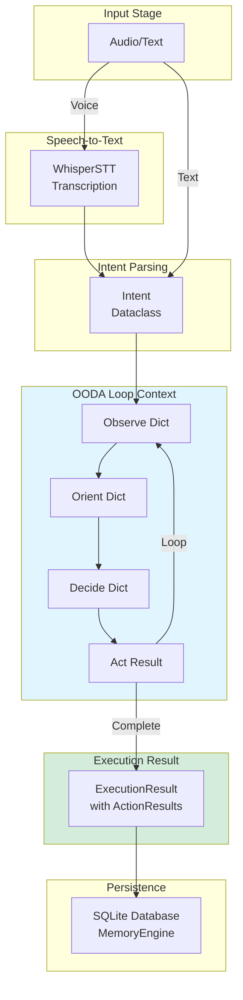

# Data Flow & Transformations

> **Architecture**: See [Complete System Architecture](./01-complete-system-architecture.md) for V3 Multi-Layer OODA Loop overview.

---


Complete guide to data structures and transformations throughout the Janus pipeline.

## 📋 Table of Contents

1. [Overview](#overview)
2. [Data Contracts](#data-contracts)
3. [Transformation Pipeline](#transformation-pipeline)
4. [Dynamic Memory Pipeline](#dynamic-memory-pipeline)
5. [Serialization](#serialization)
6. [Error Handling](#error-handling)

## Overview

Data flows through Janus in well-defined stages, with clear contracts at each transformation point.

### Complete Data Flow Diagram



### Pipeline Data Flow

```
Audio Bytes → Text String → Intent → ActionPlan → ExecutionResult → Database Record
```

The system now includes a **Dynamic Memory Pipeline** for variable passing between steps and applications.

### Type Safety

All data structures use Python dataclasses from `janus/core/contracts.py`:

```python
from janus.core.contracts import (
    Intent,
    ActionPlan,
    ActionIntent,
    ExecutionResult,
    ActionResult,
    CommandError
)
```

## Data Contracts

### 1. Intent

**Purpose**: Represents user's intention after parsing

```python
@dataclass
class Intent:
    """User's parsed intention"""
    action_type: str              # e.g., "open_app", "click", "navigate"
    parameters: Dict[str, Any]    # Action-specific params
    confidence: float             # 0.0 to 1.0
    language: str                 # "fr" or "en"
    raw_text: str                 # Original command text
    metadata: Optional[Dict]      # Additional context
```

**Example**:
```python
intent = Intent(
    action_type="open_app",
    parameters={"app_name": "Safari"},
    confidence=0.95,
    language="en",
    raw_text="open Safari"
)
```

### 2. ActionPlan

**Purpose**: Structured execution plan with ordered steps

```python
@dataclass
class ActionPlan:
    """Multi-step action plan"""
    workflow_id: str                    # Unique identifier
    description: str                    # Human-readable description
    steps: List[ActionIntent]           # Ordered actions
    context: Optional[Dict[str, Any]]   # Execution context
    estimated_duration_ms: Optional[float]

@dataclass
class ActionIntent:
    """Single step in action plan"""
    action: str                   # "system.open_app", "browser.navigate"
    parameters: Dict[str, Any]    # Action parameters
    step_number: int              # Order in sequence
    description: str              # What this step does
```

**Example**:
```python
plan = ActionPlan(
    workflow_id="wf_123",
    description="Open browser and navigate to a website",
    steps=[
        ActionIntent(
            action="system.open_application",
            parameters={"app_name": "Safari"},
            step_number=1,
            description="Launch Safari browser"
        ),
        ActionIntent(
            action="browser.navigate",
            parameters={"url": "https://example.com"},
            step_number=2,
            description="Navigate to example website"
        )
    ]
)
```

### 3. ExecutionResult

**Purpose**: Complete execution outcome

```python
@dataclass
class ExecutionResult:
    """Result of executing action plan"""
    success: bool                         # Overall success
    action_results: List[ActionResult]    # Per-step results
    total_duration_ms: float              # Total time
    error: Optional[CommandError]         # Error if failed
    workflow_id: str                      # Associated workflow
    timestamp: datetime                   # Execution time

@dataclass
class ActionResult:
    """Result of single action"""
    status: str                  # "success", "error", "partial"
    data: Optional[Dict]         # Result data
    error: Optional[str]         # Error message if failed
    duration_ms: float           # Action execution time
    action: str                  # Action that was executed
```

**Example**:
```python
result = ExecutionResult(
    success=True,
    action_results=[
        ActionResult(
            status="success",
            data={"pid": 1234},
            duration_ms=350.5,
            action="system.open_application"
        ),
        ActionResult(
            status="success",
            data={"final_url": "https://example.com"},
            duration_ms=1250.2,
            action="browser.navigate"
        )
    ],
    total_duration_ms=1600.7,
    workflow_id="wf_123",
    timestamp=datetime.now()
)
```

### 4. CommandError

**Purpose**: Structured error information

```python
@dataclass
class CommandError:
    """Error information"""
    type: ErrorType              # Enum of error types
    message: str                 # Human-readable message
    recoverable: bool            # Can retry?
    details: Optional[Dict]      # Additional context
    
class ErrorType(Enum):
    PARSE_ERROR = "parse_error"
    PLANNING_ERROR = "planning_error"
    EXECUTION_FAILED = "execution_failed"
    TIMEOUT = "timeout"
    PERMISSION_DENIED = "permission_denied"
```

## Transformation Pipeline

### Stage 1: Audio → Text

```python
# Input: Audio bytes
audio_data: bytes = microphone.capture()

# Process through STT
stt = WhisperSTT(settings)
text: str = stt.transcribe(audio_data)

# Output: "open Safari"
```

### Stage 2: Text → Intent

```python
# Input: Text string
text: str = "open Safari"

# Parse with NLU
nlu = DeterministicNLU(settings)
intent: Intent = nlu.parse(text)

# Output: Intent(action_type="open_app", parameters={"app_name": "Safari"}, ...)
```

### Stage 3: Intent → ActionPlan

**Note**: The current architecture uses Dynamic ReAct Loop (see [13-dynamic-react-loop.md](13-dynamic-react-loop.md)).

**Dynamic ReAct Loop (Current Architecture)**:
```python
# Use decide_next_action for ReAct-style execution
reasoner = ReasonerLLM(backend="ollama")
memory = {}

while True:
    # Get current visual context
    visual_context = vision.get_interactive_elements()
    system_state = get_system_state()
    
    # Decide next action based on current state
    action = reasoner.decide_next_action(
        user_goal="Find CEO of Acme Corp",
        system_state=system_state,
        visual_context=visual_context,
        memory=memory
    )
    
    if action["action"] == "done":
        break
    
    # Execute and update memory
    result = execute_action(action)
    if action["action"] == "save_to_memory":
        memory[action["args"]["key"]] = action["args"]["value"]
```

**previous Deterministic Planner (Superseded)**:
```python
# Input: Intent
intent: Intent = Intent(action_type="open_app", parameters={"app_name": "Safari"})

# Create plan
planner = DeterministicPlanner()
plan: ActionPlan = planner.create_plan(intent)

# Output: ActionPlan with single step
```

### Stage 4: ActionPlan → ExecutionResult

```python
# Input: ActionPlan
plan: ActionPlan = ActionPlan(steps=[...])

# Execute
from janus.core.agent_executor_v3 import AgentExecutorV3
from janus.core.agent_registry import get_global_agent_registry

executor = AgentExecutorV3(agent_registry=get_global_agent_registry())
result: ExecutionResult = await executor.execute_plan(steps=plan.steps, intent=intent, ...)

# Output: ExecutionResult with action_results
```

### Stage 5: ExecutionResult → Database

```python
# Input: ExecutionResult
result: ExecutionResult = ExecutionResult(success=True, ...)

# Store
memory = MemoryEngine(db_path="janus.db")
memory.store_execution(
    session_id="session_123",
    command=text,
    result=result
)

# Stored in SQLite
```

## Dynamic Memory Pipeline

Dynamic Memory enables variable passing between actions and applications.

### Overview

The Dynamic Memory Pipeline allows the agent to:
- Extract information from one window/app
- Store it in memory
- Use it in another window/app

**Example Scenario**: "Take contact information from a professional network and add it to a CRM system"

### Architecture

```
┌─────────────────┐
│  Visual Context │ → Extract data from screen
└────────┬────────┘
         │
         ▼
┌─────────────────┐
│ save_to_memory  │ → Store: {"CEO_name": "John Smith"}
└────────┬────────┘
         │
         ▼
┌─────────────────┐
│  Memory Store   │ → Persists across actions
└────────┬────────┘
         │
         ▼
┌─────────────────┐
│  Next Action    │ → Access: memory["CEO_name"]
└─────────────────┘
```

### Usage

#### 1. Save Data to Memory

```python
from janus.core.unified_memory import UnifiedMemoryManager

# Initialize memory manager
memory = UnifiedMemoryManager(db_settings, session_id="session_123")

# Save extracted data
memory.save_to_memory("contact_name", "Jane Doe")
memory.save_to_memory("company_revenue", "$10M")
memory.save_to_memory("profile_url", "https://professional-network.com/janedoe")
```

#### 2. Retrieve Data from Memory

```python
# Get single value
contact_name = memory.get_from_memory("contact_name")  # Returns: "Jane Doe"

# Get all memory
all_data = memory.get_all_memory()
# Returns: {
#   "contact_name": "Jane Doe",
#   "company_revenue": "$10M",
#   "profile_url": "https://professional-network.com/janedoe"
# }
```

#### 3. Memory in ReAct Loop

The reasoner automatically receives memory data in each iteration:

```python
# Memory is passed to decide_next_action
action = reasoner.decide_next_action(
    user_goal="Add contact name to CRM",
    system_state={"active_app": "Safari", "url": "https://crm-system.com"},
    visual_context="[{'id': 'name_field_1', 'type': 'input', ...}]",
    memory={"contact_name": "Jane Doe"}  # Available to reasoner
)

# Reasoner can use the stored data
# Returns: {
#   "action": "type_text",
#   "args": {"element_id": "name_field_1", "text": "Jane Doe"},
#   "reasoning": "Using CEO name from memory to fill the field"
# }
```

#### 4. Format in Reasoner Prompt

The memory is injected into the prompt like this:

```
**Mémoire (données mémorisées)** :
{
  "CEO_name": "John Smith",
  "company_revenue": "$10M"
}
```

The LLM can then reference these values when deciding the next action.

### API Reference

#### UnifiedMemoryManager Methods

```python
# Save data
memory.save_to_memory(key: str, value: Any)

# Retrieve data
memory.get_from_memory(key: str) -> Optional[Any]

# Get all memory
memory.get_all_memory() -> Dict[str, Any]

# Clear memory (keeps session history)
memory.clear_memory()
```

#### SessionContext Methods

The underlying storage uses SessionContext:

```python
from janus.memory.session_context import SessionContext

context = SessionContext()

# Save/retrieve data
context.save_to_memory("key", "value")
value = context.get_from_memory("key")
all_memory = context.get_all_memory()
```

### Multi-Application Scenarios

#### Scenario 1: Professional Network → CRM System

**Goal**: "Find contact information and add it to our CRM"

**Step 1** - Extract from professional network:
```python
# Visual: Profile page
action = {
    "action": "extract_data",
    "args": {
        "element_id": "profile_name_42",
        "key": "contact_name"
    }
}
# Internally calls: memory.save_to_memory("contact_name", "Jane Doe")
```

**Step 2** - Open CRM:
```python
# Memory: {"contact_name": "Jane Doe"}
action = {
    "action": "open_url",
    "args": {"url": "https://crm-system.com/contacts/new"}
}
```

**Step 3** - Fill CRM form:
```python
# Memory: {"contact_name": "Jane Doe"}
# Visual: CRM form with name field
action = {
    "action": "type_text",
    "args": {
        "element_id": "contact_name_field",
        "text": "Jane Doe"  # From memory
    }
}
```

#### Scenario 2: Website → Email

**Goal**: "Send an email with the price from this website"

**Step 1** - Extract price:
```python
# Visual: Product page
action = {
    "action": "extract_data",
    "args": {
        "element_id": "price_text_15",
        "key": "product_price"
    }
}
# Stores: {"product_price": "$99.99"}
```

**Step 2** - Open Mail app:
```python
action = {
    "action": "open_app",
    "args": {"app_name": "Mail"}
}
```

**Step 3** - Compose email with price:
```python
# Memory: {"product_price": "$99.99"}
action = {
    "action": "type_text",
    "args": {
        "element_id": "email_body_field",
        "text": "The price is $99.99"  # From memory
    }
}
```

### Memory Lifecycle

Memory persists:
- ✅ Across actions within a session
- ✅ Across different applications
- ✅ Until session ends or memory is cleared
- ❌ Does NOT persist after session ends (by design)

To persist data long-term, use the database storage:
```python
# Store in persistent database
memory.store_context(
    context_type="extracted_data",
    data={"CEO_name": "John Smith"}
)
```

### Benefits

1. **No Clipboard Required**: Agent uses internal memory instead of OS clipboard
2. **Type Safety**: Store any JSON-serializable data (strings, numbers, objects)
3. **Context Aware**: Reasoner sees all stored data when making decisions
4. **Multi-App Support**: Data flows seamlessly between applications
5. **Traceable**: Memory is part of session context for debugging

### Implementation Notes

- Memory is stored in `SessionContext.dynamic_memory`
- Memory is cleared when session ends or `clear_memory()` is called
- Memory is NOT persisted to database by default (ephemeral)
- Memory is included in `get_context_for_chaining()` for ReAct loop

### See Also

- [Dynamic ReAct Loop](13-dynamic-react-loop.md) - ReAct loop architecture
- [System Context Grounding](09-system-context-grounding.md) - Context injection
- Implementation: `janus/memory/session_context.py`
- Implementation: `janus/core/unified_memory.py`

---

## Serialization

### JSON Serialization

All dataclasses can be serialized to JSON:

```python
from dataclasses import asdict
import json

# Serialize
plan = ActionPlan(...)
json_str = json.dumps(asdict(plan))

# Deserialize
data = json.loads(json_str)
plan = ActionPlan(**data)
```

### Database Serialization

Results are stored as JSON in SQLite:

```python
# Store
cursor.execute(
    "INSERT INTO commands (command, result, timestamp) VALUES (?, ?, ?)",
    (text, json.dumps(asdict(result)), datetime.now())
)

# Retrieve
cursor.execute("SELECT result FROM commands WHERE id = ?", (cmd_id,))
result_json = cursor.fetchone()[0]
result = ExecutionResult(**json.loads(result_json))
```

## Error Handling

### Error Propagation

Errors are wrapped in CommandError and included in ExecutionResult:

```python
try:
    result = agent.execute(action, params)
except Exception as e:
    result = ExecutionResult(
        success=False,
        action_results=[],
        error=CommandError(
            type=ErrorType.EXECUTION_FAILED,
            message=str(e),
            recoverable=False
        )
    )
```

### Error Recovery

Vision recovery for UI errors:

```python
result = executor.execute(action, params)

if not result.success and action.startswith("ui."):
    # Try vision recovery
    result = vision_executor.execute_with_vision(action, params)
```

---

**Next**: [06-module-registry.md](06-module-registry.md) - Module system and extensibility

## See Also

- [Complete System Architecture](./01-complete-system-architecture.md) - Full system overview
- [Unified Pipeline](./02-unified-pipeline.md) - OODA loop flow
- [Memory Engine](./17-memory-engine.md) - Data persistence
