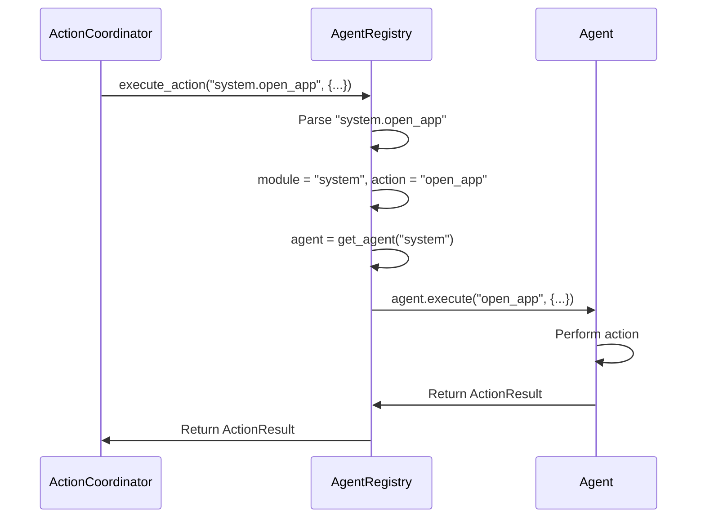

# Agent Registry - Action Routing System

> **Architecture**: See [Complete System Architecture](./01-complete-system-architecture.md) for V3 Multi-Layer OODA Loop overview.

---

## Overview

The **AgentRegistry** is a centralized routing system that maps action prefixes to domain-specific agents. It provides stable, predictable routing for all action execution in Janus V3.

### Agent Registry Architecture

```mermaid
graph TB
    subgraph Coordinator["ActionCoordinator"]
        CMD[User Command<br/>"open Calculator"]
        DEC[Reasoner Decision<br/>action: system.open_app]
    end
    
    subgraph Registry["AgentRegistry"]
        ROUTE[Action Router]
        MAP[Module Mapping]
    end
    
    subgraph Agents["Domain Agents"]
        SYS[SystemAgent<br/>system.*]
        BROW[BrowserAgent<br/>browser.*]
        FILES[FilesAgent<br/>files.*]
        UI[UIAgent<br/>ui.*]
        MSG[MessagingAgent<br/>messaging.*]
        CODE[CodeAgent<br/>code.*]
        LLM[LLMAgent<br/>llm.*]
        TERM[TerminalAgent<br/>terminal.*]
    end
    
    subgraph Result["Execution"]
        EXEC[Execute Action]
        RES[Return ActionResult]
    end
    
    CMD --> DEC
    DEC --> ROUTE
    ROUTE --> MAP
    MAP -->|system.open_app| SYS
    MAP -->|browser.navigate| BROW
    MAP -->|files.read| FILES
    MAP -->|ui.click| UI
    MAP -->|messaging.send| MSG
    MAP -->|code.run| CODE
    MAP -->|llm.summarize| LLM
    MAP -->|terminal.execute| TERM
    SYS & BROW & FILES & UI & MSG & CODE & LLM & TERM --> EXEC
    EXEC --> RES
    
    style Registry fill:#fff3cd
    style Agents fill:#d4edda
```

## Implementation

### File Location

`janus/core/agent_registry.py`

### Core Functionality

```python
class AgentRegistry:
    """
    Centralized registry for mapping modules to agents/adapters.
    
    Provides stable, predictable routing for action execution.
    Each module name maps to a specific agent that handles its actions.
    """
    
    def __init__(self):
        """Initialize empty agent registry"""
        self._agents: Dict[str, Any] = {}
        self._module_aliases: Dict[str, str] = {
            "chrome": "browser",
            "safari": "browser",
            "vscode": "code",
            "slack": "messaging",
            "vision": "ui",
        }
    
    def register(self, module: str, agent: Any) -> None:
        """Register an agent for a specific module"""
        self._agents[module] = agent
    
    def get_agent(self, module: str) -> Optional[Any]:
        """Get agent for module, resolving aliases"""
        module = self._module_aliases.get(module, module)
        return self._agents.get(module)
    
    def execute_action(self, action: str, parameters: Dict) -> ActionResult:
        """Route action to appropriate agent"""
        module, action_name = action.split('.', 1)
        agent = self.get_agent(module)
        
        if not agent:
            return ActionResult(
                success=False,
                error=f"No agent registered for module: {module}"
            )
        
        return agent.execute(action_name, parameters)
```

## Module to Agent Mapping

The registry maintains the following stable mappings:

| Module Prefix | Agent Class | Purpose |
|--------------|------------|---------|
| **system** | SystemAgent | App launching, system operations |
| **browser** | BrowserAgent | Web automation (Chrome/Safari) |
| **files** | FilesAgent | File operations (read, write, list) |
| **ui** | UIAgent | UI automation, vision-based actions |
| **messaging** | MessagingAgent | Slack, email, Teams |
| **code** | CodeAgent | Editor operations, VSCode |
| **llm** | LLMAgent | LLM interactions, summarization |
| **terminal** | TerminalAgent | Shell command execution |
| **finder** | FinderAgent | macOS Finder operations |

### Module Aliases

For convenience, the registry supports aliases:

| Alias | Resolves To |
|-------|------------|
| chrome | browser |
| safari | browser |
| vscode | code |
| slack | messaging |
| vision | ui |

## Action Routing Flow

### 1. Action Format

Actions follow the format: `module.action_name`

Examples:
- `system.open_app` → SystemAgent
- `browser.navigate` → BrowserAgent
- `files.read` → FilesAgent
- `ui.click` → UIAgent

### 2. Routing Process



### 3. Error Handling

If no agent is registered for a module:
```python
ActionResult(
    success=False,
    error="No agent registered for module: unknown_module"
)
```

## Agent Registration

### At Startup

Agents are registered at system initialization:

```python
# In agent_setup.py or similar
registry = AgentRegistry()

# Register core agents
registry.register("system", SystemAgent())
registry.register("browser", BrowserAgent())
registry.register("files", FilesAgent())
registry.register("ui", UIAgent())
registry.register("messaging", MessagingAgent())
registry.register("code", CodeAgent())
registry.register("llm", LLMAgent())
registry.register("terminal", TerminalAgent())
```

### Global Registry

A single global registry instance is used throughout:

```python
_global_registry = None

def get_global_agent_registry() -> AgentRegistry:
    """Get the global agent registry (singleton)"""
    global _global_registry
    if _global_registry is None:
        _global_registry = AgentRegistry()
        # Register all agents
        _initialize_agents(_global_registry)
    return _global_registry
```

## Integration with Execution

### In AgentExecutorV3

```python
class AgentExecutorV3:
    def __init__(self):
        self.registry = get_global_agent_registry()
    
    async def execute_step(self, step: Dict) -> ActionResult:
        """Execute a single action step"""
        action = step["action"]  # e.g., "system.open_app"
        parameters = step.get("args", {})
        
        # Route through registry
        result = self.registry.execute_action(action, parameters)
        
        return result
```

### In ActionCoordinator

```python
class ActionCoordinator:
    def __init__(self):
        self.executor = AgentExecutorV3()
        # Executor has access to registry
    
    async def _act(self, action: Dict) -> ActionResult:
        """Execute action via executor (which uses registry)"""
        return await self.executor.execute_step(action)
```

## Benefits

### 1. **Stable Routing**
- Consistent mapping from action prefix to agent
- No ambiguity about which agent handles an action

### 2. **Centralized Management**
- Single place to register/manage agents
- Easy to add new agents

### 3. **Alias Support**
- Convenient shortcuts (chrome → browser)
- Backward compatibility

### 4. **Type Safety**
- Clear module → agent mapping
- Predictable execution path

### 5. **Testability**
- Easy to mock agents for testing
- Registry can be reset between tests

## Usage Examples

### Example 1: System Action

```python
# Reasoner generates action
action = {
    "action": "system.open_app",
    "args": {"app_name": "Calculator"}
}

# Registry routes to SystemAgent
result = registry.execute_action(
    action="system.open_app",
    parameters={"app_name": "Calculator"}
)
```

### Example 2: Browser Action

```python
action = {
    "action": "browser.navigate",
    "args": {"url": "https://google.com"}
}

result = registry.execute_action(
    action="browser.navigate",
    parameters={"url": "https://google.com"}
)
```

### Example 3: Using Alias

```python
# "chrome" alias resolves to "browser" module
action = {
    "action": "chrome.navigate",  # Alias!
    "args": {"url": "https://google.com"}
}

# Registry automatically resolves chrome → browser
result = registry.execute_action(
    action="chrome.navigate",
    parameters={"url": "https://google.com"}
)
```

## Extending the Registry

### Adding a New Agent

To add support for a new domain:

1. **Create the Agent**

```python
# janus/agents/my_new_agent.py
from janus.agents.base_agent import BaseAgent

class MyNewAgent(BaseAgent):
    def execute(self, action: str, parameters: Dict) -> ActionResult:
        if action == "my_action":
            return self._my_action(parameters)
        return ActionResult(success=False, error=f"Unknown action: {action}")
```

2. **Register the Agent**

```python
# In agent initialization
registry.register("mynew", MyNewAgent())
```

3. **Use the Agent**

```python
# Reasoner can now generate actions like:
{
    "action": "mynew.my_action",
    "args": {...}
}
```

## Performance

- **Lookup Time**: O(1) dictionary lookup
- **Memory**: Minimal overhead (~1-2MB for all agents)
- **Thread Safety**: Single-threaded access (Python GIL)

## See Also

- [Agent Architecture](./04-agent-architecture.md) - Details on individual agents
- [Action Coordinator](./14-action-coordinator.md) - How actions are coordinated
- [Agent Executor V3](./01-complete-system-architecture.md#agentexecutorv3) - Step execution

---

**Document Version:** 2.0  
**Last Updated:** December 2024  
**Verified Against:** janus/core/agent_registry.py
