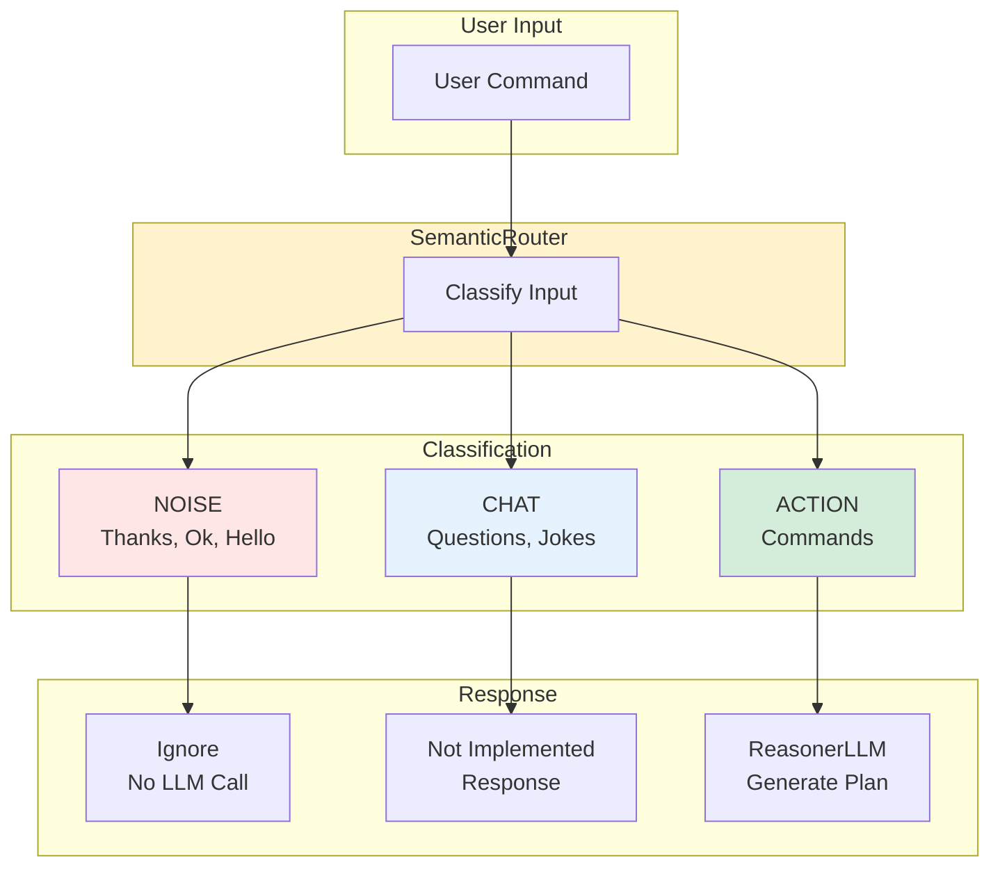

# Semantic Gatekeeper

> **Architecture**: See [Complete System Architecture](./01-complete-system-architecture.md) for V3 Multi-Layer OODA Loop overview.

---


## Overview

The **Semantic Gatekeeper** (or semantic input filter) is a critical performance optimization that filters user input BEFORE any expensive Reasoner LLM calls.

### Problem Solved

Before this implementation, **all** user inputs (including "Thanks", "Hello", "Ok") triggered the Reasoner LLM which:
- Took 2-10 seconds to process
- Consumed LLM tokens unnecessarily
- Sometimes hallucinated actions on trivial inputs

### Solution: Ultra-Fast Classification

The SemanticRouter classifies input into **3 categories** in <50ms:

1. **NOISE**: Politeness, affirmations, incomplete inputs
   - Examples: "Thanks", "Hello", "Ok", "Agreed"
   - Action: Ignored immediately, no Reasoner call

2. **CHAT**: General knowledge questions, conversation, jokes
   - Examples: "Tell me a joke", "What's the weather?"
   - Action: "Not implemented" response (for now)

3. **ACTION**: Commands requiring system actions
   - Examples: "Open Safari", "Search on Google"
   - Action: Continue to Reasoner for plan generation

### Semantic Router Architecture



## Architecture

### Pipeline Integration

```
Input → SemanticRouter → [NOISE/CHAT] → Return immediately
 ↓
 [ACTION]
 ↓
 ReasonerLLM → Validator → Executor
```

### Implementation

**File**: `janus/reasoning/semantic_router.py`

```python
class SemanticRouter:
 """Ultra-light semantic input classifier"""
 
 def classify_intent(self, text: str) -> str:
 """
 Classify input into NOISE, CHAT, or ACTION.
 Returns classification in <50ms.
 """
 # Try LLM classification if available
 if self.use_llm:
 return self._classify_with_llm(text)
 
 # TICKET-ROUTER-001: Try embedding-based classification
 if self._use_embeddings:
 return self._classify_with_embeddings(text)
 
 # Fallback to keyword-based classification
 return self._classify_with_keywords(text)
```

### Classification Methods (Priority Order)

The SemanticRouter uses multiple classification strategies in order of priority:

#### 1. LLM-Based Classification (Primary)

The SemanticRouter uses the same LLM as the Reasoner, but with ultra-light parameters:
- `max_tokens=10` (only needs one word)
- `json_mode=True` (structured JSON output - TICKET-500)
- Minimal prompt (few lines)

**System Prompt**
```
CLASSIFY INPUT into one of three categories.
OUTPUT MUST BE VALID JSON with this exact structure: {"intent": "NOISE|CHAT|ACTION"}

Categories:
- "NOISE": Politesse (merci, salut), affirmation (ok, d'accord), incomplet, bruit.
- "CHAT": Question culture générale, blague, conversation, question non-actionnable.
- "ACTION": Demande d'action système (ouvrir, chercher, envoyer, mettre, créer, supprimer).

INPUT: "{text}"
JSON OUTPUT:
```

#### 2. Embedding-Based Classification (TICKET-ROUTER-001)

**Zero-shot classification using semantic embeddings** - Handles linguistic variations better than keywords.

When LLM is unavailable, the router uses embeddings to compute semantic similarity:
- Uses `sentence-transformers/all-MiniLM-L6-v2` model
- Pre-computed centroids for 3 categories (NOISE, CHAT, ACTION)
- Classifies by finding nearest centroid using cosine similarity
- **Handles franglais and linguistic variations** (e.g., "Peux-tu check mes mails" → ACTION)

**Benefits over keyword matching:**
- Robust to spelling variations and code-switching (franglais)
- Semantic understanding (not just keyword matching)
- No manual keyword list maintenance
- Gracefully handles new vocabulary
- Language-agnostic through externalized configuration

**Representative examples configuration:**
Examples are loaded from `janus/resources/i18n/semantic_router_examples.json` to avoid hardcoded strings:
```json
{
  "categories": {
    "NOISE": {
      "examples": {
        "fr": ["Bonjour", "Merci", "Ok", ...],
        "en": ["Thanks", "Hello", "Bye", ...]
      }
    },
    "CHAT": { "examples": {...} },
    "ACTION": { "examples": {...} }
  }
}
```
This allows easy customization and localization without modifying code.

#### 3. Keyword-Based Fallback (Last Resort)

If both LLM and embeddings are unavailable, the router uses deterministic classification based on:
- **Noise keywords**: thanks, hello, hi, ok, agreed, yes, no, etc.
- **Action keywords**: open, close, search, send, create, copy, paste, etc.
- **Conversation indicators**: ?, who, what, where, when, how, why

**Limitations:**
- Fragile to linguistic variations (e.g., "check" must be in list)
- Cannot handle code-switching or franglais
- Requires manual maintenance of keyword lists

## Performance

### Performance Gains

| Scenario | Without Filter | With Filter | Gain |
|----------|----------------|-------------|------|
| "Thanks" | 2-10s (Reasoner call) | <50ms (filter) | **99% faster** |
| "Hello" | 2-10s | <50ms | **99% faster** |
| "Open Safari" | 2-10s | 2-10s (no change) | - |

### Observed Metrics

- NOISE/CHAT classification: **10-30ms** (average)
- ACTION classification: **10-30ms** + Reasoner time (2-10s)
- Token savings: **~100 tokens** per filtered input

## Testing

### Unit Tests (41 tests)

**File**: `tests/test_semantic_router.py`

```bash
python -m unittest tests.test_semantic_router -v
```

Test coverage:
- NOISE classification (11 tests)
- ACTION classification (8 tests)
- CHAT classification (6 tests)
- Mocked LLM tests (8 tests)
- Batch integration tests (3 tests)
- Edge cases (5 tests)

### Embedding Tests (11 tests) - TICKET-ROUTER-001

**File**: `tests/test_semantic_router_embeddings.py`

```bash
python -m unittest tests.test_semantic_router_embeddings -v
```

Test coverage:
- Embedding-based classification (7 tests)
- Fallback behavior when embeddings unavailable (2 tests)
- Embeddings explicitly disabled (2 tests)
- **Franglais acceptance criteria** (included in embedding tests)

### Integration Tests (11 tests)

**File**: `tests/test_semantic_router_integration.py`

```bash
python -m unittest tests.test_semantic_router_integration -v
```

Test coverage:
- Pipeline integration (10 tests)
- Performance tests (1 test)

## Acceptance Criteria

### Original Criteria (TICKET-401)

✅ **Criterion 1**: "Thanks" → Pipeline stops instantly (No Reasoner call)
- **Verified**: NOISE classification in <50ms, no Reasoner call

✅ **Criterion 2**: "Open Safari" → Pipeline continues to Reasoner
- **Verified**: ACTION classification, continues normally to Reasoner

### New Criteria (TICKET-ROUTER-001)

✅ **Criterion 1**: "Peux-tu check mes mails" (franglais, "check" absent from keyword lists) → ACTION
- **Verified**: Embedding-based classification correctly identifies ACTION
- **Test**: `tests/test_semantic_router_embeddings.py::test_acceptance_criteria_franglais`

✅ **Criterion 2**: Documentation updated in `/docs`
- **Verified**: This document updated with embedding-based classification details
- Includes implementation details, benefits, and usage instructions

## Configuration

SemanticRouter is enabled by default and requires no configuration.

### Dependencies (TICKET-ROUTER-001)

For embedding-based classification, install optional dependencies:

```bash
pip install sentence-transformers chromadb
```

**Graceful Degradation:**
- If dependencies are not installed, the router automatically falls back to keyword-based classification
- No error occurs - the system continues to work with reduced accuracy
- Installation message logged: `"sentence-transformers/numpy not available, using keyword fallback"`

### Initialization Options

```python
from janus.reasoning.semantic_router import SemanticRouter

# Default: embeddings enabled (if dependencies available)
router = SemanticRouter()

# Explicitly disable embeddings
router = SemanticRouter(enable_embeddings=False)

# With LLM reasoner (preferred)
router = SemanticRouter(reasoner=reasoner_instance)
```

### Disabling the Router (not recommended)

To disable the filter for debugging:

```python
# In janus/core/pipeline.py, comment out the Semantic Gatekeeper section
# try:
# # Step 0 - Semantic Gatekeeper
# intent_type = self.semantic_router.classify_intent(raw_command)
# ...
```

## Future Enhancements

### CHAT Support (conversation)

Currently, CHAT inputs return "Not implemented". Future enhancement could:
- Integrate conversation model (GPT-like)
- Handle general knowledge questions
- Support jokes and playful interactions

### Classification Improvements

- ~~Zero-shot classification using embeddings~~ ✅ **Implemented in TICKET-ROUTER-001**
- Learning from usage patterns (continual learning)
- Ambiguity detection (CHAT vs ACTION)
- Support multilingue étendu (actuellement FR/EN)
- Fine-tuning centroids based on user feedback
- Context-aware classification (using conversation history)

## Maintenance

### Ajout de nouveaux mots-clés

Si vous constatez des faux négatifs/positifs, ajoutez des mots-clés dans `semantic_router.py`

```python
self.noise_keywords = [
 "merci", "salut", "bonjour", ...,
 # Ajoutez vos mots-clés ici
]

self.action_keywords = [
 "ouvre", "ferme", "cherche", ...,
 # Ajoutez vos mots-clés ici
]
```

### Monitoring

SemanticRouter logs each classification:

```
INFO: Semantic classification: 'Thanks' → NOISE
INFO: NOISE detected - ignoring input (no Reasoner call)
```

Monitor these logs to detect classification errors.

## Références

- **Fichier principal** : `janus/reasoning/semantic_router.py`
- **Intégration** : `janus/core/pipeline.py`
- **Tests** : `tests/test_semantic_router.py`, `tests/test_semantic_router_integration.py`

## See Also

- [Complete System Architecture](./01-complete-system-architecture.md) - Full system overview
- [LLM-First Principle](./03-llm-first-principle.md) - LLM reasoning
- [Reasoner V4](./08-reasoner-v4-think-first.md) - Decision making
