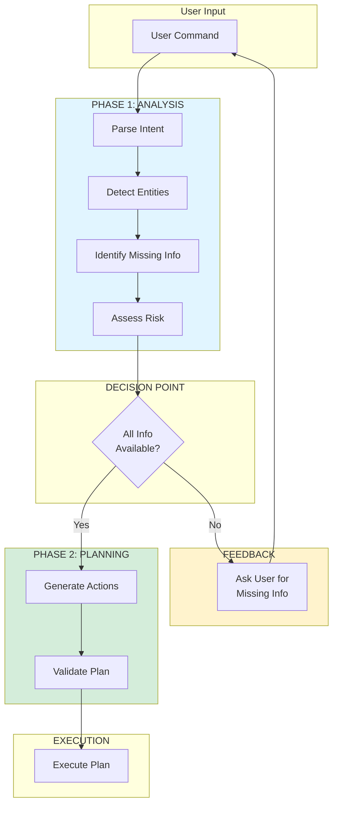

# Reasoner V4: Think-First Architecture 

> **Architecture**: See [Complete System Architecture](./01-complete-system-architecture.md) for V3 Multi-Layer OODA Loop overview.

---


Documentation for the V4 Reasoner implementation with explicit analysis phase before action planning.

## 📋 Table of Contents

1. [Overview](#overview)
2. [The Problem V4 Solves](#the-problem-v4-solves)
3. [Architecture Changes](#architecture-changes)
4. [JSON Structure](#json-structure)
5. [How It Works](#how-it-works)
6. [Examples](#examples)
7. [Migration Guide](#migration-guide)
8. [Testing](#testing)

## Overview

Reasoner V4 introduces a **"Think-First"** architecture that forces the LLM to explicitly analyze commands before generating actions. This prevents the critical failure mode of inventing missing arguments.

### Think-First Architecture Diagram



### Key Innovation

The V4 Reasoner separates reasoning into two distinct phases:

1. **ANALYSIS**: Understand intent, detect entities, identify missing information
2. **PLANNING**: Generate actions (only if all required information is present)

This explicit separation ensures the LLM never "fills in the blanks" with invented data.

## The Problem V4 Solves

### V3 Problem: Implicit Reasoning

In V3, the LLM would sometimes invent missing information:

```json
// User says: "Envoie un mail"
// V3 might generate:
{
  "steps": [
    {
      "module": "messaging",
      "action": "send_message",
      "args": {
        "recipient": "user@example.com",  // ❌ INVENTED!
        "message": ""
      }
    }
  ]
}
```

**Result**: Email sent to wrong recipient, or execution failure with confusing error.

### V4 Solution: Explicit Analysis

V4 forces the LLM to acknowledge missing information:

```json
// User says: "Envoie un mail"
// V4 generates:
{
  "analysis": {
    "user_intent": "Envoyer un email",
    "detected_entities": [],
    "missing_info": ["recipient"],  // ✅ EXPLICIT!
    "risk_assessment": "Impossible d'envoyer un mail sans destinataire"
  },
  "plan": []  // ✅ EMPTY - Won't execute with missing info
}
```

**Result**: System detects missing information and can prompt the user.

## Architecture Changes

### V3 vs V4 Flow

**V3 (Implicit)**:
```
User Command → LLM → {"steps": [...]} → Execute
                ↑
         May invent missing args
```

**V4 (Explicit)**:
```
User Command → LLM → {"analysis": {...}, "plan": [...]} → Execute
                ↑
         MUST declare missing info
         Plan is EMPTY if info missing
```

### Critical Rules for V4

The V4 prompt enforces these rules:

1. ⚠️ **NEVER invent missing arguments**
2. ✅ **ALWAYS analyze before planning**
3. ✅ **If info missing → missing_info + plan = []**
4. ⛔ **Never leave required args empty**

## JSON Structure

### V4 Format

```json
{
  "analysis": {
    "user_intent": "string",           // What does the user want?
    "detected_entities": ["string"],   // What concrete info was provided?
    "missing_info": ["string"],        // What REQUIRED info is missing?
    "risk_assessment": "string"        // Any risks or concerns?
  },
  "plan": [                           // Empty if missing_info is not empty
    {
      "module": "...",
      "action": "...",
      "args": {...},
      "context": {...}
    }
  ]
}
```

### Analysis Block Fields

- **user_intent**: High-level description of what the user wants to achieve
- **detected_entities**: Concrete entities mentioned (apps, URLs, names, files)
- **missing_info**: Array of REQUIRED information that's missing (empty array if all present)
- **risk_assessment**: Security/safety evaluation of the action

### Consistency Rule

**Critical**: If `missing_info` is not empty, `plan` MUST be empty.

```json
// ✅ Valid: Missing info → empty plan
{
  "analysis": {
    "missing_info": ["recipient"]
  },
  "plan": []
}

// ❌ Invalid: Missing info but plan has steps
{
  "analysis": {
    "missing_info": ["recipient"]
  },
  "plan": [
    {"module": "messaging", ...}  // Should not be here!
  ]
}
```

## How It Works

### 1. Analysis Phase

The LLM examines the command and identifies:

```python
# Example internal reasoning
command = "Envoie un mail à john@example.com"

analysis = {
    "user_intent": "Envoyer un email à john@example.com",
    "detected_entities": ["john@example.com"],  # Email found!
    "missing_info": [],  # Recipient present
    "risk_assessment": "Email valide détecté - action sécurisée"
}
```

### 2. Planning Phase

Only if `missing_info` is empty, the LLM generates the plan:

```python
if len(analysis["missing_info"]) == 0:
    plan = [
        {
            "module": "messaging",
            "action": "send_message",
            "args": {
                "message": "",
                "recipient": "john@example.com"  # ✅ From command!
            }
        }
    ]
else:
    plan = []  # ✅ No plan with missing info
```

### 3. Execution

The executor receives the plan:

```python
if len(plan["steps"]) == 0:
    # Missing information detected
    logger.warning(f"Cannot execute: missing {analysis['missing_info']}")
    return {"error": "missing_info", "details": analysis["missing_info"]}
else:
    # Execute normally
    for step in plan["steps"]:
        execute_step(step)
```

## Examples

### Example 1: Missing Recipient (Acceptance Criteria)

**Command**: "Envoie un mail"

**V4 Response**:
```json
{
  "analysis": {
    "user_intent": "Envoyer un email",
    "detected_entities": [],
    "missing_info": ["recipient"],
    "risk_assessment": "Impossible d'envoyer un mail sans destinataire"
  },
  "plan": []
}
```

**Outcome**: ✅ System detects missing recipient, prompts user

### Example 2: Complete Information

**Command**: "Envoie un mail à john@example.com"

**V4 Response**:
```json
{
  "analysis": {
    "user_intent": "Envoyer un email à john@example.com",
    "detected_entities": ["john@example.com"],
    "missing_info": [],
    "risk_assessment": "Email valide détecté - action sécurisée"
  },
  "plan": [
    {
      "module": "messaging",
      "action": "send_message",
      "args": {
        "message": "",
        "recipient": "john@example.com"
      },
      "context": {"app": null}
    }
  ]
}
```

**Outcome**: ✅ Email sent to correct recipient

### Example 3: Simple App Opening

**Command**: "Ouvre Safari"

**V4 Response**:
```json
{
  "analysis": {
    "user_intent": "Ouvrir l'application Safari",
    "detected_entities": ["Safari"],
    "missing_info": [],
    "risk_assessment": "No risk - action système simple"
  },
  "plan": [
    {
      "module": "system",
      "action": "open_application",
      "args": {"app_name": "Safari"},
      "context": {"app": null}
    }
  ]
}
```

**Outcome**: ✅ Safari opens normally

## Migration Guide

### For Developers

#### Using V4 in Code

```python
from janus.reasoning.reasoner_llm import ReasonerLLM

# Initialize reasoner with Qwen 2.5 (default)
reasoner = ReasonerLLM(backend="ollama", model_name="qwen2.5:7b-instruct")

# Generate plan with V4
plan = reasoner.generate_structured_plan(
    command="Envoie un mail",
    context={},
    language="fr",
    version="v4"  # ✅ Specify V4
)

# Check for missing information
if len(plan["steps"]) == 0:
    # Handle missing info
    print(f"Missing: {plan.get('missing_info', [])}")
else:
    # Execute plan
    execute_plan(plan)
```

#### Backward Compatibility

V3 is still the default for backward compatibility:

```python
# V3 (default)
plan = reasoner.generate_structured_plan(command, context, "fr")

# V4 (explicit)
plan = reasoner.generate_structured_plan(command, context, "fr", version="v4")
```

### For Prompt Engineers

The V4 prompt is located at:
```
janus/resources/prompts/reasoner_v4_system_fr.jinja2
```

Key sections:
1. **STRUCTURE JSON V4**: Defines the output format
2. **PHASE 1: ANALYSE**: Rules for analysis phase
3. **PHASE 2: PLANIFICATION**: Rules for planning phase
4. **EXEMPLES COMPLETS**: Full examples with analysis

## Testing

### Unit Tests

Tests are in `tests/test_reasoner_v4.py`:

```python
# Run V4 tests
python -m unittest tests.test_reasoner_v4 -v
```

### Test Cases

1. **test_send_email_without_recipient**: Acceptance criteria test
   - Command: "Envoie un mail"
   - Verifies: missing_info = ["recipient"], plan = []

2. **test_send_email_with_recipient**: Complete information test
   - Command: "Envoie un mail à john@example.com"
   - Verifies: plan contains send_message with recipient

3. **test_open_safari_v4**: Simple action test
   - Command: "Ouvre Safari"
   - Verifies: V4 format works for simple actions

4. **test_default_is_v3**: Backward compatibility
   - Verifies: Default version is still V3

### Manual Testing

```bash
# Test with mock backend
python -c "
from janus.reasoning.reasoner_llm import ReasonerLLM
r = ReasonerLLM(backend='mock')

# Test missing info case
plan = r.generate_structured_plan('Envoie un mail', {}, 'fr', 'v4')
print('Missing info test:', plan)

# Test complete info case  
plan = r.generate_structured_plan('Envoie un mail à john@example.com', {}, 'fr', 'v4')
print('Complete info test:', plan)
"
```

## Benefits of V4

1. **Prevents Invented Arguments**: Explicit analysis prevents hallucination
2. **Better Error Messages**: Users know exactly what's missing
3. **Risk Assessment**: Safety evaluation before execution
4. **Debuggability**: Analysis block shows LLM reasoning
5. **Backward Compatible**: V3 remains default, opt-in to V4

## Future Enhancements

Potential V4 improvements:

1. **Interactive Missing Info**: Automatically prompt user for missing info
2. **Confidence Scores**: Add confidence to detected entities
3. **Alternative Plans**: Generate multiple plans for ambiguous commands
4. **Learning**: Track common missing_info patterns for better prompts
5. **Multi-language**: Extend V4 to English prompts

## See Also

- [LLM-First Principle](03-llm-first-principle.md)
- [Complete System Architecture](01-complete-system-architecture.md)
- [Module Action Schema](../../janus/core/module_action_schema.py)
- [Test Suite](../../tests/test_reasoner_v4.py)
