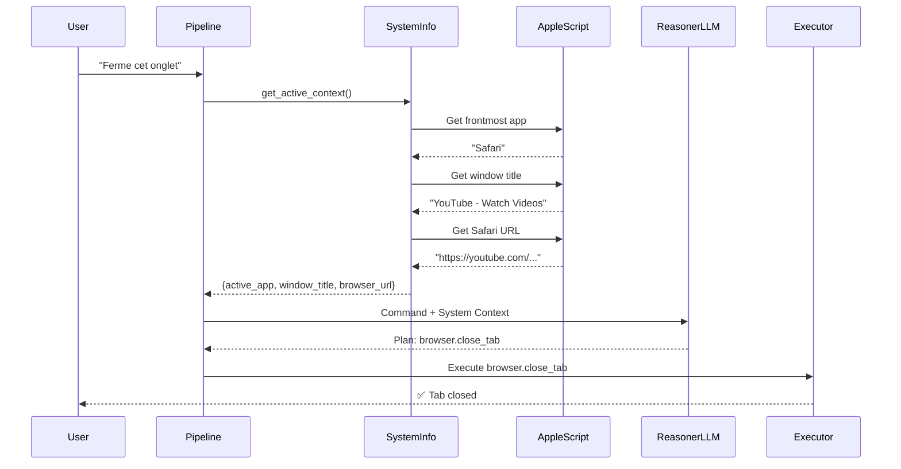

# 09 - System Context (Grounding)

> **Architecture**: See [Complete System Architecture](./01-complete-system-architecture.md) for V3 Multi-Layer OODA Loop overview.

---


Injection of "System Context" to allow the agent to "see" the system state

**Status**: ✅ Implemented
**Version**: V3+
**Last Updated**: December 2024

---

## 📋 Table of Contents

1. [Overview](#overview)
2. [Problem Statement](#problem-statement)
3. [Architecture](#architecture)
4. [Implementation](#implementation)
5. [Integration](#integration)
6. [Usage Examples](#usage-examples)
7. [Technical Details](#technical-details)
8. [Performance](#performance)
9. [Future Improvements](#future-improvements)

---

## 🎯 Overview

The **System Context (Grounding)** feature provides real-time awareness of the system state to the AI agent. This enables the agent to understand contextual references like "this tab", "that window", "here", "close this", etc., by injecting active application, window title, and browser URL information into the LLM context.

### System Context Flow

```mermaid
graph LR
    A[User Command<br/>"close this tab"] --> B[Get System Context]
    B --> C[Active App: Safari]
    B --> D[Window Title: YouTube]
    B --> E[URL: youtube.com]
    C & D & E --> F[Inject into LLM Context]
    F --> G[LLM Decides:<br/>browser.close_tab]
    G --> H[Execute Action]
    
    style B fill:#fff3cd
    style F fill:#e1f5ff
```

### Key Benefits

- ✅ **Contextual Understanding**: Agent understands implicit references ("close this tab" vs "close the app")
- ✅ **Accurate Actions**: Correct module selection based on active application (browser.close_tab vs system.close_app)
- ✅ **Natural Language**: Users can speak naturally without specifying application names
- ✅ **Platform-Aware**: macOS-specific implementation with graceful degradation

---

## 🔍 Problem Statement

### Previous Approach: System Context

**User on YouTube in Safari**: "Ferme cet onglet"
**Agent without context**
- ❌ Doesn't know Safari is active
- ❌ Doesn't know it's a browser tab
- ❌ Might try `system.close_app` instead of `browser.close_tab`
- ❌ Ambiguous reference "cet onglet" unresolved

### Current Approach: System Context

**User on YouTube in Safari**: "Ferme cet onglet"
**Agent with context**
- ✅ Knows `active_app = "Safari"`
- ✅ Knows `window_title = "YouTube"`
- ✅ Knows `browser_url = "https://www.youtube.com/..."`
- ✅ Correctly generates `browser.close_tab` action

---

## 🏗️ Architecture

### System Components

```
┌─────────────────────────────────────────────────────────────┐
│ SYSTEM CONTEXT LAYER │
│ │
│ ┌────────────────────┐ ┌─────────────────────────┐ │
│ │ system_info.py │────────▶│ AppleScript Executor │ │
│ │ │ │ - System Events │ │
│ │ get_active_context()│ │ - Safari scripting │ │
│ │ │ │ - Chrome scripting │ │
│ └────────┬───────────┘ └─────────────────────────┘ │
│ │ │
│ │ Returns: { │
│ │ active_app: "Safari" │
│ │ window_title: "YouTube" │
│ │ browser_url: "https://..." │
│ │ } │
└───────────┼───────────────────────────────────────────────────┘
 │
 ▼
┌─────────────────────────────────────────────────────────────┐
│ PIPELINE INTEGRATION │
│ │
│ ┌──────────────────────────────────────────────────────────┐│
│ │ process_command_async() ││
│ │ ││
│ │ 1. system_context = get_active_context() ││
│ │ 2. context["system_state"] = system_context ││
│ │ 3. Pass context to ReasonerLLM ││
│ └──────────────────────────────────────────────────────────┘│
└─────────────────────────┬───────────────────────────────────┘
 │
 ▼
┌─────────────────────────────────────────────────────────────┐
│ REASONER LLM PROMPT │
│ │
│ === ÉTAT SYSTÈME ACTUEL === │
│ App active: Safari │
│ Window: YouTube - Watch Videos │
│ URL: https://www.youtube.com/watch?v=... │
│ │
│ RULE: If user dit 'here', 'this', 'this tab', │
│ 'cette page', refer to à the system state ci-dessus. │
│ │
│ CURRENT COMMAND: Ferme cet onglet │
└─────────────────────────────────────────────────────────────┘
```

### Data Flow



---

## 🔧 Implementation

### Module: `janus/os/system_info.py`

```python
def get_active_context() -> Dict[str, Any]:
 """
 Get current system context (active app, window title, browser URL).
 
 Returns:
 {
 "active_app": str, # Name of frontmost application
 "window_title": str, # Title of active window
 "browser_url": str, # Current URL (if browser)
 "platform": str, # Operating system
 "error": str, # Error if detection failed
 }
 """
```

### Platform Support

#### macOS (Implemented)
- ✅ Active app detection via System Events
- ✅ Window title extraction
- ✅ Safari URL detection via AppleScript
- ✅ Chrome URL detection via AppleScript
- ✅ Firefox page title detection via System Events (window title)

#### Linux/Windows
- ❌ Not implemented
- Returns error: "Platform not supported"
- Graceful degradation: Agent continues without system context

---

## 🔗 Integration

### Pipeline Integration

The system context is captured at the start of `process_command_async()`

```python
# Inject System Context (Grounding)
from ..os.system_info import get_active_context

system_context = get_active_context()
logger.info(
 f"System context captured - "
 f"app='{system_context.get('active_app')}', "
 f"window='{system_context.get('window_title', '')[:30]}...'"
)

# Add to context dict for Reasoner
context["system_state"] = system_context
```

### Prompt Template Update

The ReasonerLLM prompt builder injects the system state

```python
# Add system state context (grounding)
if context and "system_state" in context:
 system_state = context["system_state"]
 
 prompt += "\n=== ÉTAT SYSTÈME ACTUEL ===\n"
 if system_state.get("active_app"):
 prompt += f"App active: {system_state['active_app']}\n"
 if system_state.get("window_title"):
 prompt += f"Window: {system_state['window_title']}\n"
 if system_state.get("browser_url"):
 prompt += f"URL: {system_state['browser_url']}\n"
 
 prompt += (
 "\nRULE: If user dit 'here', 'this', 'this tab', "
 "'this page', 'this window', refer to à the system state.\n"
 )
```

---

## 💡 Usage Examples

### Example 1: Close Tab

**System State**
```json
{
 "active_app": "Safari",
 "window_title": "YouTube - Watch Videos",
 "browser_url": "https://www.youtube.com/watch?v=dQw4w9WgXcQ"
}
```

**User**: "Ferme cet onglet"

**LLM Reasoning**
- User says "cet onglet" (this tab)
- System state shows Safari is active with YouTube
- "onglet" means tab → use `browser.close_tab`
- NOT `system.close_app` (would close entire Safari)

**Generated Plan**
```json
{
 "steps": [
 {
 "module": "browser",
 "action": "close_tab",
 "args": {}
 }
 ]
}
```

### Example 2: Copy URL

**System State**
```json
{
 "active_app": "Google Chrome",
 "window_title": "GitHub - BenHND/Janus",
 "browser_url": "https://github.com/BenHND/Janus"
}
```

**User**: "Copie l'URL de cette page"

**LLM Reasoning**
- User says "cette page" (this page)
- System state shows Chrome with GitHub URL
- Copy browser URL to clipboard

**Generated Plan**
```json
{
 "steps": [
 {
 "module": "clipboard",
 "action": "copy",
 "args": {
 "text": "https://github.com/BenHND/Janus"
 }
 }
 ]
}
```

### Example 3: Take Screenshot

**System State**
```json
{
 "active_app": "Visual Studio Code",
 "window_title": "pipeline.py — Janus",
 "browser_url": null
}
```

**User**: "Prends une capture d'écran de ça"

**LLM Reasoning**
- User says "de ça" (of this)
- System state shows VSCode is active
- Take screenshot of active window

**Generated Plan**
```json
{
 "steps": [
 {
 "module": "system",
 "action": "screenshot",
 "args": {
 "target": "active_window"
 }
 }
 ]
}
```

---

## 🔬 Technical Details

### AppleScript Implementation

#### Get Active App and Window Title
```applescript
tell application "System Events"
 set frontApp to name of first application process whose frontmost is true
 set frontWindow to ""
 try
 set frontWindow to name of front window of first application process whose frontmost is true
 end try
 return frontApp & "|" & frontWindow
end tell
```

#### Get Safari URL
```applescript
tell application "Safari"
 if (count of windows) > 0 then
 get URL of current tab of front window
 end if
end tell
```

#### Get Chrome URL
```applescript
tell application "Google Chrome"
 if (count of windows) > 0 then
 get URL of active tab of front window
 end if
end tell
```

### Error Handling

1. **Platform Not Supported**: Returns dict with error message, agent continues without grounding
2. **AppleScript Failure**: Logs warning, returns partial context (e.g., app name but no URL)
3. **Browser Not Running**: Returns app name and window title, but `browser_url = None`
4. **Permission Denied**: macOS accessibility permissions required for System Events

---

## ⚡ Performance

### Latency

| Operation | Typical Time | Notes |
|-----------|-------------|-------|
| Get active app | 10-50ms | System Events query |
| Get window title | 10-50ms | System Events query |
| Get Safari URL | 50-150ms | AppleScript to Safari |
| Get Chrome URL | 50-150ms | AppleScript to Chrome |
| **Total overhead** | **100-300ms** | Acceptable for user commands |

### Optimization

- ✅ **Cached executor**: AppleScript executor reused across calls
- ✅ **Short timeouts**: 2s timeout prevents blocking on slow apps
- ✅ **Parallel execution**: Could be optimized to run URL extraction in parallel
- ✅ **No retries**: Simple status checks don't need retry logic

### Memory

- Minimal: ~1-2 KB per context dict
- No persistent storage of system state
- Fresh capture on every command

---

## 🚀 Future Improvements

### Planned Enhancements

1. **Cross-Platform Support**
 - Linux: X11/Wayland window info + browser extensions
 - Windows: Win32 API for active window + COM for browsers

2. **Extended Context**
 - Selected text in active app
 - Scroll position in browser
 - Recently used files in editor
 - Active Spotify/Music track

4. **Caching Strategy**
 - Cache system context for rapid-fire commands
 - Invalidate on app switch or significant time elapsed
 - Reduce AppleScript overhead for multi-step plans

5. **Accessibility Integration**
 - Use macOS Accessibility API for richer context
 - Get focused UI element properties
 - Read form field values, button states, etc.

### Known Limitations

1. **macOS Only**: Linux/Windows not implemented yet
2. **Browser-Specific**: Only Safari and Chrome supported
3. **Accessibility Required**: macOS System Events needs permissions
4. **No Private Browsing Detection**: Can't distinguish private/incognito mode
5. **Single Active Window**: Only captures frontmost window, not all open windows

---

## 📚 Related Documentation

- [01-complete-system-architecture.md](01-complete-system-architecture.md) - Overall system architecture
- [02-unified-pipeline.md](02-unified-pipeline.md) - Pipeline integration details
- [03-llm-first-principle.md](03-llm-first-principle.md) - Why LLM needs grounding context
- [04-agent-architecture.md](04-agent-architecture.md) - Agent execution with context

---

## 🧪 Testing

### Test Suite: `tests/test_system_context.py`

```python
def test_get_active_context_structure():
 """Test context dict has required keys"""
 context = get_active_context()
 assert "active_app" in context
 assert "window_title" in context
 assert "browser_url" in context
 assert "platform" in context

def test_get_safari_url():
 """Test Safari URL extraction with mocked AppleScript"""
 # Mock AppleScript executor to return test data
 # Verify URL is extracted correctly

def test_get_chrome_url():
 """Test Chrome URL extraction with mocked AppleScript"""
 # Mock AppleScript executor to return test data
 # Verify URL is extracted correctly
```

### Manual Testing

On macOS

1. Open Safari with YouTube
2. Run: `python -c "from janus.os.system_info import get_active_context; import json; print(json.dumps(get_active_context(), indent=2))"`
3. Verify output contains Safari, YouTube title, and YouTube URL

---

## 🎯 Acceptance Criteria

- [x] ✅ Created `janus/os/system_info.py` module
- [x] ✅ Implemented `get_active_context()` function
- [x] ✅ Used AppleScript for macOS app detection
- [x] ✅ Extracted active app name
- [x] ✅ Extracted window title
- [x] ✅ Extracted Safari URL
- [x] ✅ Extracted Chrome URL
- [x] ✅ Integrated into `process_command_async()`
- [x] ✅ Passed system context to ReasonerLLM
- [x] ✅ Updated prompt template with system state section
- [x] ✅ Added grounding rule to prompt
- [ ] ⏳ Tested on macOS: User on YouTube says "Ferme cet onglet"
- [ ] ⏳ Verified Reasoner receives `context.app="Safari"`
- [ ] ⏳ Verified plan generates `browser.close_tab` (not `system.close_app`)

**Status**: Implementation complete, requires macOS environment for full validation.

---

**Last Updated**: December 2024
**Author**: GitHub Copilot + BenHND
Reference

## See Also

- [Complete System Architecture](./01-complete-system-architecture.md) - Full system overview
- [Reasoner V4](./08-reasoner-v4-think-first.md) - How context is used in decisions
- [Vision Integration](./18-proactive-vision-integration.md) - Visual context
