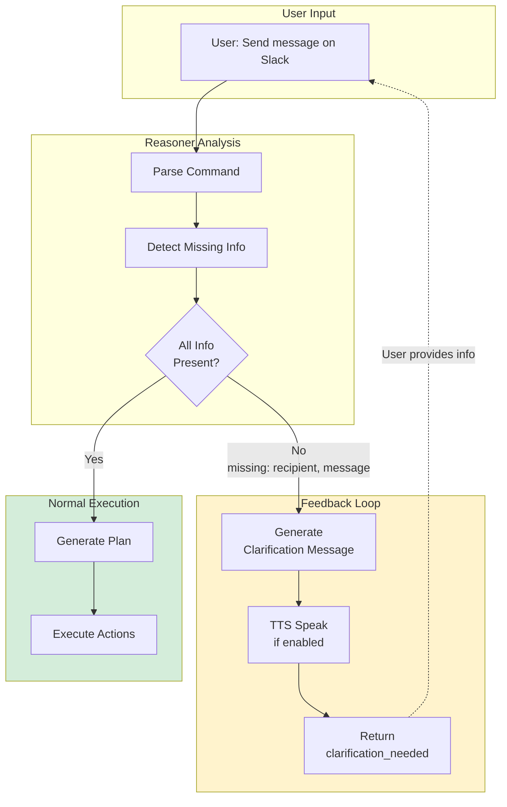

# Missing Info Management (Feedback Loop)

> **Architecture**: See [Complete System Architecture](./01-complete-system-architecture.md) for V3 Multi-Layer OODA Loop overview.

---


## Overview

This feature allows the agent to detect when a command cannot be executed due to missing information and ask for clarification from the user via TTS (Text-to-Speech).

### Missing Info Feedback Flow



## Architecture

### Processing Flow

```
User: "Send a message on Slack"
 ↓
ReasonerLLM detects missing_info: ["recipient", "message"]
 ↓
Pipeline detects missing_info and empty plan
 ↓
Pipeline generates clarification message
 ↓
TTS (if enabled): "Cannot execute request. Missing: recipient, message."
 ↓
ExecutionResult with action="clarification_needed"
```

### Modified Components

#### 1. ReasonerLLM (`janus/reasoning/reasoner_llm.py`)

**Change**: Preservation of `missing_info` in plan result

```python
# Preserve missing_info from analysis for pipeline feedback
data = {"steps": plan_steps, "missing_info": missing_info}
```

ReasonerLLM extracts `missing_info` from V4 analysis and preserves it in the plan returned to pipeline, even after validation.

#### 2. Pipeline (`janus/core/pipeline.py`)

**Change**: Detection and handling of missing information

```python
# Check for missing information before validation
missing_info = plan_dict.get('missing_info', [])
if not plan_dict.get('steps') and missing_info:
    # Case: Intent understood but parameters missing
    missing_str = ", ".join(missing_info)
    # Use i18n for multilingual support
    response_text = t("errors.missing_info", missing=missing_str)
    
    # TTS feedback if enabled
    if self.tts:
        await self.tts.speak(response_text)
    
    # Return clarification result
    return ExecutionResult(
        intent=Intent(action="clarification_needed", ...),
        success=False,
        message=response_text
    )
```

### Internationalization (i18n)

Messages use the centralized translation system (`janus/i18n`)

**French:**
```python
"errors.missing_info": "Je ne peux pas exécuter la demande. Il manque : {missing}."
```

**English:**
```python
"errors.missing_info": "I cannot execute the request. Missing: {missing}."
```

The system automatically selects the language based on user settings.

## V4 Response Format

Reasoner V4 returns a structured format with analysis and plan:

```json
{
  "analysis": {
    "user_intent": "Send a message on Slack",
    "detected_entities": [],
    "missing_info": ["recipient", "message"],
    "risk_assessment": "low"
  },
  "plan": []
}
```

### V4 Contract

**Strict rule**: If `missing_info` is not empty, then `plan` must be empty.

ReasonerLLM enforces this rule in production mode:

```python
# V4 Consistency Check
if missing_info and plan_steps:
 logger.error("Forcing plan to be empty to enforce V4 contract")
 plan_steps = []
```

## Testing

Tests validate 4 scenarios:

1. **test_missing_info_detection_no_tts**: Detection without TTS enabled
2. **test_missing_info_with_tts_async**: Async TTS feedback
3. **test_missing_info_with_tts_sync**: Sync TTS feedback
4. **test_no_missing_info_executes_normally**: Normal execution if info complete

All tests use mocks to isolate components and avoid system dependencies.

## Acceptance Criteria

### ✓ Implemented Functionality

- [x] Reasoner detects missing information in analysis
- [x] Pipeline intercepts missing_info and generates clarification
- [x] TTS feedback provided if enabled (async and sync)
- [x] No window opens when info is missing
- [x] ExecutionResult contains action="clarification_needed"
- [x] Tests covering all scenarios
- [x] Centralized messages via i18n system (FR/EN)

### Usage Example

**Command**: "Send a message on Slack"

**Expected Result**:
- Audio (TTS): "I cannot execute the request. Missing: recipient, message."
- No window opens
- ExecutionResult.success = False
- ExecutionResult.intent.action = "clarification_needed"
- ExecutionResult.message contains missing info
- Message automatically translated based on configured language (FR/EN)

## Current Limitations

1. **No UI interaction**: Feedback is currently audio-only (TTS). Overlay display is optional for this sprint.
2. **No interactive loop**: Agent doesn't automatically re-ask for information. User must reformulate command with complete info.

## Future Integration

### Phase 1 (Current): Detection and feedback
- ✓ Missing info detection
- ✓ TTS feedback
- ✓ ExecutionResult with clarification

### Phase 2 (Optional)
- [ ] Overlay UI display
- [ ] Suggestion buttons in overlay
- [ ] Interactive clarification loop

### Phase 3 (Advanced)
- [ ] Automatic context information extraction
- [ ] Intelligent suggestions based on history
- [ ] Multi-turn disambiguation

## References

## Deployment Notes

1. **Compatibility**: Works with Reasoner V3 and V4
2. **TTS Configuration**: Requires `enable_tts=True` in settings for audio feedback
3. **Testing**: Run `pytest tests/test_missing_info.py` to validate
4. **Performance**: No impact on latency (detection after plan generation)

## See Also

- [Complete System Architecture](./01-complete-system-architecture.md) - Full system overview
- [Reasoner V4](./08-reasoner-v4-think-first.md) - Think-First analysis
- [Unified Pipeline](./02-unified-pipeline.md) - OODA loop flow
