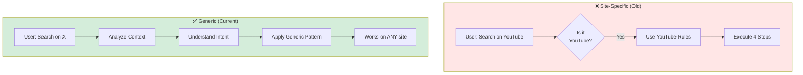

# Generic Tooling Standardization

> **Architecture**: See [Complete System Architecture](./01-complete-system-architecture.md) for V3 Multi-Layer OODA Loop overview.

---


Documentation for the standardization of generic tools to make the agent capable of handling unknown websites.

## 📋 Table of Contents

1. [Overview](#overview)
2. [The Problem](#the-problem)
3. [Solution](#solution)
4. [Tool Definitions](#tool-definitions)
5. [Examples](#examples)
6. [Migration from Hardcoded Rules](#migration-from-hardcoded-rules)
7. [Testing](#testing)

## Overview

Introduces a standardization of generic tools to enable the agent to work on unknown websites without hardcoded rules. The key innovation is removing site-specific logic and replacing it with **context-based reasoning**.

### Generic vs Site-Specific Approach



### Key Innovation

Instead of hardcoding rules for specific sites, the agent now
1. **Analyzes the context** to understand what the user wants
2. **Deduces the necessary action** based on intent, not site name
3. **Applies generic patterns** that work across all websites

This makes the agent **robust** and **generalizable** to any website.

## The Problem

### Previous Approach:  Hardcoded Site-Specific Rules

The previous approach used explicit rules for specific sites

```
❌ RULE: "If it's YouTube, do search then click"
❌ RULE: "If the user says 'mets X sur YouTube', generate 4 steps"
```

**Problems:**
1. **Not scalable**: Need to add rules for every new site (Wikipedia, Amazon, Booking, etc.)
2. **Fragile**: Rules break when sites change
3. **Limited**: Can't handle unknown websites
4. **Cognitive overhead**: Agent must remember site-specific behaviors

### Example of Old Behavior

```
User: "Cherche Daft Punk sur YouTube"
Agent thinking: "YouTube detected → Use YouTube-specific search rule"
Plan: open_url(youtube) -> search("Daft Punk")
```

This worked for YouTube but failed for Wikipedia, Amazon, or any other site.

## Solution

### Current Approach:  Context-Based Generic Logic

The new approach uses **principle-based reasoning**

```
✅ PRINCIPLE: "To consume content, search for it first on the relevant site"
✅ PRINCIPLE: "browser.search applies to the internal search bar of ANY website"
✅ PRINCIPLE: "Deduce the action based on user intent, not site name"
```

### Example of New Behavior

```
User: "Va sur Wikipédia et cherche 'Napoléon'"
Agent thinking: "User wants to consult → open site → use internal search"
Plan: open_url(wikipedia) -> search("Napoléon")
```

**This works identically for:**
- Wikipedia: `open_url(wikipedia) -> search("Napoleon")`
- Amazon: `open_url(amazon) -> search("laptop")`
- GitHub: `open_url(github) -> search("Python projects")`
- Booking: `open_url(booking) -> search("hotel Paris")`
- **ANY OTHER WEBSITE with an internal search bar**

## Tool Definitions

### Updated Tool Definitions (V4)

#### **browser.search**

```
Definition: Use ONLY pour interagir avec la barre de recherche 
            within a website.

Usage: This action searches within the currently open site.

Examples:
- YouTube: search bar at top
- Amazon: product search bar
- Gmail: email search bar
- Wikipedia: article search bar
- GitHub: repository search bar
```

**Key insight:** `browser.search` is a **generic action** that applies to ANY website's internal search functionality.

#### **ui.click**

```
Definition: Cliquer sur un élément textuel visible.

Args: text (le texte exact du bouton/lien visible à l'écran)

Examples:
- Click on "Submit" button
- Click on "Login" link
- Click on first search result (e.g., video title, product name)
```

**Key insight:** `ui.click` uses **visible text** as the target, making it work on any UI element regardless of the website.

### Complete Action List

**system:**
- `open_application(app_name)`: Open a system application

**browser:**
- `open_url(url)`: Navigate to a complete URL
- `search(query)`: Use the internal search bar of the currently open website
- `extract_text`: Extract visible text from the page

**messaging:**
- `send_message(message, recipient)`: Send a message
- `open_thread(name)`: Open a conversation

**ui:**
- `click(text)`: Click on a visible text element

**files:**
- `open_file(path)`: Open a file
- `search_files(query)`: Search for files

**llm:**
- `summarize`: Summarize content
- `analyze`: Analyze content

**code:**
- `goto_line`: Navigate in code
- `find_text`: Search text in code

## Examples

### Example 1: Wikipedia Search (Acceptance Criteria)

**Command:** "Va sur Wikipédia et cherche 'Napoléon'"

**Generated Plan (V4):**
```json
{
  "analysis": {
    "user_intent": "Rechercher de l'information sur Wikipédia",
    "detected_entities": ["Wikipédia", "Napoléon"],
    "missing_info": [],
    "risk_assessment": "Action de recherche - aucun risque"
  },
  "plan": [
    {
      "module": "system",
      "action": "open_application",
      "args": {"app_name": "Safari"},
      "context": {"app": null}
    },
    {
      "module": "browser",
      "action": "open_url",
      "args": {"url": "https://wikipedia.org"},
      "context": {"app": "Safari"}
    },
    {
      "module": "browser",
      "action": "search",
      "args": {"query": "Napoléon"},
      "context": {"app": "Safari"}
    }
  ]
}
```

**✅ Success:** The agent generated the correct plan for Wikipedia **without any Wikipedia-specific rule**.

### Example 2: Amazon Product Search

**Command:** "Cherche un laptop sur Amazon"

**Generated Plan:**
```json
{
  "plan": [
    {"module": "system", "action": "open_application", "args": {"app_name": "Safari"}},
    {"module": "browser", "action": "open_url", "args": {"url": "https://amazon.com"}},
    {"module": "browser", "action": "search", "args": {"query": "laptop"}}
  ]
}
```

### Example 3: GitHub Repository Search

**Command:** "Va sur GitHub et cherche des projets Python"

**Generated Plan:**
```json
{
  "plan": [
    {"module": "system", "action": "open_application", "args": {"app_name": "Safari"}},
    {"module": "browser", "action": "open_url", "args": {"url": "https://github.com"}},
    {"module": "browser", "action": "search", "args": {"query": "projets Python"}}
  ]
}
```

### Example 4: Consume Content (with click)

**Command:** "Joue une vidéo relaxante"

**Generated Plan:**
```json
{
  "plan": [
    {"module": "system", "action": "open_application", "args": {"app_name": "Safari"}},
    {"module": "browser", "action": "open_url", "args": {"url": "https://example-streaming.com"}},
    {"module": "browser", "action": "search", "args": {"query": "vidéo relaxante"}},
    {"module": "ui", "action": "click", "args": {"text": "vidéo relaxante"}}
  ]
}
```

**Key:** The agent adds `ui.click` when the user wants to **consume** content (verbs: play, watch, listen), not just search.

### Example 5: Missing Information

**Command:** "Cherche un produit sur Amazon"

**Generated Plan:**
```json
{
  "analysis": {
    "user_intent": "Rechercher un produit sur Amazon",
    "detected_entities": ["Amazon"],
    "missing_info": ["query"],
    "risk_assessment": "Information manquante - nom du produit requis"
  },
  "plan": []
}
```

**Key:** The agent correctly identifies missing information instead of inventing a query.

## Migration from Hardcoded Rules

### What Changed

#### 1. Removed Site-Specific Rules

**Before (V3 old):**
```
⚠️⚠️⚠️ RÈGLE CRITIQUE POUR LES COMMANDES YOUTUBE/MÉDIA ⚠️⚠️⚠️
AVANT DE PLANIFIER, vérifie si la commande contient un VERBE DE CONSOMMATION :
- "mets", "met", "joue", "lance", "écoute", "regarde", "play", "watch", "listen"

SI OUI (ex: "mets Forgive de Burial sur YouTube") → TU DOIS GÉNÉRER **4 ÉTAPES**
```

**After (V3 new):**
```
⚠️ PRINCIPE GÉNÉRAL : Déduis l'action nécessaire selon le contexte et l'intention de l'utilisateur.
Pour consommer un contenu (média, article, produit), il faut souvent le chercher d'abord.
```

#### 2. Generalized Semantic Rules

```
- "Cherche Daft Punk sur YouTube" → 3 steps (s'arrête à la recherche).
- "Mets Daft Punk sur YouTube"    → 4 steps (clique sur le premier résultat).
```

```
1. **POUR CONSULTER** (verbes : cherche, trouve, montre-moi) :
   Arrête-toi après browser.search
   
2. **POUR CONSOMMER** (verbes : mets, joue, lance, écoute, regarde) :
   Ajoute un ui.click après browser.search
```

#### 3. Updated Examples

- All examples used YouTube
- Reinforced the idea that rules are site-specific

- Examples use Wikipedia, Amazon, GitHub, generic sites
- Demonstrates that the same pattern works everywhere

### Updated Prompt Files

The following prompt templates were updated

1. `janus/resources/prompts/reasoner_v4_system_fr.jinja2`
2. `janus/resources/prompts/reasoner_v3_system_fr.jinja2`
3. `janus/resources/prompts/reasoner_v3_system_lite_fr.jinja2`
4. `janus/resources/prompts/reasoner_v3_system_en.jinja2`
5. `janus/resources/prompts/reasoner_v3_system_lite_en.jinja2`

All prompts now follow the same principle-based approach.

## Testing

### Acceptance Criteria (from )

**Test Command:** "Va sur Wikipédia et cherche 'Napoléon'"

**Expected Output:**
```python
plan = [
    {"module": "browser", "action": "open_url", "args": {"url": "wikipedia"}},
    {"module": "browser", "action": "search", "args": {"query": "Napoléon"}}
]
```

**Key validation:**
- ✅ No Wikipedia-specific rule in the prompt
- ✅ Agent deduces the correct sequence from context
- ✅ Same logic applies to any other website

### Test Cases

Test the agent with various websites to verify generic behavior

```python
test_cases = [
    # Wikipedia
    ("Va sur Wikipédia et cherche 'Python'", ["open_url", "search"]),
    
    # Amazon
    ("Trouve un produit sur Amazon", ["open_url", "search"]),
    
    # GitHub
    ("Cherche des projets Python sur GitHub", ["open_url", "search"]),
    
    # Booking
    ("Cherche un hôtel à Paris sur Booking", ["open_url", "search"]),
    
    # Generic site (unknown to agent)
    ("Va sur example.com et cherche documentation", ["open_url", "search"]),
    
    # With consumption intent
    ("Joue une vidéo sur un site de streaming", ["open_url", "search", "click"]),
]
```

### Running Tests

```bash
# Test with ReasonerLLM
python -c "
from janus.reasoning.reasoner_llm import ReasonerLLM

reasoner = ReasonerLLM(backend='mock')

# Test Wikipedia (acceptance criteria)
plan = reasoner.generate_structured_plan(
    'Va sur Wikipédia et cherche Napoléon',
    {},
    'fr',
    'v4'
)

print('Wikipedia test:', plan)
assert 'search' in str(plan)
assert 'wikipedia' in str(plan).lower()
"
```

## Benefits

### 1. **Scalability**
- Works on **any website** without adding new rules
- No maintenance needed when new sites are used

### 2. **Robustness**
- Doesn't break when websites change their design
- Generic patterns are more resilient than site-specific rules

### 3. **Simplicity**
- Fewer rules to remember and maintain
- Easier for the LLM to reason about actions

### 4. **Generalizability**
- Same logic applies to Wikipedia, Amazon, GitHub, Booking, etc.
- Agent can handle **unknown websites** it has never seen

### 5. **Maintainability**
- Prompts are shorter and clearer
- Easy to update principles without breaking specific cases

## Design Principles

The standardization follows these core principles

1. **Context over Rules**: Deduce action from context, not hardcoded rules
2. **Intent-based Planning**: Focus on what the user wants, not what site they're on
3. **Generic Actions**: Define tools that work across all websites
4. **Principle-based Reasoning**: Use general principles instead of specific cases

## Future Enhancements

Potential improvements

1. **Auto-detection of Search Bars**: Use vision/OCR to automatically detect search input fields
2. **Multi-step Refinement**: Allow the agent to refine searches based on results
3. **Site Patterns Learning**: Learn common patterns across similar sites (e-commerce, social media, etc.)
4. **Feedback Loop**: Track success rates and improve prompts based on failures


## See Also

- [Complete System Architecture](./01-complete-system-architecture.md) - Full system overview
- [LLM-First Principle](./03-llm-first-principle.md) - Context-based reasoning
- [Agent Architecture](./04-agent-architecture.md) - Generic tool implementation

---

- Generic Tooling Standardization
**Status:** ✅ Completed
**Date:** December 2024
**Impact:** High - Enables agent to work on any website without hardcoded rules
