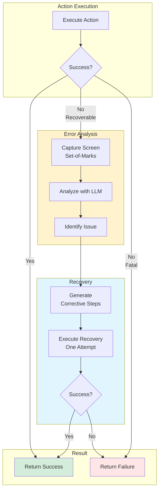

# Smart Self-Healing (Automatic Recovery)

> **Architecture**: See [Complete System Architecture](./01-complete-system-architecture.md) for V3 Multi-Layer OODA Loop overview.

---


## Overview

**Smart Self-Healing** is an automatic recovery mechanism that allows the agent to self-correct when an action fails. Instead of giving up immediately, the agent:

1. Captures the current screen state
2. Analyzes the situation with LLM via **proactive vision**
3. Generates minimal corrective steps based on structural analysis
4. Executes these steps (single attempt - Fail Fast)
5. Returns either success or the original failure

### Self-Healing Flow



## Proactive Vision (Set-of-Marks)

Vision is **no longer reactive** but **proactive**:
- **Before**: Vision analyzed screen after failure to understand what happened
- **Now**: Vision detects interactive elements with IDs (Set-of-Marks) BEFORE the action
- LLM receives structured list: `[ID 1] Button "Search" (x=100, y=200)`
- No more hallucinated CSS selectors, LLM directly references IDs

This proactive approach allows self-healing to better understand the real screen state.

## Design Principle

### Errors are Human and Digital

As stated in the ticket, **"Errors are human and digital. If an action fails, we should not give up, but attempt repair once."**

The system follows the **"Try Once, Fail Fast"** principle:
- **Try Once**: Single automatic repair attempt
- **Fail Fast**: If correction fails, abandon immediately without looping

## Architecture

### Components Involved

> **Note (TICKET-REFACTOR-003)**: Self-healing logic extracted to ExecutionService

1. **AgentExecutorV3** (`janus/core/agent_executor_v3.py`)
   - Orchestrates execution and delegates to ExecutionService
   
2. **ExecutionService** (`janus/services/execution_service.py`)
   - Main method: `execute_step_with_self_healing()`
   - Detects recoverable errors (ELEMENT_NOT_FOUND, TIMEOUT)
   - Delegates to ReplanningService for corrective steps

2. **ReasonerLLM** (`janus/reasoning/reasoner_llm.py`)
   - New method: `replan_with_vision()`
   - Uses template `replan_recovery_fr.jinja2`
   - Generates 2-3 minimal corrective steps (not a complete plan)

3. **Prompt template** (`janus/resources/prompts/replan_recovery_fr.jinja2`)
   - Specific instructions for vision-based recovery
   - Recovery strategies based on error type
   - Strict JSON format for corrective steps

### Execution Flow

```
┌─────────────────────────────────────────────────────────────┐
│ 1. Normal execution via _execute_step_with_self_healing()  │
└──────────────────────┬──────────────────────────────────────┘
  │
  ▼
  ┌─────────────────┐
  │ Success?        │
  └────┬────────┬───┘
       │        │
      YES       │ NO
       │        │
       ▼        ▼
  ┌──────────┐ ┌─────────────────────────────┐
  │ Return   │ │ 2. Recoverable error?       │
  │ success  │ │ (ELEMENT_NOT_FOUND,         │
  └──────────┘ │ TIMEOUT_ERROR)              │
               └──────────┬──────────────────┘
                          │
                          ▼
               ┌─────────────────────────────┐
               │ 3. Capture screenshot       │
               │ and vision analysis         │
               └──────────┬──────────────────┘
                          │
                          ▼
               ┌─────────────────────────────┐
               │ 4. Call Reasoner            │
               │ replan_with_vision()        │
               └──────────┬──────────────────┘
                          │
                          ▼
               ┌─────────────────────────────┐
               │ 5. Execute corrective       │
               │ steps (1 attempt)           │
               └──────────┬──────────────────┘
                          │
                ┌──────┴──────┐
                │             │
             Success        Fail
                │             │
                ▼             ▼
        ┌──────────────┐ ┌──────────────┐
        │ Return       │ │ Return       │
        │ success with │ │ original     │
        │ self_healing │ │ error        │
        └──────────────┘ └──────────────┘
```

## Technical Details

### Recoverable Errors

Self-healing is triggered only for these error types:
- `ErrorType.ELEMENT_NOT_FOUND`: UI element not found
- `ErrorType.TIMEOUT_ERROR`: Timeout during wait
- `ErrorType.NOT_FOUND_ERROR`: Resource not found

Other error types (validation, permission, etc.) do NOT trigger self-healing.

### Screen State Capture

The `_capture_screen_state()` method:
1. Captures screenshot via `ScreenshotEngine`
2. Uses `VisualGroundingEngine` to detect interactive elements (Set-of-Marks)
3. Generates structured list with IDs and coordinates for LLM
4. Falls back to basic message if vision unavailable

**Note**: Vision now generates **structured data** instead of literary descriptions:
- ✅ `[ID 1] Button "Search" (x=100, y=200)`
- ✅ `[ID 2] Textfield "Email" (x=150, y=250)`
- ❌ "I see a nice interface with a blue button..."

### Prompt Template: `replan_recovery_fr.jinja2`

The template includes:
- **Recovery strategies**: Rules based on error type
- **Available modules**: ui, browser, vision, system
- **Strict output format**: JSON with `steps` and `explanation`
- **Critical guidelines**:
  - Maximum 2-3 corrective steps
  - Based on structured element list (Set-of-Marks)
  - Reference elements by ID, not CSS selectors
  - Return empty plan if no alternative found

**Note**: Template now uses **Dynamic ReAct Loop**:
- No static JSON planning
- Dynamic reasoning based on actual screen state
- Real-time adaptation to interface changes

### Configuration

Self-healing is controlled by the `enable_replanning` flag in `AgentExecutorV3`:

```python
executor = AgentExecutorV3(
    enable_replanning=True,  # Enable self-healing
    enable_vision_recovery=True,
    max_retries=1
)
```

**Important**: Self-healing requires an operational `ReasonerLLM`.

## Acceptance Scenario

### Test: "Search" Button Not Found

**Context**: User requests "Click on the 'Search' button"

**Error**: Text button "Search" not found on screen

**Recovery**:
1. Agent captures screenshot
2. Vision analysis detects magnifying glass icon
3. Reasoner generates corrective step: `click(magnifying_glass)`
4. Agent executes click on icon
5. **Result**: Success via self-healing

### Test Code

See `tests/test_self_healing.py::TestAcceptanceCriteria::test_acceptance_click_search_button_not_found_uses_icon`

## Limitations and Constraints

### 1. Single Attempt (Fail Fast)

Self-healing attempts correction **only once**. If correction fails, original error is returned immediately. No infinite loops.

### 2. LLM Dependency

Self-healing requires:
- Available and operational `ReasonerLLM`
- LLM model capable of reasoning about screen descriptions
- Flag `enable_replanning=True`

If LLM is unavailable, normal behavior (direct failure) applies.

### 3. Vision Quality

Recovery quality depends on:
- Screenshot capture (timing, resolution)
- Vision analysis (alternative element detection)
- LLM's ability to interpret description

### 4. Supported Error Types

Only certain error types trigger self-healing. Validation, permission, or structural errors are NOT recoverable.

## Metrics and Observability

### Logs

Self-healing generates structured logs:

```
🔧 Attempting smart self-healing for ui.click (error: element_not_found)
✓ Self-healing plan generated: 2 corrective steps
  Explanation: 'Search' button not found. Screen analysis detected magnifying glass icon...
  Executing corrective step 1/2: ui.click
  ✓ Corrective step 1 succeeded
✓ Self-healing successful! Problem resolved.
```

### Returned Result

When self-healing succeeds, the `ActionResult` contains:

```python
{
 "success": True,
 "message": "Recovered via self-healing: ...",
 "data": {
 "self_healing": True,
 "corrective_steps": 2
  }
}
```

This allows tracking self-healing successes in metrics.

## Usage Examples

### Example 1: Text Button → Icon

**Original Action**: `click(text="Search")`
**Error**: ELEMENT_NOT_FOUND
**Correction**: `click(text="magnifying_glass")`

### Example 2: Hidden Element in Menu

**Original Action**: `click(text="Options")`
**Error**: ELEMENT_NOT_FOUND
**Correction**:
1. `click(text="Menu")` # Open menu
2. `click(text="Options")` # Click option

### Example 3: Timeout on Web Page

**Original Action**: `click(text="Submit")`
**Error**: TIMEOUT_ERROR
**Correction**: `press_key(key="Enter")` # Alternative to click

## Future Enhancements

### Version 1.1: Multimodal Vision

Replace textual lists with images with visual annotations sent directly to vision LLM (GPT-4V, Gemini Vision).

### Version 1.2: Pattern Learning

Memorize successful corrections to reuse in similar contexts.

### Version 1.3: Proactive Auto-Repair

Predict potential errors before execution and adjust plan upstream using Set-of-Marks to validate element availability.

### Version 2.0: Complete Set-of-Marks Integration

- Pré-analyse systématique avant chaque action
- Validation proactive des éléments requis
- Génération automatique d'alternatives si l'élément principal n'est pas disponible

## Références

- **Code**
 - `janus/core/agent_executor_v3.py::_execute_step_with_self_healing()`
 - `janus/reasoning/reasoner_llm.py::replan_with_vision()`
 - `janus/resources/prompts/replan_recovery_fr.jinja2`

- **Tests**
 - `tests/test_self_healing.py`

- **Tickets liés**
 - : Pre-flight checks (validation avant exécution)
 - : Vision recovery with heuristics

---

**Date de création** : 2025-12-08
**Auteur** : GitHub Copilot Agent
**Version** : 1.0

## See Also

- [Complete System Architecture](./01-complete-system-architecture.md) - Full system overview
- [Vision Integration](./18-proactive-vision-integration.md) - Set-of-Marks for recovery
- [Reasoner V4](./08-reasoner-v4-think-first.md) - Recovery reasoning
- [Dynamic ReAct Loop](./13-dynamic-react-loop.md) - OODA adaptation
