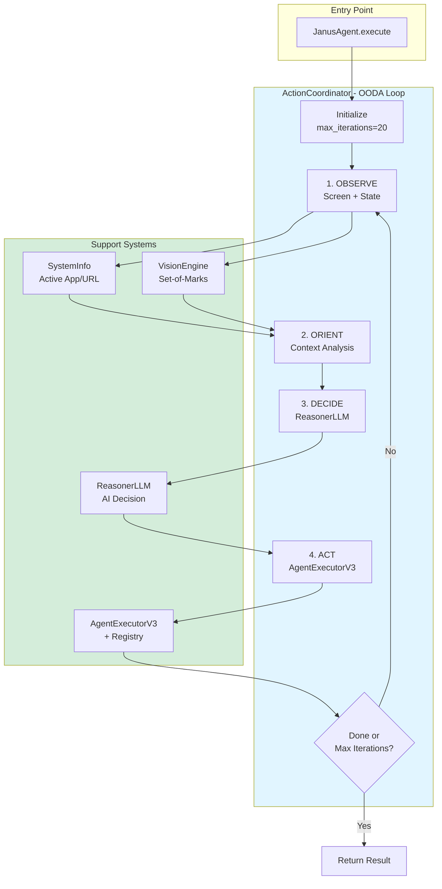

# ActionCoordinator - OODA Loop Orchestration

> **Architecture**: See [Complete System Architecture](./01-complete-system-architecture.md) for V3 Multi-Layer OODA Loop overview.

---

## Overview

**ActionCoordinator** is the central orchestration component that implements the OODA Loop (Observe-Orient-Decide-Act) pattern. It coordinates the execution of user goals through iterative cycles of observation, reasoning, and action.

### ActionCoordinator Flow



## Implementation

### File Location

`janus/core/action_coordinator.py` (~333 lines)

### Core Structure

```python
class ActionCoordinator:
    """
    Minimal coordinator implementing the OODA Loop.
    
    Responsibilities:
    1. Execute OODA loop iterations (Observe-Orient-Decide-Act)
    2. Call ReasonerLLM for next action decision
    3. Route actions to AgentExecutorV3
    4. Manage execution context and memory
    5. Handle loop termination
    """
    
    def __init__(
        self,
        reasoner: ReasonerLLM,
        executor: AgentExecutorV3,
        vision_engine: Optional[VisionEngine] = None,
        max_iterations: int = 20,
        enable_vision: bool = True
    ):
        self.reasoner = reasoner
        self.executor = executor
        self.vision_engine = vision_engine
        self.max_iterations = max_iterations
        self.enable_vision = enable_vision
        self.memory_engine = MemoryEngine()
```

## The OODA Loop

### Execution Flow

```python
async def execute_goal(
    self,
    user_goal: str,
    intent: Intent,
    session_id: str,
    language: str = "en"
) -> ExecutionResult:
    """
    Execute user goal using OODA loop.
    
    Args:
        user_goal: Natural language description of goal
        intent: Parsed intent from user command
        session_id: Session identifier
        language: Language for LLM communication
    
    Returns:
        ExecutionResult with success status and action results
    """
    memory = {}
    iteration = 0
    
    while iteration < self.max_iterations:
        iteration += 1
        
        # 1. OBSERVE - Capture current state
        system_state = await self._observe_system_state()
        visual_context = await self._observe_visual_context() if self.enable_vision else None
        
        # 2. ORIENT - Analyze context
        context = self._orient(
            user_goal=user_goal,
            system_state=system_state,
            visual_context=visual_context,
            memory=memory,
            iteration=iteration
        )
        
        # 3. DECIDE - Get next action from Reasoner
        decision = await self._decide(context, language)
        
        # Check if done
        if decision["action"] == "done":
            return ExecutionResult(
                success=True,
                message="Goal completed",
                action_results=memory.get("results", [])
            )
        
        # 4. ACT - Execute action
        result = await self._act(decision, memory)
        
        # Update memory
        memory["last_action"] = decision
        memory["last_result"] = result
        memory.setdefault("results", []).append(result)
        
        # Handle errors (but continue loop)
        if not result.success:
            memory["last_error"] = result.error
    
    # Max iterations reached
    return ExecutionResult(
        success=False,
        message=f"Max iterations ({self.max_iterations}) reached",
        action_results=memory.get("results", [])
    )
```

## OODA Phases in Detail

### Phase 1: OBSERVE

Captures the current state of the system and environment.

```python
async def _observe_system_state(self) -> Dict[str, Any]:
    """Capture system state (active app, URL, etc.)"""
    state = {}
    
    # Get active application
    state["active_app"] = get_active_app_name()
    
    # Get window title
    state["window_title"] = get_active_window_title()
    
    # Get browser URL if applicable
    if state["active_app"] in ["Safari", "Chrome", "Firefox"]:
        state["browser_url"] = get_browser_url()
    
    return state

async def _observe_visual_context(self) -> Optional[str]:
    """Capture visual context with Set-of-Marks"""
    if not self.vision_engine:
        return None
    
    # Capture screen with element detection
    elements = await self.vision_engine.capture_with_marks()
    
    # Format for LLM
    return self._format_visual_context(elements)
```

### Phase 2: ORIENT

Analyzes the observations and builds context for decision-making.

```python
def _orient(
    self,
    user_goal: str,
    system_state: Dict,
    visual_context: Optional[str],
    memory: Dict,
    iteration: int
) -> Dict[str, Any]:
    """Build context for decision-making"""
    context = {
        "user_goal": user_goal,
        "iteration": iteration,
        "system_state": system_state,
        "visual_context": visual_context,
        "memory": {
            "last_action": memory.get("last_action"),
            "last_result": memory.get("last_result"),
            "last_error": memory.get("last_error"),
        }
    }
    
    return context
```

### Phase 3: DECIDE

Calls ReasonerLLM to decide the next action.

```python
async def _decide(self, context: Dict, language: str) -> Dict[str, Any]:
    """
    Use Reasoner to decide next action.
    
    Returns:
        {
            "action": "system.open_app" | "done",
            "args": {...},
            "reasoning": "..."
        }
    """
    decision = await self.reasoner.decide_next_action(
        user_goal=context["user_goal"],
        system_state=context["system_state"],
        visual_context=context["visual_context"],
        memory=context["memory"],
        language=language
    )
    
    return decision
```

### Phase 4: ACT

Executes the decided action via AgentExecutorV3.

```python
async def _act(self, decision: Dict, memory: Dict) -> ActionResult:
    """Execute action through executor"""
    action = decision["action"]
    args = decision.get("args", {})
    
    # Execute through AgentExecutorV3 (which uses AgentRegistry)
    result = await self.executor.execute_step({
        "action": action,
        "args": args
    })
    
    return result
```

## Loop Termination

The loop terminates when:

1. **Goal Completed**: Reasoner returns `action: "done"`
2. **Max Iterations**: Reaches configured max_iterations (default: 20)
3. **Fatal Error**: Unrecoverable error occurs (rare)

```python
# Reasoner signals completion
{
    "action": "done",
    "reasoning": "Goal achieved - Calculator opened and computation performed"
}

# Loop exits with success
return ExecutionResult(success=True, ...)
```

## Configuration

### Initialization Options

```python
coordinator = ActionCoordinator(
    reasoner=reasoner_llm,          # Required
    executor=agent_executor_v3,     # Required
    vision_engine=vision_engine,    # Optional
    max_iterations=20,              # Default: 20
    enable_vision=True              # Default: True
)
```

### Runtime Options

```python
result = await coordinator.execute_goal(
    user_goal="Open Calculator and compute 15 + 27",
    intent=intent,
    session_id="session_123",
    language="en"  # or "fr"
)
```

## Integration with JanusAgent

```python
class JanusAgent:
    def __init__(self):
        # Initialize components
        self.reasoner = ReasonerLLM()
        self.executor = AgentExecutorV3()
        self.vision = VisionEngine()
        
        # Create coordinator
        self.coordinator = ActionCoordinator(
            reasoner=self.reasoner,
            executor=self.executor,
            vision_engine=self.vision
        )
    
    async def execute(self, command: str) -> ExecutionResult:
        """Execute command through coordinator"""
        intent = self._parse_intent(command)
        
        result = await self.coordinator.execute_goal(
            user_goal=command,
            intent=intent,
            session_id=self.session_id
        )
        
        return result
```

## Error Handling

### Non-Fatal Errors

Errors during action execution don't stop the loop - the LLM sees the error and adapts:

```python
# Action fails
result = ActionResult(
    success=False,
    error="Calculator not found"
)

# Error stored in memory
memory["last_error"] = result.error

# Loop continues to next iteration
# Reasoner sees error in context and tries alternative approach
```

### Fatal Errors

Only catastrophic errors stop the loop:

```python
try:
    result = await self._act(decision, memory)
except CatastrophicError as e:
    return ExecutionResult(
        success=False,
        error=f"Fatal error: {e}"
    )
```

## Performance

### Typical Metrics

| Metric | Value | Notes |
|--------|-------|-------|
| **Iterations per goal** | 3-10 | Simple goals: 3-5, Complex: 5-10 |
| **Time per iteration** | 2-5s | Depends on LLM + vision + action |
| **Memory per session** | 10-50 MB | Context + results |
| **Max iterations** | 20 | Configurable, prevents infinite loops |

### Optimization

- **Vision caching**: 2s TTL to avoid redundant captures
- **Async operations**: Non-blocking I/O throughout
- **Lazy loading**: Vision loaded only if enabled
- **Connection pooling**: Reuse LLM connections

## Debugging

### Logging

```python
logger.info(f"OODA iteration {iteration}/{max_iterations}")
logger.info(f"System state: {system_state}")
logger.info(f"Decision: {decision['action']}")
logger.info(f"Result: success={result.success}")
```

### Observability

Track OODA loop progress:

```python
# Each iteration logs:
# - Current state
# - LLM decision
# - Action result
# - Memory state
```

## Example Execution

### Simple Goal: "Open Calculator"

```
Iteration 1:
  OBSERVE: active_app=Finder
  DECIDE: system.open_app(app_name="Calculator")
  ACT: Success
  
Iteration 2:
  OBSERVE: active_app=Calculator
  DECIDE: done
  Result: SUCCESS (2 iterations, 4s)
```

### Complex Goal: "Search YouTube for Daft Punk"

```
Iteration 1:
  OBSERVE: active_app=Finder
  DECIDE: browser.navigate(url="https://youtube.com")
  ACT: Success
  
Iteration 2:
  OBSERVE: active_app=Safari, url=youtube.com
  DECIDE: ui.click(element_id="search_box")
  ACT: Success
  
Iteration 3:
  OBSERVE: Search box focused
  DECIDE: ui.type(text="Daft Punk")
  ACT: Success
  
Iteration 4:
  OBSERVE: Text entered
  DECIDE: ui.press_key(key="Enter")
  ACT: Success
  
Iteration 5:
  OBSERVE: Search results displayed
  DECIDE: done
  Result: SUCCESS (5 iterations, 12s)
```

## See Also

- [OODA Loop Deep Dive](./13-dynamic-react-loop.md) - Detailed OODA explanation
- [Agent Executor V3](./01-complete-system-architecture.md#agentexecutorv3) - Step execution
- [Reasoner LLM](./08-reasoner-v4-think-first.md) - AI decision making
- [Vision Engine](./18-proactive-vision-integration.md) - Set-of-Marks system

---

**Document Version:** 2.0  
**Last Updated:** December 2024  
**Verified Against:** janus/core/action_coordinator.py
