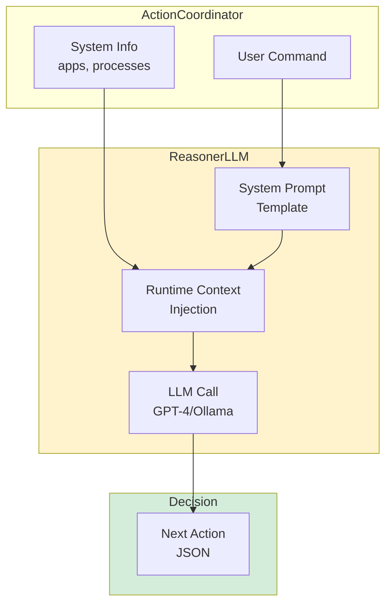

# Prompt Engineering - ReAct System Prompts

> **Architecture**: See [Complete System Architecture](./01-complete-system-architecture.md) for V3 Multi-Layer OODA Loop overview.

---

## Overview

Janus uses carefully engineered prompts to guide the LLM's decision-making in the OODA Loop. The prompt system provides context, normalization rules, and strategic guidance to ensure reliable action generation.

### Prompt Architecture



## Active Prompt Templates

### Location

`janus/resources/prompts/`

### Current Templates

| Template | Purpose | Language |
|----------|---------|----------|
| `reasoner_react_system_en.jinja2` | Main ReAct OODA loop prompt | English |
| `reasoner_react_system_fr.jinja2` | Main ReAct OODA loop prompt | French |
| `reasoner_reflex_en.jinja2` | Quick reflex actions | English |
| `reasoner_reflex_fr.jinja2` | Quick reflex actions | French |
| `parse_command_en.jinja2` | Command parsing | English |
| `parse_command_fr.jinja2` | Command parsing | French |
| `verification_system_en.jinja2` | Action validation | English |
| `verification_system_fr.jinja2` | Action validation | French |
| `error_detection_en.jinja2` | Error analysis | English |
| `error_detection_fr.jinja2` | Error analysis | French |

## ReAct Prompt Structure

The main `reasoner_react_system_*.jinja2` prompts have three key sections:

### 1. System Context

Provides real-time awareness of the system state:

```jinja2
## Available Applications
{{ available_apps | join(', ') }}

## Currently Running
{{ running_processes | join(', ') }}

## Active Window
App: {{ active_app }}

URL: {{ browser_url }}

```

**Purpose**: LLM knows what apps exist and what's currently running.

### 2. Normalization Rules

Critical guidelines for handling app names and variations:

```jinja2
## App Name Normalization Rules

1. **Case Insensitive**: "Safari", "safari", "SAFARI" → all same
2. **Accent Handling**: "café" = "cafe", "naïve" = "naive"  
3. **Partial Matching**: "VS Code" matches "Visual Studio Code"
4. **Common Aliases**:
   - "Chrome" → "Google Chrome"
   - "Word" → "Microsoft Word"
   - "Excel" → "Microsoft Excel"
5. **Space Tolerance**: "VSCode" = "VS Code" = "Visual Studio Code"
6. **Use Exact Names**: Always use official name from available_apps list
```

**Purpose**: Handles real-world user variations in app names.

### 3. Decision Strategy

Guides the LLM's action selection process:

```jinja2
## Decision Strategy

For each OODA iteration:

1. **Observe**: Current screen state + system info
2. **Orient**: Analyze user goal vs current state
3. **Decide**: Choose ONE next action (not a plan)
4. **Output Format**: JSON with action, args, reasoning

## Action Selection Rules

- If app already running → use it (don't open again)
- If app needed but not running → open it first
- Use exact app name from available_apps list
- Reference visual elements by Set-of-Marks IDs
- Return "done" when goal achieved
```

**Purpose**: Ensures LLM follows OODA Loop principles.

## System Info Provider

### Implementation

`janus/os/system_info.py` provides runtime context:

```python
def get_available_applications() -> List[str]:
    """
    Get list of launchable applications.
    
    Returns:
        List of application names (e.g., ["Safari", "Chrome", "Calculator"])
    """
    # macOS: Scans /Applications and ~/Applications
    # Windows: Scans Program Files
    # Linux: Scans .desktop files

def get_running_processes() -> List[str]:
    """
    Get list of currently running applications.
    
    Returns:
        List of process names (e.g., ["Finder", "Terminal", "Safari"])
    """
    # macOS: Uses AppleScript
    # Others: Uses psutil
```

### Usage in Prompts

```python
# In ReasonerLLM
context = {
    "user_goal": user_goal,
    "available_apps": get_available_applications(),
    "running_processes": get_running_processes(),
    "active_app": get_active_app_name(),
    "browser_url": get_browser_url() if is_browser else None,
}

prompt = render_template("reasoner_react_system_en.jinja2", **context)
```

## Prompt Engineering Principles

### 1. Context-Rich

Every prompt includes:
- User's goal
- Current system state
- Available resources
- Visual context (Set-of-Marks)
- Recent action history

### 2. Normalization-Aware

Prompts explicitly teach the LLM to handle:
- Case variations (Safari vs safari)
- Accent variations (café vs cafe)
- Aliases (Chrome vs Google Chrome)
- Spacing variations (VSCode vs VS Code)

### 3. OODA-Focused

Prompts emphasize:
- ONE action at a time (not planning)
- Observe before deciding
- Adapt to current state
- Loop until done

### 4. Type-Safe Output

Prompts specify exact JSON schema:

```json
{
  "action": "system.open_app | browser.navigate | done",
  "args": {
    "app_name": "...",
    "url": "..."
  },
  "reasoning": "Brief explanation"
}
```

## Examples

### Example 1: App Name Normalization

**User Command**: "open chrome"

**Prompt Context**:
```python
available_apps: ["Safari", "Google Chrome", "Firefox"]
running_processes: ["Finder", "Terminal"]
```

**LLM Decision**:
```json
{
  "action": "system.open_app",
  "args": {"app_name": "Google Chrome"},
  "reasoning": "Normalized 'chrome' to 'Google Chrome' from available_apps"
}
```

### Example 2: Already Running App

**User Command**: "open Safari"

**Prompt Context**:
```python
available_apps: ["Safari", "Google Chrome"]
running_processes: ["Safari", "Terminal"]
```

**LLM Decision**:
```json
{
  "action": "done",
  "args": {},
  "reasoning": "Safari is already running (in running_processes)"
}
```

### Example 3: Visual Element Reference

**User Command**: "click the submit button"

**Prompt Context**:
```python
visual_elements: [
  "[ID 1] Button 'Submit' (x=100, y=200)",
  "[ID 2] Button 'Cancel' (x=150, y=200)"
]
```

**LLM Decision**:
```json
{
  "action": "ui.click",
  "args": {"element_id": 1},
  "reasoning": "Clicking Submit button at ID 1"
}
```

## Prompt Loading

### Template Engine

```python
# In ReasonerLLM class
def _load_prompt_template(self, template_name: str) -> Template:
    """Load Jinja2 template from resources"""
    template_path = Path("janus/resources/prompts") / template_name
    with open(template_path) as f:
        return Template(f.read())

def _render_prompt(self, template: Template, **context) -> str:
    """Render template with runtime context"""
    return template.render(**context)
```

### Language Selection

```python
# Automatic language selection based on settings
def _get_prompt_template(self, prompt_type: str) -> Template:
    language = self.settings.language  # "en" or "fr"
    template_name = f"{prompt_type}_{language}.jinja2"
    return self._load_prompt_template(template_name)
```

## Validation Prompts

### Purpose

Separate prompts validate actions before execution:

```python
# verification_system_en.jinja2
"""
You are a validation agent. Check if this action is safe:

Action: {{ action }}
Args: {{ args }}

Validate:
1. Are required args present?
2. Are values sensible?
3. Are there any safety concerns?

Return: {valid: true/false, reason: "..."}
"""
```

### Usage

```python
# In ValidatorAgent
validation_result = await reasoner.validate_action(
    action=action,
    args=args,
    context=current_context
)

if not validation_result["valid"]:
    return ActionResult(success=False, error=validation_result["reason"])
```

## Performance Considerations

### Token Efficiency

- **Context trimming**: Only include relevant recent actions
- **Visual element filtering**: Only include interactive elements
- **App list caching**: Cache available_apps (changes rarely)

### Prompt Size

| Prompt Type | Typical Size | Max Size |
|-------------|-------------|----------|
| ReAct System | 800-1200 tokens | 2000 tokens |
| Reflex | 200-400 tokens | 600 tokens |
| Validation | 150-300 tokens | 500 tokens |

### Response Time

- **With context**: 2-4s per decision
- **Without context**: 5-8s (less accurate)
- **Cached apps**: Saves ~100 tokens per request

## Best Practices

### 1. Keep Prompts Updated

When architecture changes:
- Update templates immediately
- Test with real LLM calls
- Verify JSON output schema

### 2. Include Examples

Prompts should include:
- 2-3 example inputs
- Expected output format
- Common edge cases

### 3. Clear Instructions

Use:
- Numbered lists for multi-step processes
- Bold for critical rules
- Code blocks for exact formats

### 4. Version Control

- Keep old prompts in git history
- Document significant changes
- Test before deploying new prompts

## See Also

- [Complete System Architecture](./01-complete-system-architecture.md) - Full system overview
- [Reasoner V4](./08-reasoner-v4-think-first.md) - How prompts are used in decision making
- [System Context](./09-system-context-grounding.md) - Context injection details
- [LLM-First Principle](./03-llm-first-principle.md) - Why we use prompts instead of heuristics

---

**Document Version:** 1.0  
**Last Updated:** December 2024  
**Verified Against:** janus/resources/prompts/, janus/reasoning/reasoner_llm.py
