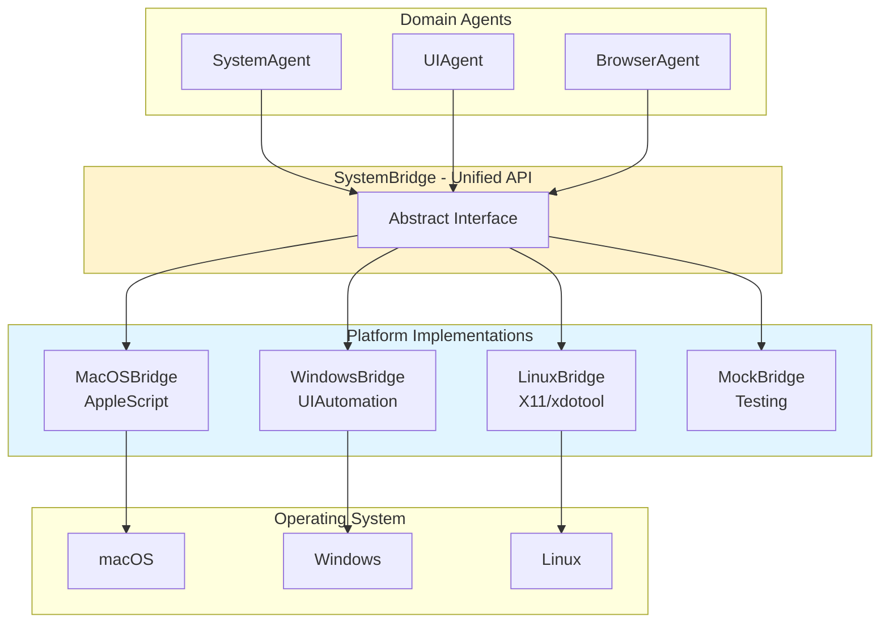

# 19. System Abstraction Layer (SystemBridge) - Official HAL

> **Architecture**: See [Complete System Architecture](./01-complete-system-architecture.md) for V3 Multi-Layer OODA Loop overview.
> **Decision**: See [HAL Consolidation ADR](./30-hal-consolidation-adr.md) for why SystemBridge is the official HAL.

---

**Create System Abstraction Layer (SystemBridge) - Official HAL**

**Status:** ✅ Implemented & Official  
**Version:** 1.0  
**Date:** December 2024  
**Decision:** CORE-FOUNDATION-003 - SystemBridge is the sole Hardware Abstraction Layer

---

## Overview

The SystemBridge is the **unified and official abstraction layer** for platform-agnostic system operations across macOS, Windows, and Linux. It eliminates the need for agents to implement platform-specific code and provides a consistent API for system interactions.

⚠️ **Note**: The `janus/automation/*` layer (OSInterface) is deprecated. All new code should use SystemBridge.
See [HAL Consolidation ADR](./30-hal-consolidation-adr.md) for migration guide.

### SystemBridge Architecture



### Problem Statement

Before SystemBridge, each agent reimplemented system operations with platform-specific code duplicated across agents, making it hard to port, test, and maintain.

### Solution

SystemBridge provides
- ✅ **Unified API**: Single interface for all system operations
- ✅ **Platform-Specific Implementations**: MacOSBridge, WindowsBridge, LinuxBridge
- ✅ **Easy to Mock**: MockSystemBridge for testing
- ✅ **Single Point of Maintenance**: Fix bugs once, benefit everywhere

---

## Architecture

### Class Hierarchy

```
SystemBridge (ABC)
├── MacOSBridge      - macOS implementation (AppleScript + System Events)
├── WindowsBridge    - Windows implementation (subprocess + PowerShell + optional deps) ✅
├── LinuxBridge      - Linux implementation (subprocess + standard tools + optional deps) ✅
└── MockSystemBridge - Test implementation
```

### Core Components

```
janus/os/
├── system_bridge.py    - Abstract base class and data structures
├── macos_bridge.py     - macOS implementation (✅ Complete)
├── windows_bridge.py   - Windows implementation (✅ Complete - TICKET-PLATFORM-001)
├── linux_bridge.py     - Linux implementation (✅ Complete)
├── mock_bridge.py      - Testing implementation
└── __init__.py         - Factory methods
```

---

## API Reference

### Factory Methods

```python
from janus.os import get_system_bridge, create_system_bridge

# Get singleton instance (recommended)
bridge = get_system_bridge()

# Create new instance (for testing)
bridge = create_system_bridge()
```

### Core Operations

#### 1. Platform Detection

```python
# Check if bridge is available on current platform
if bridge.is_available():
    # Safe to use bridge operations
    pass

# Get platform name
platform = bridge.get_platform_name()  # "macOS", "Windows", "Linux", "Mock"
```

#### 2. Application Management

```python
# Open/launch an application
result = bridge.open_app("Safari")
if result.success:
    print(f"Opened {result.data['app_name']}")

# Close/quit an application
result = bridge.close_app("TextEdit")

# Get list of running applications
result = bridge.get_running_apps()
if result.success:
    apps = result.data["apps"]  # List[str]
    print(f"Running: {apps}")
```

#### 3. Window Management

```python
# Get active window info
result = bridge.get_active_window()
if result.success:
    window = result.data["window"]  # WindowInfo
    print(f"Active: {window.app_name} - {window.title}")

# List all windows
result = bridge.list_windows()
if result.success:
    windows = result.data["windows"]  # List[WindowInfo]
    for window in windows:
        print(f"{window.app_name}: {window.title}")

# Focus/activate a window
result = bridge.focus_window("Safari")
```

#### 4. UI Interactions

```python
# Click at coordinates
result = bridge.click(x=100, y=200, button="left")

# Type text
result = bridge.type_text("Hello, World!")

# Press key with modifiers
result = bridge.press_key("c", modifiers=["command"])  # Cmd+C

# Press special keys
result = bridge.press_key("return")  # Enter
result = bridge.press_key("escape")  # Esc
```

#### 5. Clipboard Operations

```python
# Get clipboard text
result = bridge.get_clipboard()
if result.success:
    text = result.data["text"]
    print(f"Clipboard: {text}")

# Set clipboard text
result = bridge.set_clipboard("New content")
```

#### 6. System Operations

```python
# Show system notification
result = bridge.show_notification(
    message="Task completed",
    title="Janus"
)

# Run platform-specific script
# macOS: AppleScript
# Windows: PowerShell (TODO)
# Linux: Bash (TODO)
result = bridge.run_script(
    'tell application "Finder" to activate'
)
if result.success:
    stdout = result.data["stdout"]
    stderr = result.data["stderr"]
```

---

## Data Structures

### SystemBridgeResult

All operations return a `SystemBridgeResult` for consistent error handling

```python
@dataclass
class SystemBridgeResult:
    status: SystemBridgeStatus  # SUCCESS, ERROR, NOT_AVAILABLE, TIMEOUT
    data: Dict[str, Any]        # Operation-specific data
    error: Optional[str]        # Error message if failed
    
    @property
    def success(self) -> bool:
        return self.status == SystemBridgeStatus.SUCCESS
```

### WindowInfo

Window information is returned as a `WindowInfo` dataclass

```python
@dataclass
class WindowInfo:
    title: str                    # Window title/name
    app_name: str                 # Application name
    window_id: Optional[str]      # Platform-specific window ID
    is_active: bool               # Whether this is the active window
    bounds: Optional[Dict[str, int]]  # x, y, width, height
```

---

## Platform Implementations

### macOS (MacOSBridge) ✅

**Status:** Fully Implemented

**Technologies:**
- AppleScript for app/window management
- System Events for keyboard/mouse automation
- pbcopy/pbpaste for clipboard operations

**Features:**
- ✅ Application launch/quit
- ✅ Window focus and listing
- ✅ Keyboard input (text typing, key presses)
- ✅ Mouse clicks
- ✅ Clipboard read/write
- ✅ System notifications
- ✅ Custom AppleScript execution

**Example:**
```python
from janus.os.macos_bridge import MacOSBridge

bridge = MacOSBridge()
if bridge.is_available():
    # Open Safari
    bridge.open_app("Safari")
    
    # Type URL
    bridge.type_text("https://example.com")
    bridge.press_key("return")
    
    # Copy text
    bridge.press_key("a", modifiers=["command"])  # Select all
    bridge.press_key("c", modifiers=["command"])  # Copy
    
    # Get clipboard
    result = bridge.get_clipboard()
    print(result.data["text"])
```

### Windows (WindowsBridge) ✅

**Status:** ✅ Fully Implemented (TICKET-PLATFORM-001, December 2024)

**Technologies Used:**
- subprocess for application management
- taskkill/tasklist for process control
- tkinter for clipboard operations (built-in)
- PowerShell for notifications and scripts
- **Optional**: pywinauto for window management
- **Optional**: pyautogui for UI interactions

**Features:**
- ✅ All 16 SystemBridge methods implemented
- ✅ Graceful degradation with optional dependencies
- ✅ 38 comprehensive unit tests
- ✅ Full documentation

**Documentation:** See [Windows Bridge Guide](../platform/windows-bridge-guide.md)

### Linux (LinuxBridge) ✅

**Status:** ✅ Fully Implemented (December 2024)

**Technologies Used:**
- subprocess for application management
- ps/pkill for process control
- bash for script execution
- notify-send for notifications
- **Optional**: xclip/xsel for clipboard operations
- **Optional**: xdotool/wmctrl for window management
- **Optional**: pyautogui for UI interactions

**Features:**
- ✅ All 16 SystemBridge methods implemented
- ✅ Graceful degradation with optional dependencies
- ✅ X11-focused (Wayland support future enhancement)

---

## Testing

### MockSystemBridge

For testing, use `MockSystemBridge` which simulates all operations

```python
from janus.os.mock_bridge import MockSystemBridge

# Create mock bridge
mock = MockSystemBridge()

# All operations succeed by default
result = mock.open_app("TestApp")
assert result.success

# Check call log
assert mock.was_called("open_app")
assert mock.get_call_count("open_app") == 1
last_call = mock.get_last_call("open_app")
assert last_call["args"]["app_name"] == "TestApp"

# Test failure scenarios
mock_fail = MockSystemBridge(should_fail=True)
result = mock_fail.open_app("App")
assert not result.success
assert result.status == SystemBridgeStatus.ERROR
```

### Running Tests

```bash
# Run all SystemBridge tests
python -m unittest tests.test_system_bridge -v

# Run specific test class
python -m unittest tests.test_system_bridge.TestMacOSBridge -v

# Run with coverage
pytest tests/test_system_bridge.py --cov=janus.os --cov-report=html
```

**Test Coverage:** 46 tests, 100% passing

---

## Migration Guide

### From OSInterface to SystemBridge

If you're using the old `OSInterface` from `janus.automation`, migrate to SystemBridge

```python
from janus.automation.factory import get_os_interface
from janus.automation.os_interface import OSInterfaceResult

os_interface = get_os_interface()
result = os_interface.focus_window("Safari")
if result.success:
    print("Success")
```

```python
from janus.os import get_system_bridge, SystemBridgeResult

bridge = get_system_bridge()
result = bridge.open_app("Safari")  # focus_window → open_app
if result.success:
    print("Success")
```

**Key Differences:**
- `focus_window()` → `open_app()` (same functionality on macOS)
- `send_keys()` → `press_key()` (more consistent naming)
- Add clipboard operations: `get_clipboard()`, `set_clipboard()`
- Add app management: `get_running_apps()`, `close_app()`

### For Agent Developers

Update your agents to use SystemBridge instead of direct platform calls

```python
class MyAgent:
    def execute(self, action):
        # Direct AppleScript - platform-specific
        script = f'tell application "{app}" to activate'
        subprocess.run(["osascript", "-e", script])
```

```python
from janus.os import get_system_bridge

class MyAgent:
    def __init__(self):
        self.bridge = get_system_bridge()
    
    def execute(self, action):
        # Platform-agnostic
        result = self.bridge.open_app(app)
        if not result.success:
            raise AgentError(result.error)
```

---

## Best Practices

### 1. Always Check Availability

```python
bridge = get_system_bridge()
if not bridge.is_available():
    raise RuntimeError(f"SystemBridge not available on {bridge.get_platform_name()}")
```

### 2. Handle Errors Gracefully

```python
result = bridge.open_app("Safari")
if not result.success:
    if result.status == SystemBridgeStatus.NOT_AVAILABLE:
        print("Operation not supported on this platform")
    else:
        print(f"Error: {result.error}")
```

### 3. Use Singleton for Performance

```python
# Good: Use singleton (cached)
bridge = get_system_bridge()

# Avoid: Creating new instances unnecessarily
bridge = create_system_bridge()  # Only for testing
```

### 4. Mock in Tests

```python
from janus.os.mock_bridge import MockSystemBridge

def test_my_feature():
    mock_bridge = MockSystemBridge()
    # Inject mock into your code
    result = mock_bridge.open_app("TestApp")
    assert result.success
```

### 5. Timeout Long Operations

```python
# Specify timeout for operations that might hang
result = bridge.open_app("MyApp", timeout=5.0)
```

---

## Performance Considerations

### Lazy Loading

The AppleScript executor is lazy-loaded on first use

```python
bridge = MacOSBridge()  # Fast - no executor loaded yet
result = bridge.open_app("Safari")  # Executor loaded here
```

### Singleton Pattern

Use `get_system_bridge()` to reuse the same instance

```python
# Only creates bridge once
bridge1 = get_system_bridge()
bridge2 = get_system_bridge()
assert bridge1 is bridge2
```

### Operation Costs

| Operation | Typical Time | Notes |
|-----------|--------------|-------|
| `open_app()` | 500-2000ms | App launch time |
| `get_active_window()` | 50-200ms | AppleScript query |
| `type_text()` | 100ms + text length | System Events |
| `press_key()` | 50-100ms | Fast |
| `click()` | 50-100ms | Fast |
| `get_clipboard()` | 10-50ms | Very fast (pbpaste) |
| `set_clipboard()` | 10-50ms | Very fast (pbcopy) |

---

## Troubleshooting

### Common Issues

#### 1. "MacOSBridge is only available on macOS"

**Cause:** Trying to use macOS-specific operations on Linux/Windows.

**Solution:** Check availability first
```python
if bridge.is_available():
    bridge.open_app("Safari")
```

#### 2. AppleScript Timeout Errors

**Cause:** Operation takes longer than default timeout.

**Solution:** Increase timeout
```python
result = bridge.open_app("MyApp", timeout=30.0)
```

#### 3. Clipboard Operations Fail

**Cause:** pbcopy/pbpaste not available or permissions issue.

**Solution:** On macOS, pbcopy/pbpaste should be available by default. Check permissions.

#### 4. Window Not Found

**Cause:** Application not running or window doesn't exist.

**Solution:** Check running apps first
```python
result = bridge.get_running_apps()
if "Safari" in result.data["apps"]:
    bridge.focus_window("Safari")
```

---

## Future Enhancements

### Short Term (Next Sprint)

- [ ] Complete WindowsBridge implementation
- [ ] Complete LinuxBridge implementation
- [ ] Add window bounds/position operations
- [ ] Add screenshot capabilities

### Medium Term (Next Quarter)

- [ ] Cross-platform drag-and-drop
- [ ] File dialog automation
- [ ] System tray/menu bar interactions
- [ ] Keyboard layout detection

### Long Term (Future)

- [ ] Remote system control (over network)
- [ ] Multi-monitor support
- [ ] Accessibility API integration
- [ ] Hardware input simulation

---

## Related Documentation

- [04-agent-architecture.md](04-agent-architecture.md) - Agent-based execution system
- [11-generic-tooling-standardization.md](11-generic-tooling-standardization.md) - Generic tooling approach
- [ARCHITECTURE_AUDIT_COMPREHENSIVE_EN.md](../old/development/ARCHITECTURE_AUDIT_COMPREHENSIVE_EN.md) - Full architecture audit

---

## Summary

SystemBridge provides a clean, testable, and maintainable abstraction for system operations

- ✅ **Unified API**: One interface for all platforms
- ✅ **Platform Implementations**: macOS, Windows, and Linux fully implemented
- ✅ **Easy Testing**: MockSystemBridge for unit tests
- ✅ **Well Documented**: Comprehensive API and platform-specific guides
- ✅ **Fully Tested**: 85+ tests covering all functionality across platforms

**Platform Status (December 2024):**
- ✅ **macOS**: Fully implemented with AppleScript
- ✅ **Windows**: Fully implemented (TICKET-PLATFORM-001)
- ✅ **Linux**: Fully implemented with graceful degradation

**Future Enhancements:**
1. Add advanced features (window positioning, screenshots)
2. Enhanced Wayland support for Linux
3. Native Windows UIAutomation integration
4. Performance optimizations
