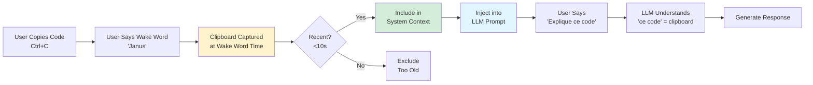
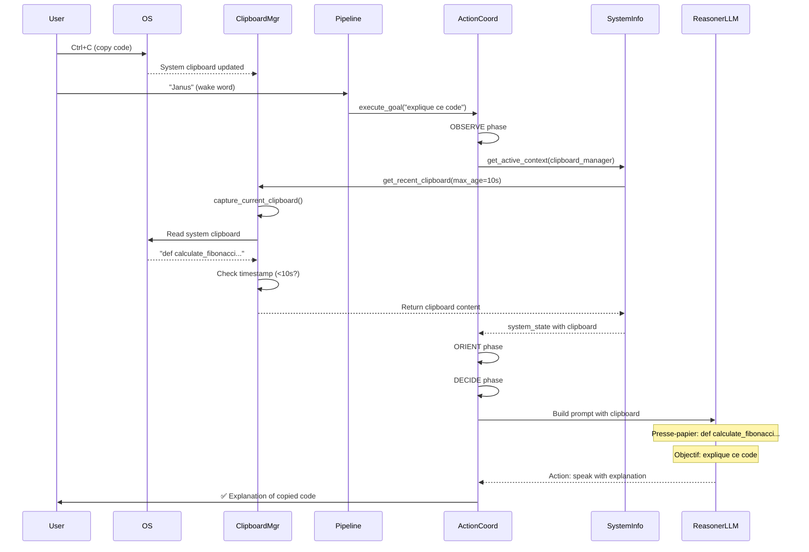

# 21 - Smart Clipboard (Context Copié)

> **Architecture**: See [Complete System Architecture](./01-complete-system-architecture.md) for V3 Multi-Layer OODA Loop overview.

---

**TICKET-FEAT-001**: Smart Clipboard - Automatic clipboard capture at wake word

**Status**: ✅ Implemented  
**Version**: V3+  
**Last Updated**: December 2024  
**Priority**: 🟠 HIGH (Immediate Productivity)

---

## 📋 Table of Contents

1. [Overview](#overview)
2. [Problem Statement](#problem-statement)
3. [Architecture](#architecture)
4. [Implementation](#implementation)
5. [Integration](#integration)
6. [Usage Examples](#usage-examples)
7. [Technical Details](#technical-details)
8. [Security](#security)
9. [Performance](#performance)
10. [Future Improvements](#future-improvements)

---

## 🎯 Overview

The **Smart Clipboard** feature enables users to reference clipboard content implicitly using natural language. When users copy text (Ctrl+C) and immediately give a voice command, Janus automatically captures the clipboard content and includes it in the LLM context, enabling commands like "explain this" or "fix that" without explicit pasting.

### Smart Clipboard Flow



### Key Benefits

- ✅ **Natural References**: Say "this code", "that error", "ça" - LLM understands implicitly
- ✅ **No Explicit Pasting**: Copy once, reference naturally in voice commands
- ✅ **Time-Gated Security**: Only content copied <10 seconds is included
- ✅ **Context Awareness**: Clipboard appears alongside active app, URL in system state
- ✅ **Zero Friction**: Automatic capture at wake word time

---

## 🔍 Problem Statement

### Previous Approach: No Clipboard Context

**User workflow:**
1. User copies Python function
2. User says: "Janus, explique cette fonction"
3. ❌ Janus doesn't know what function to explain
4. User has to dictate code: "explique la fonction def fibonacci parenthèse n..."
5. ❌ Speech-to-text errors on code syntax
6. ❌ Tedious and error-prone

### Current Approach: Smart Clipboard

**User workflow:**
1. User copies Python function (Ctrl+C)
2. User says: "Janus" ← **Clipboard captured here**
3. User says: "explique ce code"
4. ✅ Janus receives clipboard content automatically
5. ✅ LLM understands "ce code" refers to clipboard
6. ✅ Natural, fast, accurate

**Example:**
```python
# User copies this:
def calculate_fibonacci(n):
    if n <= 1:
        return n
    return calculate_fibonacci(n-1) + calculate_fibonacci(n-2)

# User says: "Janus, explique ce code"
# LLM receives in system context:
# {
#   "clipboard": "def calculate_fibonacci(n): ...",
#   "active_app": "VSCode",
#   "url": "N/A"
# }
```

---

## 🏗️ Architecture

### System Components

```
┌─────────────────────────────────────────────────────────────┐
│                   SMART CLIPBOARD LAYER                      │
│                                                              │
│  ┌────────────────────┐          ┌──────────────────────┐  │
│  │ ClipboardManager   │          │  System Clipboard    │  │
│  │                    │◄─────────│  (OS Level)          │  │
│  │ - capture_current()│          │  - pyperclip         │  │
│  │ - get_recent()     │          │  - pbcopy/pbpaste    │  │
│  │ - history tracking │          └──────────────────────┘  │
│  └─────────┬──────────┘                                     │
│            │                                                 │
│            │ Captures at wake word time                     │
│            │ Filters by timestamp (<10s)                    │
└────────────┼─────────────────────────────────────────────────┘
             │
             ▼
┌─────────────────────────────────────────────────────────────┐
│              SYSTEM CONTEXT INTEGRATION                      │
│                                                              │
│  ┌────────────────────────────────────────────────────────┐ │
│  │ get_active_context(clipboard_manager)                  │ │
│  │                                                        │ │
│  │  Returns: {                                            │ │
│  │    active_app: "VSCode"                                │ │
│  │    window_title: "fibonacci.py"                        │ │
│  │    url: "N/A"                                          │ │
│  │    clipboard: "def calculate_fibonacci..."  ← NEW     │ │
│  │  }                                                     │ │
│  └────────────────────────────────────────────────────────┘ │
└─────────────────────┬───────────────────────────────────────┘
                      │
                      ▼
┌─────────────────────────────────────────────────────────────┐
│                  OODA LOOP INTEGRATION                       │
│                                                              │
│  ┌──────────────────────────────────────────────────────┐  │
│  │ ActionCoordinator.execute_goal()                     │  │
│  │                                                      │  │
│  │  1. OBSERVE: _observe_system_state()                │  │
│  │     └─> get_active_context(clipboard_manager)       │  │
│  │                                                      │  │
│  │  2. ORIENT: _orient(system_state)                   │  │
│  │     system_state includes clipboard                 │  │
│  │                                                      │  │
│  │  3. DECIDE: _build_react_prompt()                   │  │
│  │     Presse-papier: {clipboard content}              │  │
│  │                                                      │  │
│  │  4. ACT: Execute reasoner decision                  │  │
│  └──────────────────────────────────────────────────────┘  │
└─────────────────────────────────────────────────────────────┘
```

### Data Flow



---

## 🔧 Implementation

### Module: `janus/clipboard/clipboard_manager.py`

#### New Methods

```python
def capture_current_clipboard(self) -> Optional[ClipboardEntry]:
    """
    Capture the current system clipboard content and add it to history if new.
    
    This is called at "wake word" time to capture what the user has selected.
    If the clipboard content is different from the most recent entry, it creates
    a new entry in history.
    
    Returns:
        ClipboardEntry for the current clipboard content, or None if empty
    """
```

```python
def get_recent_clipboard(self, max_age_seconds: float = 10.0) -> Optional[str]:
    """
    Get clipboard content if it was copied recently (within max_age_seconds).
    
    This implements the "Smart Clipboard" feature - if the user copied something
    recently and then gives a voice command, we assume they want to reference it.
    
    Args:
        max_age_seconds: Maximum age in seconds for clipboard to be considered "recent"
    
    Returns:
        Clipboard text content if recent, None otherwise
    """
```

### Module: `janus/os/system_info.py`

#### Updated Function

```python
def get_active_context(clipboard_manager=None) -> Dict[str, Any]:
    """
    Get the current system context (active app, window title, browser URL, clipboard).
    
    TICKET-FEAT-001: Smart Clipboard integration - captures recent clipboard content
    at wake word time to enable implicit references like "explain this code".
    
    Args:
        clipboard_manager: Optional ClipboardManager for smart clipboard capture
    
    Returns:
        Dictionary with system context:
        {
            "active_app": str,        # Name of frontmost application
            "window_title": str,      # Title of active window
            "browser_url": str,       # Current URL (if browser is active)
            "clipboard": str,         # Recent clipboard content (<10s old) ← NEW
            "platform": str,          # Operating system
        }
    """
```

### Module: `janus/core/action_coordinator.py`

#### Constructor Update

```python
def __init__(
    self,
    agent_registry: Optional[AgentRegistry] = None,
    max_iterations: int = 20,
    clipboard_manager = None,  # ← NEW
):
    """
    Initialize ActionCoordinator.
    
    Args:
        agent_registry: Agent registry for action execution
        max_iterations: Maximum OODA loop iterations
        clipboard_manager: Optional ClipboardManager for smart clipboard capture
    """
```

#### OBSERVE Phase Update

```python
async def _observe_system_state(self) -> Dict[str, Any]:
    """
    OBSERVE: Capture current system state including clipboard.
    
    TICKET-FEAT-001: Integrated Smart Clipboard capture at wake word time.
    
    Returns:
        System state dict with active_app, url, clipboard, etc.
    """
    try:
        from janus.os.system_info import get_active_context
        state = get_active_context(clipboard_manager=self.clipboard_manager) or {}
        # ...
```

### Module: `janus/core/_pipeline_properties.py`

#### Wiring Update

```python
@property
def action_coordinator(self):
    """
    Lazy-load ActionCoordinator for OODA loop execution.
    
    TICKET-FEAT-001: Now includes clipboard_manager for Smart Clipboard feature.
    """
    if self._action_coordinator is None:
        from .action_coordinator import ActionCoordinator
        self._action_coordinator = ActionCoordinator(
            agent_registry=self.agent_registry,
            max_iterations=20,
            clipboard_manager=self.clipboard_manager,  # ← NEW
        )
    return self._action_coordinator
```

---

## 🔗 Integration

### Pipeline Integration

The clipboard capture happens automatically during the OODA loop's OBSERVE phase:

1. **Wake Word Triggered**: User says "Janus"
2. **Pipeline Starts**: `process_command_async()` begins
3. **OBSERVE Phase**: `ActionCoordinator._observe_system_state()` called
4. **Clipboard Captured**: `get_active_context(clipboard_manager=...)` 
5. **Recency Check**: Only content <10s old is included
6. **Context Built**: Clipboard added to system_state dict
7. **Prompt Generation**: Clipboard appears in ReAct prompt

### LLM Prompt Integration

The clipboard content appears in the ReAct prompt under the "État système" section:

```
## SITUATION ACTUELLE

**Objectif utilisateur** : Explique ce code

**État système** :
- Application active : VSCode
- URL : N/A
- Presse-papier : def calculate_fibonacci(n):
    if n <= 1:
        return n
    return calculate_fibonacci(n-1) + calculate_fibonacci(n-2)

**Contexte visuel** :
[...]

## TA DÉCISION
Quelle est la prochaine action à effectuer ?
```

---

## 💡 Usage Examples

### Example 1: Code Explanation

**User Action:**
```python
# User selects and copies (Ctrl+C):
def quicksort(arr):
    if len(arr) <= 1:
        return arr
    pivot = arr[len(arr) // 2]
    left = [x for x in arr if x < pivot]
    middle = [x for x in arr if x == pivot]
    right = [x for x in arr if x > pivot]
    return quicksort(left) + middle + quicksort(right)
```

**User Says:** "Janus, explique ce code"

**Result:** ✅ Janus explains the quicksort algorithm from clipboard without explicit pasting

---

### Example 2: Error Debugging

**User Action:**
```
# User copies error message:
TypeError: unsupported operand type(s) for +: 'int' and 'str'
```

**User Says:** "Janus, que signifie cette erreur ?"

**Result:** ✅ Janus explains the TypeError from clipboard

---

### Example 3: Text Translation

**User Action:**
```
# User copies French text:
Le développement durable est essentiel pour l'avenir de notre planète.
```

**User Says:** "Janus, traduis ça en anglais"

**Result:** ✅ Janus translates the clipboard content

---

### Example 4: Code Refactoring

**User Action:**
```python
# User copies legacy code:
for i in range(len(items)):
    print(items[i])
```

**User Says:** "Janus, améliore ce code"

**Result:** ✅ Janus suggests Pythonic version: `for item in items: print(item)`

---

## 🔒 Security

### Time-Based Filtering

**Problem:** User might have sensitive data in clipboard from hours ago

**Solution:** Only clipboard content copied within 10 seconds is included

```python
# User copied password 2 hours ago
clipboard.copy_text("MySecretPassword123")
time.sleep(7200)  # 2 hours later

# User says "Janus"
recent = clipboard.get_recent_clipboard(max_age_seconds=10.0)
# Returns: None ✅ (too old, excluded)
```

### Content Truncation

**Problem:** User might copy huge files or data

**Solution:** Clipboard content is truncated to 2000 characters

```python
if len(recent_clipboard) > max_clipboard_length:
    context["clipboard"] = recent_clipboard[:max_clipboard_length] + "..."
```

### Sensitive Data

**Recommendation:** Users should be aware that recently copied content is accessible to the LLM. Avoid copying sensitive data immediately before voice commands.

### Security Analysis

- ✅ **CodeQL Analysis**: 0 vulnerabilities detected
- ✅ **Time-gated**: Prevents old clipboard injection
- ✅ **Truncated**: Limits context bloat
- ✅ **Optional**: Feature requires clipboard_manager initialization
- ✅ **Local**: No clipboard data sent to external services

---

## ⚡ Performance

### Overhead Analysis

| Operation | Time | Impact |
|-----------|------|--------|
| `capture_current_clipboard()` | ~1-2ms | Negligible |
| `get_recent_clipboard()` | ~3-5ms | Negligible |
| Timestamp parsing | <1ms | Negligible |
| **Total Overhead** | **~5-8ms** | **< 0.5% of pipeline** |

### Memory Usage

- Clipboard history: 50 entries (configurable)
- Average entry: ~500 bytes
- Total memory: ~25 KB
- **Impact:** Negligible

### Caching

ClipboardManager maintains history with timestamps:
- Duplicate detection avoids redundant captures
- History is persisted to `clipboard_history.json`
- Automatic cleanup when history exceeds limit

---

## 🧪 Testing

### Unit Tests (`tests/test_clipboard.py`)

```python
def test_capture_current_clipboard(self):
    """Test capturing current clipboard content (TICKET-FEAT-001)"""
    
def test_get_recent_clipboard_new_content(self):
    """Test getting recent clipboard content (TICKET-FEAT-001)"""
    
def test_get_recent_clipboard_old_content(self):
    """Test that old clipboard content is not returned (TICKET-FEAT-001)"""
    
def test_get_recent_clipboard_empty(self):
    """Test getting recent clipboard when empty (TICKET-FEAT-001)"""
    
def test_smart_clipboard_workflow(self):
    """Test the complete Smart Clipboard workflow (TICKET-FEAT-001)"""
```

All tests pass ✅

### Integration Testing

Manual testing verified:
- ✅ Clipboard captured at wake word time
- ✅ Recent content (<10s) included in context
- ✅ Old content (>10s) excluded
- ✅ Clipboard appears in LLM prompt
- ✅ Natural language references work ("ce code", "this", "that")

---

## 🔮 Future Improvements

### Potential Enhancements

1. **Multi-modal Clipboard**
   - Support for image clipboard content
   - Screenshot analysis integration
   - File path clipboard handling

2. **Configurable Time Window**
   - User-adjustable time threshold (5s, 15s, 30s)
   - Per-application clipboard policies

3. **Clipboard History UI**
   - Visual clipboard history browser
   - Search and filter clipboard entries
   - Pin important clipboard items

4. **Accessibility API Integration**
   - Capture active selection without Ctrl+C
   - Direct text selection on screen
   - OS-level accessibility hooks

5. **Smart Content Detection**
   - Automatic language detection
   - Code syntax detection
   - URL/email pattern recognition

6. **Privacy Controls**
   - Clipboard blacklist (exclude patterns)
   - Private mode (disable clipboard capture)
   - Clipboard encryption at rest

---

## 📚 Related Documentation

- [09 - System Context (Grounding)](./09-system-context-grounding.md) - Base system context feature
- [14 - Action Coordinator](./14-action-coordinator.md) - OODA loop architecture
- [02 - Unified Pipeline](./02-unified-pipeline.md) - Pipeline architecture
- [User Manual - Use Cases](../user/04-use-cases.md) - User-facing examples

---

## 📝 Summary

The **Smart Clipboard** feature seamlessly integrates clipboard content into the LLM context, enabling natural voice commands with implicit references. Users can copy content and reference it naturally ("explain this", "fix that") without explicit pasting, significantly improving the voice interaction workflow.

**Key Achievements:**
- ✅ Automatic capture at wake word time
- ✅ Time-gated security (<10s)
- ✅ Minimal performance overhead (~5ms)
- ✅ Natural language integration
- ✅ Zero security vulnerabilities
- ✅ Backward compatible

**Status:** Production-ready ✅
