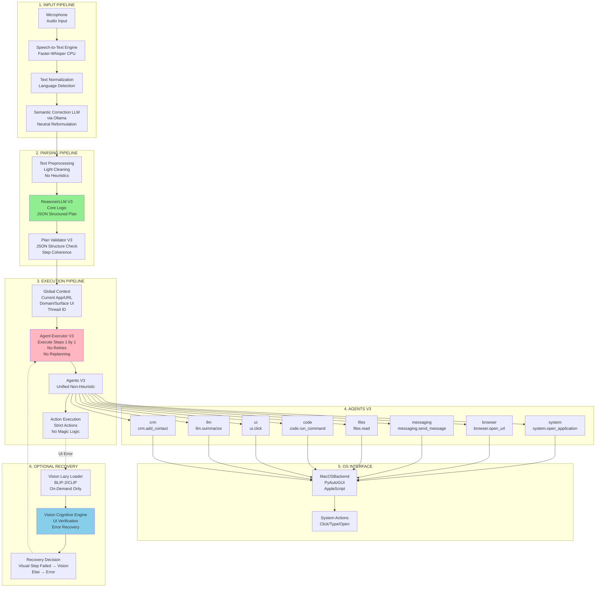
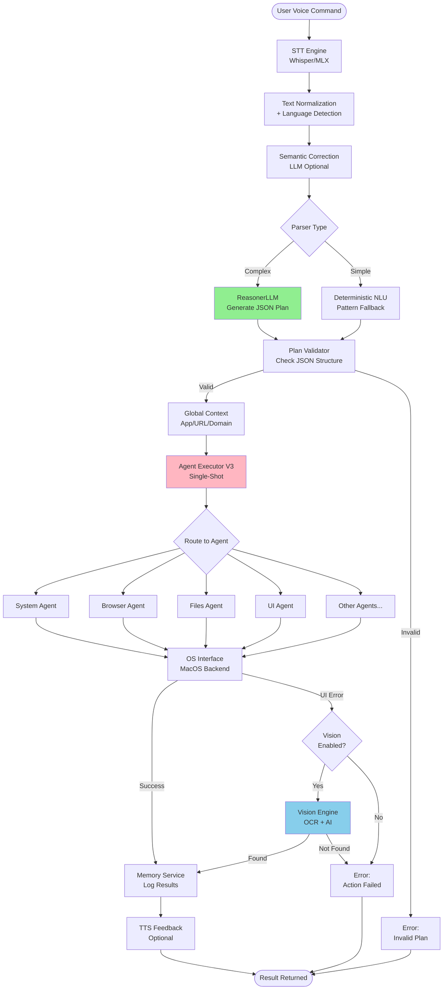
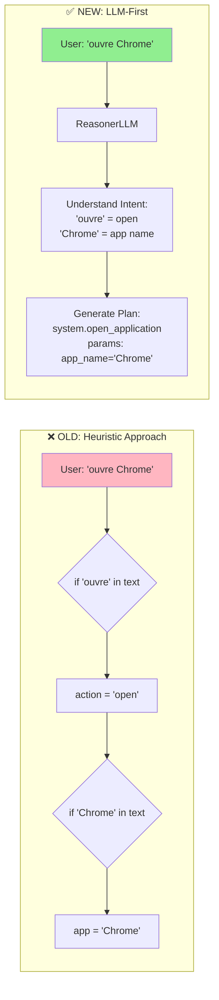
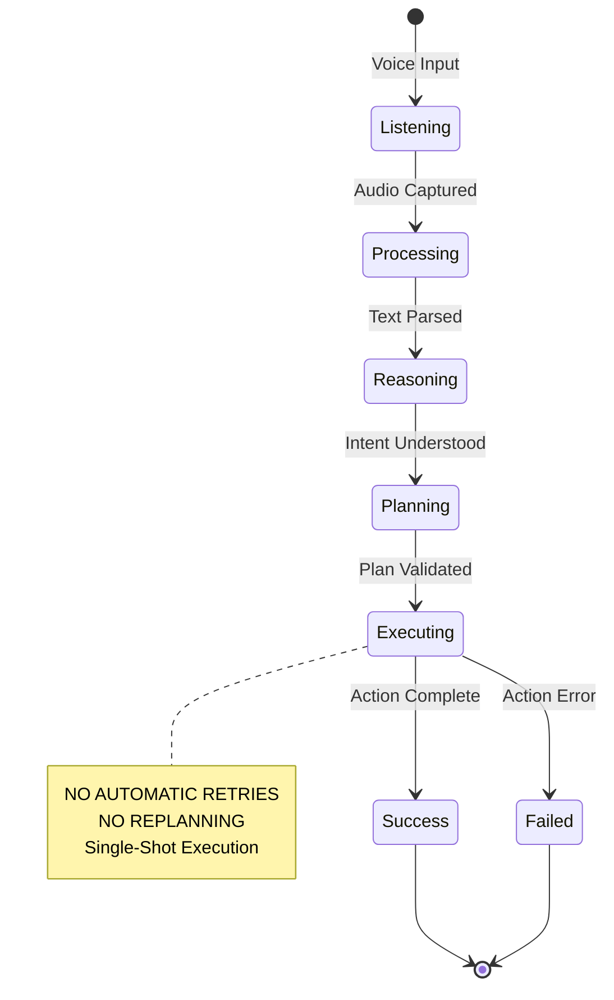
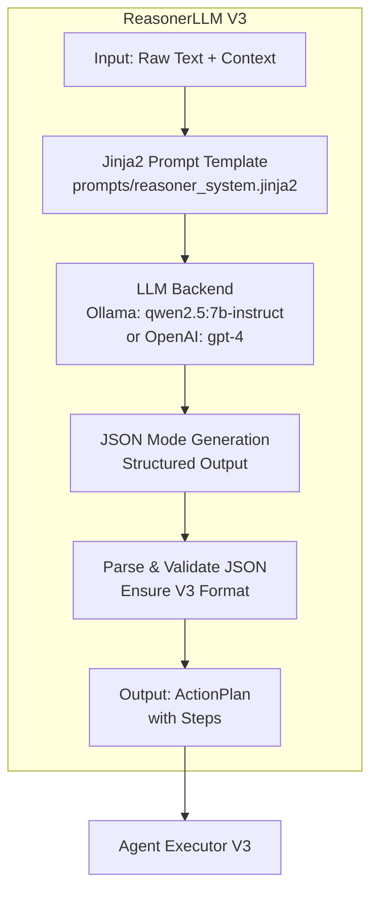
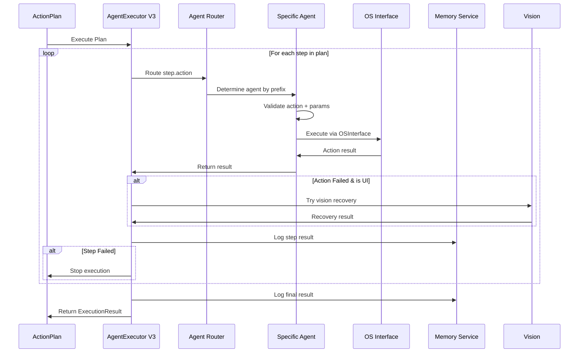
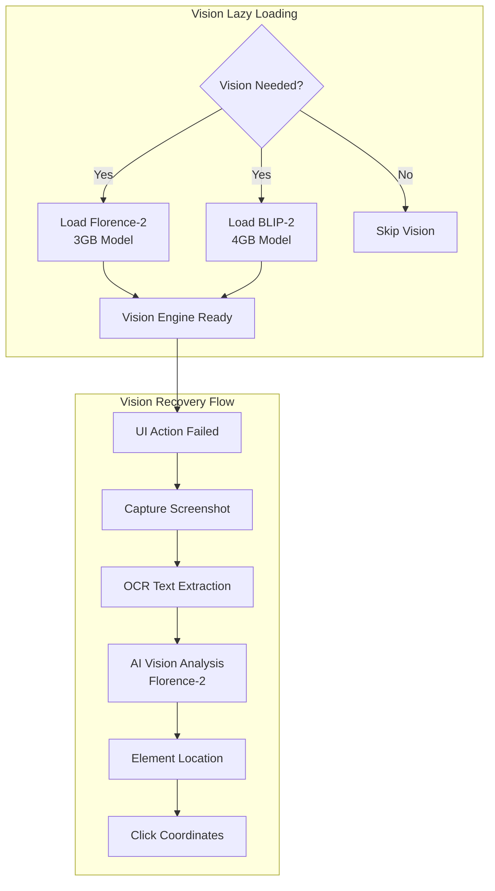

# Global Architecture - The Big Picture

Complete overview of Janus V3 architecture with detailed data flow diagrams.

## 📋 Table of Contents

1. [Architecture V3 Diagram](#architecture-v3-diagram)
2. [LLM-First Principle](#llm-first-principle)
3. [Unified Pipeline - Single-Shot Mode](#unified-pipeline---single-shot-mode)
4. [Component Interactions](#component-interactions)

## Architecture V3 Diagram

### Complete Data Flow: Microphone → STT → Pipeline → Reasoner → Executor → OS



### Detailed Pipeline Stages



## LLM-First Principle

### The Anti-Heuristics Policy

**Core Rule: ZERO heuristics, ZERO regex, ZERO pattern matching.**



### Why LLM-First?

| Traditional Heuristics | LLM-First Approach |
|----------------------|-------------------|
| ❌ Brittle patterns | ✅ Natural understanding |
| ❌ Manual maintenance | ✅ Auto-adaptive |
| ❌ Language-specific | ✅ Multi-language native |
| ❌ Context-blind | ✅ Context-aware |
| ❌ Fails on variations | ✅ Handles variations naturally |

**Example:**
```
Traditional fails on:
- "launch Chrome" (not "open")
- "bring up Chrome" (not "open")
- "ouvre Chrome" (French)
- "lance Chrome" (French)

LLM understands ALL variations without code changes!
```

## Unified Pipeline - Single-Shot Mode

### Single-Shot Execution Model



### Why Single-Shot?

1. **Predictability**: User knows exactly what happens
2. **Speed**: No retry delays
3. **Clarity**: Clear success or failure
4. **Safety**: No unintended repeated actions

### Pipeline Flow Timing

```mermaid
gantt
    title Janus Pipeline Timing (Apple Silicon M1/M2)
    dateFormat  X
    axisFormat  %L ms
    
    section Input
    Voice Capture       :0, 500
    STT (Whisper)      :500, 1500
    
    section Processing
    Text Normalization  :1500, 50
    Semantic Correction :1550, 1000
    
    section Reasoning
    LLM Reasoning      :2550, 2000
    Plan Validation    :4550, 50
    
    section Execution
    Context Gathering  :4600, 100
    Agent Execution    :4700, 500
    
    section Output
    Memory Logging     :5200, 50
    TTS Feedback       :5250, 500
```



**Total latency: ~5-6 seconds** (voice to completion with LLM)

## Component Interactions

### ReasonerLLM V3 - The Core Logic



### Agent Executor V3 - The Orchestrator



### Vision System Integration



## Key Technical Decisions

### 1. LLM-First (2024 - V3)
**Why:** Traditional heuristics require constant maintenance and break easily. LLMs provide natural understanding without code changes.

### 2. Single-Shot Execution
**Why:** Automatic retries and replanning add complexity and unpredictability. Users prefer clarity over "smart" but confusing behavior.

### 3. Lazy Loading for AI Models
**Why:** Startup time optimization. Whisper, Vision, and LLM models load only when first needed.

### 4. Agent-Based Architecture
**Why:** Clear domain boundaries. Each agent validates and executes actions in its domain without cross-contamination.

### 5. Vision as Recovery Only
**Why:** Vision is slow (500-2000ms). Use standard automation first, vision only when UI automation fails.

---

**Next**: [Development Environment Setup](02-development-environment.md)
