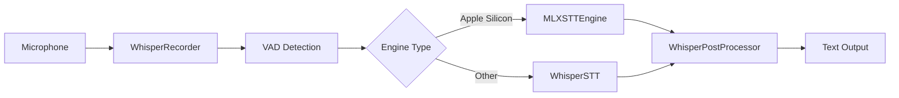
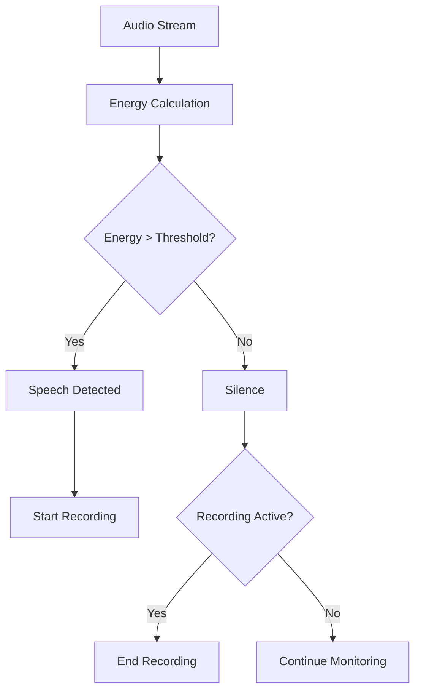
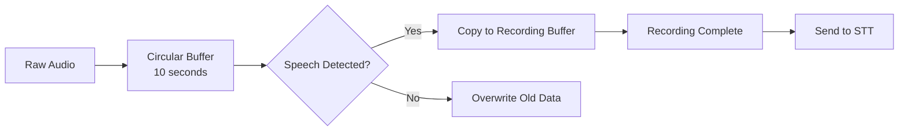
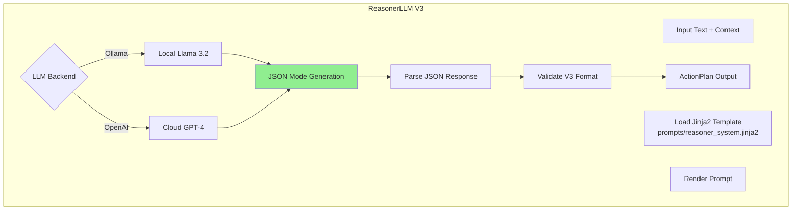
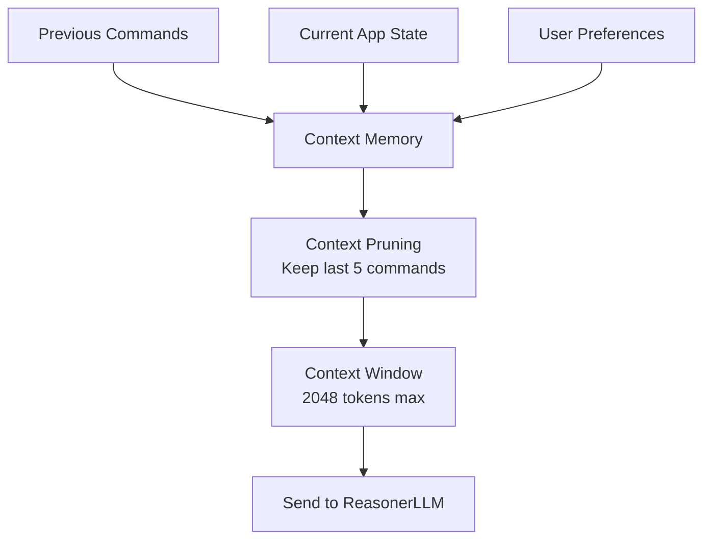
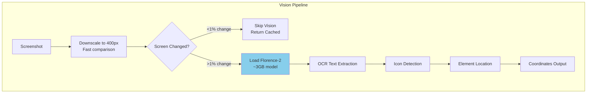
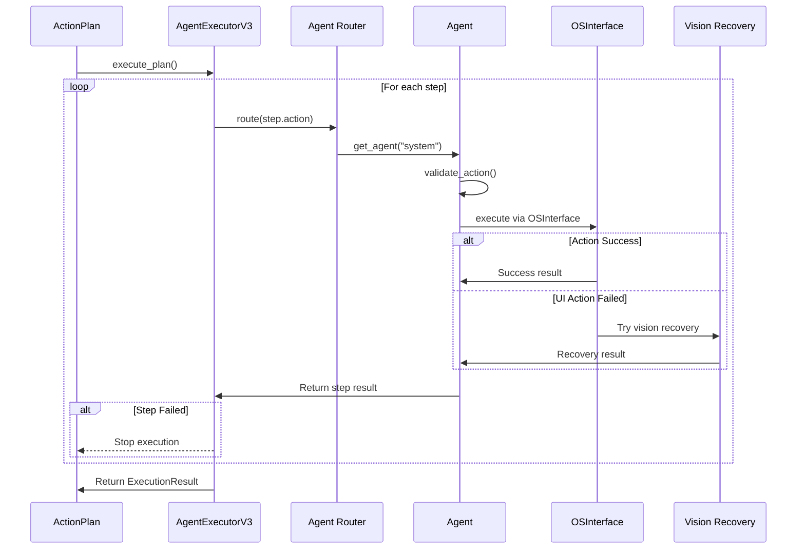
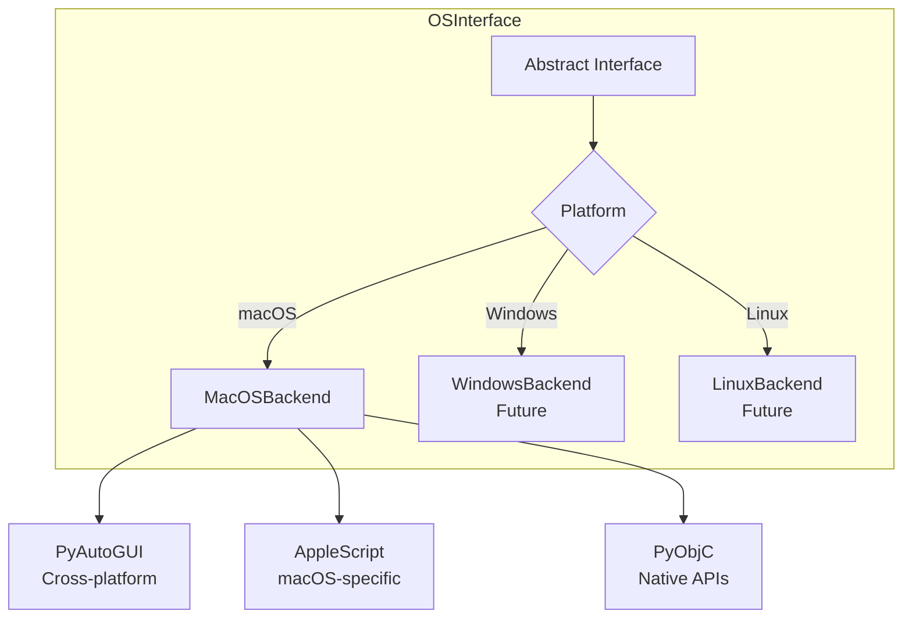

# Core Modules - Technical Details

Detailed technical documentation for Janus core modules: STT, Reasoning, Vision, and Execution.

## 📋 Table of Contents

1. [STT & Audio - The Ears](#stt--audio---the-ears)
2. [Reasoning - The Brain](#reasoning---the-brain)
3. [Vision - The Eyes](#vision---the-eyes)
4. [Execution - The Hands](#execution---the-hands)

## STT & Audio - The Ears

### Architecture Overview



### MLXSTTEngine vs WhisperSTT

| Feature | MLXSTTEngine | WhisperSTT |
|---------|-------------|------------|
| **Platform** | Apple Silicon only (M1/M2/M3) | All platforms |
| **Backend** | lightning-whisper-mlx | faster-whisper / openai-whisper |
| **Speed** | Ultra-fast (<500ms for 5s audio) | Fast (500-1500ms) |
| **Accuracy** | High (optimized models) | High |
| **RAM Usage** | Low (~500MB) | Medium (~1GB) |
| **Hardware** | Neural Engine | CPU |

### Implementation: MLXSTTEngine

**File**: `janus/stt/mlx_stt_engine.py`

```python
from lightning_whisper_mlx import LightningWhisperMLX

class MLXSTTEngine:
    """Ultra-low-latency STT for Apple Silicon"""
    
    def __init__(self, model_size='base'):
        # Initialize MLX Whisper on Neural Engine
        self.model = LightningWhisperMLX(
            model=f"distil-whisper/distil-{model_size}-en",
            batch_size=6,  # Optimal for M-series
            quant=None     # No quantization (already optimized)
        )
    
    def transcribe(self, audio: np.ndarray) -> TranscriptionResult:
        """
        Transcribe audio using MLX acceleration.
        
        Performance: <500ms for 5s audio on M1
        """
        start_time = time.time()
        
        # Transcribe with MLX (hardware accelerated)
        result = self.model.transcribe(audio)
        
        duration_ms = (time.time() - start_time) * 1000
        
        return TranscriptionResult(
            text=result['text'],
            language=result.get('language', 'en'),
            confidence=0.9,  # MLX models are very accurate
            duration_ms=duration_ms,
            model_used='mlx-whisper'
        )
```

**Key Optimization**: Uses Apple Neural Engine for hardware acceleration.

### Voice Activity Detection (VAD)



**Implementation**: `janus/stt/whisper_recorder.py`

```python
class WhisperRecorder:
    """Records audio with Voice Activity Detection"""
    
    def __init__(self, threshold=60.0):
        self.threshold = threshold  # Energy threshold
        self.is_recording = False
        self.buffer = []
    
    def _calculate_energy(self, audio_chunk):
        """Calculate audio energy level"""
        return np.sqrt(np.mean(audio_chunk ** 2)) * 100
    
    def process_chunk(self, audio_chunk):
        """Process audio chunk with VAD"""
        energy = self._calculate_energy(audio_chunk)
        
        if energy > self.threshold:
            # Speech detected - start/continue recording
            if not self.is_recording:
                self.is_recording = True
                self.buffer = []
            self.buffer.append(audio_chunk)
        elif self.is_recording:
            # Silence after speech - end recording
            self.is_recording = False
            return np.concatenate(self.buffer)
        
        return None  # Continue monitoring
```

**VAD Types**:
1. **Energy-based VAD** (default): Simple, fast, works well in quiet environments
2. **Neural VAD** (optional): ML-based, better in noisy environments

### Audio Buffering Strategy



**Buffer Configuration**:
- **Circular buffer**: 10 seconds (prevents memory growth)
- **Chunk size**: 1024 samples (optimal for real-time)
- **Sample rate**: 16000 Hz (Whisper requirement)

## Reasoning - The Brain

### ReasonerLLM Architecture



### ReasonerLLM Implementation

**File**: `janus/reasoning/reasoner_llm.py` (~1900 lines, 29 methods)

> **TICKET-REFACTOR-002 (2025-Q1)**: ReasonerLLM refactored. Removed legacy planning methods.
> Focus on ReAct architecture: `decide_next_action()` for OODA loop.

```python
class ReasonerLLM:
    """LLM-based reasoning engine - NO HEURISTICS
    
    TICKET-REFACTOR-002: Focused on core LLM functionality:
    - ReAct decision making (decide_next_action, decide_reflex_action)
    - Command parsing
    - Vision-based error recovery
    
    Removed legacy methods:
    - generate_plan() - Old static planning
    - replan() - Superseded by ReAct loop
    - decompose_task() - Hierarchical decomposition
    """
    
    # Default model: Qwen 2.5 7B Instruct - superior reasoning & multilingual
    DEFAULT_OLLAMA_MODEL = "qwen2.5:7b-instruct"
    
    def __init__(self, backend='ollama', model_name=None):
        self.backend = LLMBackend(backend)
        self.model_name = model_name or self.DEFAULT_OLLAMA_MODEL
    
    def decide_next_action(
        self,
        user_goal: str,
        system_state: Dict[str, Any],
        visual_context: str,
        memory: Optional[Dict[str, Any]] = None,
        language: str = "fr",
    ) -> Dict[str, Any]:
        """
        ReAct-style decision making: ONE action at a time.
        
        This is the primary reasoning method for the OODA loop.
        ActionCoordinator calls this to get the next action.
        
        Args:
            user_goal: User's original command/goal
            system_state: Current app, URL, clipboard
            visual_context: Elements visible on screen (from Set-of-Marks)
            memory: Extracted data from previous steps
            language: "fr" or "en"
        
        Returns:
            {
                "action": "action_name" or "done",
                "args": {...},
                "reasoning": "Why this action"
            }
        """
        # Build ReAct prompt
        prompt = self._build_react_prompt(
            user_goal, system_state, visual_context, memory, language
        )
        
        # LLM inference with JSON mode
        response = self._run_inference(prompt, max_tokens=256, json_mode=True)
        
        # Parse and return
        return self._parse_react_response(response)
```

### Jinja2 Prompt Templates

**File**: `janus/reasoning/prompts/reasoner_system.jinja2`

```jinja2
You are the reasoning core of Janus, a voice-controlled automation system.

TASK: Convert natural language commands to structured action plans.

RULES:
1. Understand commands in ANY language (French, English, etc.)
2. Infer intent from context, NOT keywords
3. Generate precise action steps with parameters
4. Output VALID JSON only (V3 format)
5. NO heuristics, NO pattern matching - UNDERSTAND the intent

AVAILABLE AGENTS:

- {{ agent }}: {{ actions | join(', ') }}


CONTEXT:
- Current app: {{ context.current_app }}
- Current URL: {{ context.current_url }}
- Language: {{ context.language }}

V3 JSON FORMAT:
{
  "steps": [
    {
      "action": "agent.action_name",
      "parameters": { ... },
      "description": "What this step does"
    }
  ]
}

COMMAND: {{ command }}

Generate the action plan in V3 JSON format:
```

**Key Features**:
- **Multi-language**: Understands French, English, etc. natively
- **Context-aware**: Uses current app, URL, etc.
- **Strict format**: V3 JSON format enforced
- **No heuristics**: Pure reasoning, no regex

### JSON V3 Format Specification

```json
{
  "steps": [
    {
      "action": "system.open_application",
      "parameters": {
        "app_name": "Chrome"
      },
      "description": "Open Chrome browser"
    },
    {
      "action": "browser.navigate",
      "parameters": {
        "url": "https://google.com"
      },
      "description": "Navigate to Google homepage"
    }
  ]
}
```

**Format Rules**:
1. `action`: Must be `<agent>.<action_name>`
2. `parameters`: Dictionary with action-specific params
3. `description`: Human-readable explanation

### Context Management



**Context Pruning Strategy**:
```python
def prune_context(self, context: Dict) -> Dict:
    """Keep only recent relevant context"""
    return {
        'current_app': context['current_app'],
        'current_url': context['current_url'],
        'recent_commands': context['commands'][-5:],  # Last 5
        'user_preferences': context['preferences']
    }
```

## Vision - The Eyes

### Vision System Architecture



### LightVisionEngine (Florence-2)

**File**: `janus/vision/light_vision_engine.py`

```python
class LightVisionEngine:
    """Lightweight vision using Florence-2 only"""
    
    def __init__(self, force_cpu=False):
        self.model = None  # Lazy load
        self.force_cpu = force_cpu
        self.last_screenshot = None
        self.last_screenshot_hash = None
    
    def _load_model(self):
        """Load Florence-2 model on first use"""
        if self.model is None:
            device = "cpu" if self.force_cpu else "cuda"
            self.model = Florence2ForConditionalGeneration.from_pretrained(
                "microsoft/Florence-2-base",
                torch_dtype=torch.float16 if device == "cuda" else torch.float32
            ).to(device)
    
    def verify_action(
        self, 
        screenshot: Image, 
        expected_change: str
    ) -> Tuple[bool, str]:
        """
        Verify if expected change occurred.
        
        Fast heuristic check first (TICKET-P1-03):
        - Compare screenshots (downscaled to 400px)
        - If <1% pixels changed → no action needed
        - Else → use Florence-2 for verification
        """
        # Fast heuristic: did screen change?
        if not self._screen_changed(screenshot):
            return (True, "No significant change detected")
        
        # Screen changed - use AI verification
        self._load_model()  # Lazy load
        
        # OCR + Icon detection with Florence-2
        ocr_result = self.extract_text(screenshot)
        icons = self.detect_icons(screenshot)
        
        # Check if expected change is visible
        found = expected_change.lower() in ocr_result.lower()
        
        return (found, f"Found: {found}, OCR: {ocr_result[:100]}")
```

### Fast Screen Change Detection

```python
def _screen_changed(self, new_screenshot: Image) -> bool:
    """
    Fast heuristic check: did screen change significantly?
    
    TICKET-P1-03: Avoids loading heavy AI models when not needed.
    """
    if self.last_screenshot is None:
        self.last_screenshot = new_screenshot
        return True
    
    # Downscale for speed (400x400 max)
    old_small = self._downscale(self.last_screenshot, 400)
    new_small = self._downscale(new_screenshot, 400)
    
    # Convert to grayscale numpy arrays
    old_array = np.array(old_small.convert('L'))
    new_array = np.array(new_small.convert('L'))
    
    # Count changed pixels
    diff = np.abs(old_array - new_array)
    changed_pixels = np.sum(diff > PIXEL_CHANGE_THRESHOLD)
    total_pixels = old_array.size
    
    change_percentage = changed_pixels / total_pixels
    
    # Update cache
    self.last_screenshot = new_screenshot
    
    # Return True if >1% pixels changed
    return change_percentage > SCREEN_CHANGE_THRESHOLD
```

**Performance**:
- **Fast check**: <10ms (no AI models loaded)
- **AI verification**: 500-1500ms (Florence-2 inference)
- **Memory**: ~3GB when model loaded

### VisionActionMapper

**Files**: 
- `janus/vision/vision_action_mapper.py` (Coordinator/Facade)
- `janus/vision/element_finder.py` (Element search)
- `janus/vision/action_executor.py` (Action execution)
- `janus/vision/action_verifier.py` (Verification)

**REFACTORED (TICKET-REVIEW-001)**: Decomposed from 917-line god object into focused modules.

```python
class VisionActionMapper:
    """
    Facade for vision-based automation.
    Delegates to specialized components:
    - ElementFinder: Finds UI elements by text/attributes
    - ActionExecutor: Executes vision-based actions
    - ActionVerifier: Verifies action results
    """
    
    def __init__(self, enable_auto_scroll=True, enable_auto_retry=True):
        # Delegates to specialized components
        self.element_finder = ElementFinder(...)
        self.action_executor = ActionExecutor(...)
        self.action_verifier = ActionVerifier(...)
    
    def click_viz(self, target: str) -> ActionResult:
        """Vision-based click - finds and clicks element"""
        return self.action_executor.click_viz(target)
    
    def find_element_by_text(self, text: str) -> ElementMatch:
        """Find element by text with fuzzy matching"""
        return self.element_finder.find_element_by_text(text)
```

**Benefits of Refactoring**:
- **Single Responsibility**: Each class has one clear purpose
- **Improved Testability**: Components can be tested independently
- **Better Maintainability**: Smaller, focused modules
- **Backward Compatible**: All existing code continues to work

### Screenshot Engine with PII Masking

**File**: `janus/vision/screenshot_engine.py`

The ScreenshotEngine captures screenshots with optional PII (Personally Identifiable Information) masking to prevent data leaks in logs.

```python
class ScreenshotEngine:
    """Screenshot engine with optional PII masking"""
    
    def __init__(self, optimize_quality=True, enable_pii_masking=False):
        """
        Args:
            optimize_quality: Trade quality for speed
            enable_pii_masking: Enable PII masking for saved screenshots
        """
        self.enable_pii_masking = enable_pii_masking
        self._pii_masker = None  # Lazy loaded
        self._ocr_engine = None  # Lazy loaded
    
    def save_screenshot(
        self, 
        image: Image.Image, 
        file_path: str,
        mask_pii: Optional[bool] = None,
        ocr_results: Optional[List] = None
    ):
        """
        Save screenshot with optional PII masking.
        
        Args:
            image: PIL Image to save
            file_path: Path to save
            mask_pii: Override instance setting
            ocr_results: Pre-computed OCR results for efficiency
        """
        should_mask = mask_pii if mask_pii is not None else self.enable_pii_masking
        
        if should_mask:
            # Apply PII masking before saving
            image = self._apply_pii_masking(image, ocr_results)
        
        image.save(file_path)
```

**Key Features**:
- **Dual-layer approach**: Images stay clear in RAM for LLM reasoning
- **Lazy loading**: OCR engine and masker loaded only when needed
- **OCR reuse**: Pre-computed OCR results can be passed to avoid redundant processing
- **Backward compatible**: Disabled by default

**PII Detection** (`janus/vision/pii_masker.py`):
- Emails (e.g., contact@entreprise.com)
- IBAN bank account numbers
- Phone numbers and credit cards (8+ digits)
- Gaussian blur masking (15px radius)

**Performance**:
- Disabled: 0ms overhead
- Enabled: ~210ms (OCR 200ms + blur 10ms)
- With OCR reuse: ~10ms (blur only)

📖 See [Security & Sandbox](./05-security-and-sandbox.md#pii-visual-filter) for complete PII filter documentation.

## Execution - The Hands

### AgentExecutorV3 Architecture



### AgentExecutorV3 Implementation

**File**: `janus/automation/action_executor.py`

```python
class AgentExecutorV3:
    """Executes action plans step by step"""
    
    def __init__(self, enable_vision_recovery=False):
        self.agents = self._register_agents()
        self.vision_recovery = enable_vision_recovery
        self.vision_engine = None  # Lazy load
    
    def execute_plan(self, plan: ActionPlan) -> ExecutionResult:
        """
        Execute action plan - Single-Shot mode.
        
        Rules:
        - NO automatic retries
        - NO replanning
        - Vision recovery ONLY for UI errors (if enabled)
        """
        results = []
        
        for step in plan.steps:
            # Route to agent
            agent = self._route_to_agent(step.action)
            
            # Validate before executing
            if not agent.validate_action(step.action, step.parameters):
                return ExecutionResult(
                    success=False,
                    error="Invalid action parameters"
                )
            
            # Execute step
            result = agent.execute(step.action, step.parameters)
            results.append(result)
            
            # Handle failure
            if result['status'] == 'error':
                # Try vision recovery for UI actions only
                if self.vision_recovery and step.action.startswith('ui.'):
                    result = self._try_vision_recovery(step)
                    results[-1] = result
                
                # Stop on error (Single-Shot)
                if result['status'] == 'error':
                    break
        
        return ExecutionResult(
            success=all(r['status'] == 'success' for r in results),
            action_results=results
        )
```

### OSInterface - Hardware Abstraction



**File**: `janus/os/macos_backend.py`

```python
class MacOSBackend:
    """macOS-specific automation backend"""
    
    def __init__(self):
        self.applescript = AppleScriptExecutor()
        self.pyautogui_safe = True
    
    def click(self, x: int, y: int):
        """Click at coordinates"""
        pyautogui.click(x, y)
    
    def type_text(self, text: str):
        """Type text (handles special characters)"""
        pyautogui.write(text, interval=0.05)
    
    def open_application(self, app_name: str):
        """Open app via AppleScript (native)"""
        script = f'tell application "{app_name}" to activate'
        self.applescript.run(script)
    
    def get_foreground_app(self) -> str:
        """Get currently focused app"""
        script = '''
        tell application "System Events"
            name of first application process whose frontmost is true
        end tell
        '''
        return self.applescript.run(script).strip()
```

**Why AppleScript?**
- Native macOS control (better than PyAutoGUI for apps)
- Reliable application switching
- Access to macOS-specific features

---

**Next**: [Contribution Guide - Extending Janus](04-contribution-guide.md)
