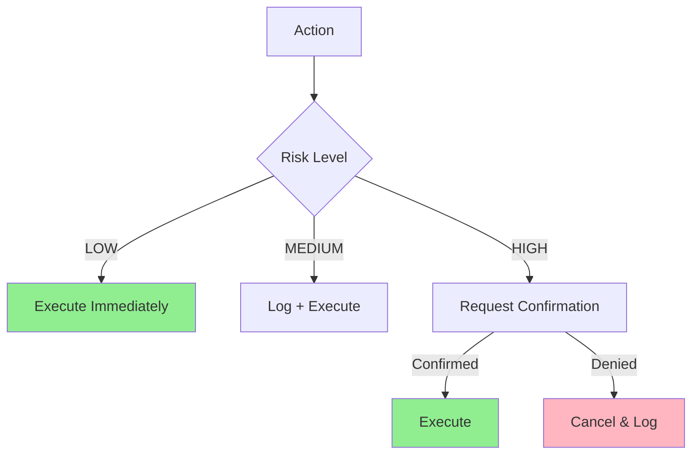
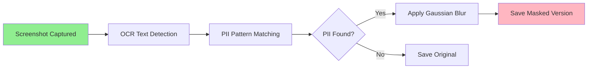

# Security & Sandbox

Security measures and sandboxing in Janus.

## 📋 Table of Contents

1. [Action Validation](#action-validation)
2. [PII Visual Filter](#pii-visual-filter)
3. [Secrets Management](#secrets-management)

## Action Validation

### StrictActionValidator (TICKET-SEC-001)

**File**: `janus/validation/strict_action_validator.py`

The validator protects against dangerous actions by enforcing the module action schema and returning risk levels for each action.

```python
class StrictActionValidator:
    """
    Strict validator for module actions based on the schema.
    
    This is the GATEKEEPER between Reasoner and Executor.
    No action passes without validation.
    """
    
    def validate_step(
        self,
        step: Dict[str, Any],
        auto_correct: Optional[bool] = None,
        normalize: bool = True
    ) -> Tuple[bool, Optional[Dict[str, Any]], Optional[str], Optional[RiskLevel]]:
        """
        Validate and optionally correct a single action step.
        
        Returns:
            Tuple of (is_valid, corrected_step_or_none, error_message_or_none, risk_level)
        """
        # Validates action exists in schema
        # Returns risk level for human-in-the-loop confirmation
        ...
```

### Risk Scoring System (TICKET-SEC-001)

Every action in Janus has an assigned risk level that determines if user confirmation is required:

```python
class RiskLevel(Enum):
    """Risk level for actions"""
    LOW = "low"      # Safe read operations
    MEDIUM = "medium"  # Reversible modifications
    HIGH = "high"    # Dangerous operations requiring confirmation
```

**Risk Level Assignment**:

```python
@dataclass
class ActionDefinition:
    """Definition of a valid action within a module"""
    name: str
    description: str
    parameters: List[ActionParameter] = field(default_factory=list)
    risk_level: RiskLevel = RiskLevel.LOW  # Default to LOW risk
```

### Risk Classification



| Risk Level | Examples | Action |
|-----------|----------|--------|
| LOW | `files.search_files`, `browser.extract_text`, `files.open_file` | Execute immediately |
| MEDIUM | `ui.click`, `system.close_application`, `files.create_folder` | Log and execute |
| HIGH | `files.delete_file`, `messaging.send_message`, `crm.update_field` | **Request confirmation** |

### Human-in-the-Loop Confirmation (TICKET-SEC-001)

High-risk actions trigger a confirmation flow before execution:

```python
# In ExecutionEngineV3
async def execute_plan_async(self, steps, ...):
    for step in steps:
        # Check risk level
        risk_level = self._get_action_risk_level(module, action)
        
        if risk_level == RiskLevel.HIGH:
            # Request confirmation
            confirmation_granted = await self._request_confirmation(
                step, module, action, args, request_id
            )
            
            if not confirmation_granted:
                # User denied - cancel execution
                return error_result("User denied confirmation")
        
        # Execute action
        ...
```

**Confirmation Request Event**:

```python
@dataclass
class RequestConfirmation:
    """Event raised when a high-risk action requires user confirmation"""
    action_type: str  # e.g., "files.delete_file"
    action_details: Dict[str, Any]  # Full step information
    risk_level: str  # "HIGH"
    confirmation_prompt: str  # "Confirm deletion of file: /tmp/test.txt"
    request_id: str
```

**Confirmation Response**:

```python
@dataclass
class ConfirmationResponse:
    """User response to a confirmation request"""
    request_id: str
    confirmed: bool  # True = proceed, False = cancel
```

### Example: File Deletion with Confirmation

```python
# 1. User requests file deletion
steps = [{
    "module": "files",
    "action": "delete_file",
    "args": {"path": "/Users/me/document.pdf"}
}]

# 2. ExecutionEngineV3 detects HIGH risk
# 3. Raises RequestConfirmation event:
#    "Confirm deletion of file: /Users/me/document.pdf"

# 4. User confirms via UI or voice
response = ConfirmationResponse(request_id="abc", confirmed=True)

# 5. Execution proceeds only after confirmation
```

### Safety Features

1. **Default Deny**: If no confirmation handler is set, HIGH risk actions are automatically denied
2. **Mock Mode Bypass**: Mock execution skips confirmation for testing
3. **Specific Prompts**: Each action type gets a tailored confirmation message
4. **No Silent Failures**: All denials are logged with reasons

## PII Visual Filter

### Overview (TICKET-PRIV-001)

**Files**: 
- `janus/vision/pii_masker.py` - Core PII masking utility
- `janus/vision/screenshot_engine.py` - Integration with screenshot capture

The PII Visual Filter prevents data leaks by automatically detecting and masking Personally Identifiable Information (PII) in screenshots before they are saved to disk or displayed in the dashboard.

### Protected Data Types

The system detects and masks the following PII patterns:

| PII Type | Pattern | Example |
|----------|---------|---------|
| **Email** | `[user]@[domain].[tld]` | contact@entreprise.com |
| **IBAN** | `[CC][DD][Account]` | FR7630006000011234567890189 |
| **Phone/CC** | 8+ digit sequences | 0123456789, 1234-5678-9012-3456 |
| **Credit Card** | 13-19 digits with separators | 4532-0151-1283-0366 |

### How It Works



**Process**:
1. Screenshot is captured and kept clear in memory for LLM reasoning
2. OCR engine detects text regions in the image
3. PII patterns are matched using regex
4. Gaussian blur (15px radius, 5px padding) is applied to detected regions
5. Only the masked version is saved to disk

### Usage

**Basic Usage**:
```python
from janus.vision.screenshot_engine import ScreenshotEngine

# Enable PII masking for saved screenshots
engine = ScreenshotEngine(enable_pii_masking=True)

# Capture (stays clear in memory)
screenshot = engine.capture_screen()

# Save with automatic PII masking
engine.save_screenshot(screenshot, "logs/screenshot_001.png")
```

**Advanced Usage with OCR Reuse**:
```python
from janus.vision.screenshot_engine import ScreenshotEngine
from janus.vision.ocr_engine import OCREngine

# Initialize
screenshot_engine = ScreenshotEngine(enable_pii_masking=True)
ocr_engine = OCREngine()

# Capture
screenshot = screenshot_engine.capture_screen()

# Perform OCR once
ocr_results = ocr_engine.get_all_text_with_boxes(screenshot)

# Use clear image for LLM reasoning
llm_response = process_with_llm(screenshot, ocr_results)

# Save masked version (reuse OCR results for efficiency)
screenshot_engine.save_screenshot(
    screenshot, 
    "logs/screenshot.png",
    ocr_results=ocr_results  # ~10ms overhead vs ~210ms
)
```

**Per-Screenshot Override**:
```python
# Override masking on specific screenshots
engine.save_screenshot(screenshot, "debug.png", mask_pii=False)
```

### Configuration

**Customize Blur Radius**:
```python
from janus.vision.pii_masker import PIIMasker

# More blur (more privacy)
masker = PIIMasker(blur_radius=25)

# Less blur (more context visible)
masker = PIIMasker(blur_radius=10)

# Default
masker = PIIMasker(blur_radius=15)
```

### Performance Impact

| Operation | Without Masking | With Masking | Overhead |
|-----------|----------------|--------------|----------|
| Screenshot Capture | ~50ms | ~50ms | 0ms |
| OCR Processing | N/A | ~200ms | +200ms |
| Blur Application | N/A | ~10ms | +10ms |
| Image Save | ~5ms | ~5ms | 0ms |
| **Total** | **~55ms** | **~265ms** | **+210ms** |

**Note**: When OCR results are reused, overhead is only ~10ms for blurring.

### Security Benefits

- ✅ Prevents accidental PII exposure in logs
- ✅ Safe screenshot sharing for debugging
- ✅ Protects user privacy during demos
- ✅ Complies with data protection requirements (GDPR)
- ✅ Dual-layer approach: clear in RAM, masked on disk

### Limitations

1. **OCR Accuracy**: PII detection depends on OCR quality
2. **Pattern Matching**: Only predefined patterns are detected
3. **False Positives**: May mask legitimate sequences (e.g., product codes)
4. **Performance**: OCR adds latency when enabled (~200ms per image)

### Testing

Comprehensive test coverage includes:
- 18 unit tests for pattern detection and masking
- Integration tests with ScreenshotEngine
- Acceptance test: 19.16% pixel difference on email blur
- CodeQL security scan: 0 vulnerabilities

## Secrets Management

### Log Filtering

Sensitive data is filtered from logs:

```python
class SecretFilter:
    """Filter secrets from logs"""
    
    PATTERNS = [
        r'password["\s]*[:=]["\s]*([^"\\s]+)',
        r'token["\s]*[:=]["\s]*([^"\\s]+)',
        r'api_key["\s]*[:=]["\s]*([^"\\s]+)',
        r'sk-[a-zA-Z0-9]{48}',  # OpenAI key
    ]
    
    def filter(self, message: str) -> str:
        """Replace secrets with [REDACTED]"""
        for pattern in self.PATTERNS:
            message = re.sub(pattern, r'\1[REDACTED]', message)
        return message
```

**Example**:
```python
# Input log
logger.info(f"Connecting with api_key=sk-abc123...")

# Output log
"Connecting with api_key=[REDACTED]"
```

### Environment Variables

Store secrets in `.env`:

```bash
# .env (never commit!)
OPENAI_API_KEY=sk-abc123...
ANTHROPIC_API_KEY=sk-ant-abc...
SPOTIFY_CLIENT_SECRET=abc123...
```

Load with:
```python
from dotenv import load_dotenv
load_dotenv()

api_key = os.getenv("OPENAI_API_KEY")
```

---

**Next**: [Deployment & Packaging](06-deployment-and-packaging.md)
