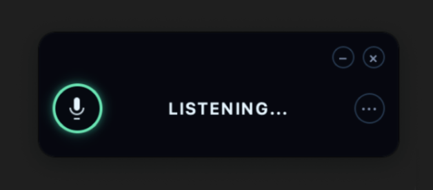
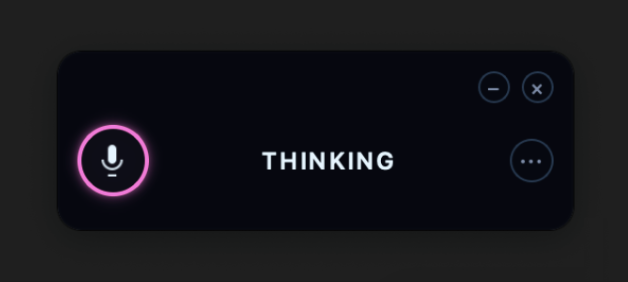

# 📘 Janus User Manual - Introduction

**[← Back to Documentation Index](README.md)** | **[Next: Installation →](02-installation.md)**

---

# 1. Introduction: Welcome to the Future

## Vision: What is Janus?

**Janus is your personal, local, private, and intelligent AI assistant that transforms how you interact with your computer.**

Imagine a world where you can control your entire computer with just your voice. No more endless clicking, typing, or searching through menus. No more repetitive tasks eating up your valuable time. With Janus, your voice becomes the most powerful interface to your digital world.

### More Than Just Voice Commands

Janus isn't another cloud-based voice assistant that listens to wake words and executes pre-programmed commands. It's a revolutionary **AI-powered agent** that:

- **🎯 Understands Your Intent** - Not just what you say, but what you mean
- **🧠 Plans Intelligently** - Breaks down complex requests into optimal action sequences
- **👁️ Sees Your Screen** - Uses computer vision to interact with any application
- **🔗 Chains Actions** - Executes multi-step workflows seamlessly
- **💡 Learns From You** - Adapts to your preferences and corrections
- **🔄 Recovers From Errors** - Detects failures and finds alternative approaches

*Janus in listening mode - ready to assist you*

*Janus thinking and processing your request*

### The Janus Difference

Unlike traditional voice assistants, Janus is built on three revolutionary principles:

#### 1. **100% Local Processing**
Everything happens on your computer. No data ever leaves your machine. No cloud dependencies. No internet required. Complete privacy guaranteed.

#### 2. **AI-Powered Intelligence**
Advanced natural language understanding, computer vision, and multi-step planning. Janus doesn't just execute commands—it understands context, reasons about your goals, and adapts to achieve them.

#### 3. **Universal Application Control**
Works with ANY application on your computer. Whether it's a modern web app or legacy software from the 90s, if you can see it on your screen, Janus can interact with it.

---

## Why Choose Janus?

### 🔒 **Total Privacy & Confidentiality**

**Your data never leaves your computer. Ever.**

In an era where every voice assistant sends your data to the cloud, Janus stands apart by keeping everything local.

#### **What This Means For You:**

- ✅ **All voice processing happens locally** using OpenAI's Whisper model running on your device
- ✅ **No cloud dependencies** - Works completely offline, no internet connection required
- ✅ **Zero telemetry, zero tracking** - We don't collect usage data, analytics, or any information
- ✅ **Your conversations stay private** - No recordings sent to servers, no data mining
- ✅ **Encrypted local storage** - Your command history and preferences are stored securely on your device

#### **Perfect For Sensitive Work:**

- **Legal Professionals** - Discuss confidential cases without worrying about data breaches
- **Medical Practitioners** - Handle patient information securely and compliantly
- **Financial Advisors** - Work with sensitive financial data with confidence
- **Business Executives** - Discuss proprietary strategies without corporate espionage risks
- **Researchers** - Protect intellectual property and unpublished findings
- **Privacy-Conscious Users** - Anyone who values their digital privacy

> **"In a world where privacy is increasingly rare, Janus gives you complete control over your data."**

### ⚡ **Lightning Fast Performance**

**Optimized for modern hardware with sub-second response times.**

Janus is engineered for speed. We've optimized every component to deliver instant responses without sacrificing accuracy.

#### **Apple Silicon Performance:**

- ✅ **Native M1/M2/M3/M4 support** - Built specifically for Apple's Neural Engine
- ✅ **GPU acceleration** - Leverages the unified memory architecture
- ✅ **Metal acceleration** - Uses Apple's Metal framework for maximum performance
- ✅ **Efficient power usage** - Runs cool and quiet without draining your battery

#### **Windows Optimization:**

- ✅ **CUDA acceleration** - Full support for NVIDIA GPUs
- ✅ **DirectML support** - Works with AMD and Intel GPUs
- ✅ **Multi-core utilization** - Takes advantage of modern CPUs
- ✅ **Memory optimization** - Efficient use of system resources

#### **Real-World Performance:**

- **Simple commands:** < 1 second (e.g., "Open Safari")
- **Complex analysis:** 2-3 seconds (e.g., "Summarize this article")
- **Multi-step workflows:** Execute continuously in background
- **Vision tasks:** 1-2 seconds for screen analysis

> **"Most users report Janus feels faster than using keyboard and mouse for common tasks."**

### 🧠 **True Intelligence**

**Not just pattern matching—real AI understanding and reasoning.**

Janus uses advanced AI to understand context, reason about your goals, and execute complex plans.

#### **Natural Language Understanding:**

- **Intent Recognition** - Understands what you want, not just what you say
  - "Open that" → Janus knows which "that" you mean from context
  - "Do it again" → Repeats your last command
  - "Send this to John" → Knows "this" refers to your current selection

- **Contextual Memory** - Remembers your conversation
  - You: *"Open Chrome"*
  - You: *"Go to my email"* (Janus remembers you're in Chrome)
  - You: *"Find messages from Sarah"* (Janus knows you're in email)

- **Ambiguity Resolution** - Asks clarifying questions when needed
  - You: *"Open Excel"*
  - Janus: *"I found Microsoft Excel and LibreOffice Calc. Which would you like?"*

#### **Computer Vision:**

- **Screen Understanding** - Can "see" and interpret what's on your screen
- **Visual Element Detection** - Finds buttons, menus, text fields by appearance
- **OCR (Text Recognition)** - Reads text anywhere on screen, even in images
- **Error Detection** - Automatically spots error dialogs and warnings
- **Action Verification** - Confirms actions succeeded by checking screen changes

#### **Intelligent Planning:**

When you give a complex command like:
> *"Open Chrome, go to Google Drive, download the Budget spreadsheet, then open it in Excel"*

Janus breaks it down intelligently:
1. Open or focus Chrome
2. Navigate to drive.google.com
3. Wait for page to load
4. Search for "Budget" spreadsheet
5. Use vision to locate the file
6. Right-click and download
7. Monitor downloads folder
8. Wait for download to complete
9. Launch Excel
10. Open the downloaded file
11. Verify file opened successfully

All of this happens automatically, with adaptive error recovery if any step fails.

#### **Adaptive Learning:**

- **Preference Learning** - Remembers what you prefer
  - You correct: *"No, I meant Chrome"* → Janus learns you prefer Chrome
  - Next time: *"Open browser"* → Opens Chrome automatically

- **Pattern Recognition** - Notices your habits
  - Always save to "Projects" folder → Janus suggests it first
  - Frequently email John → Janus auto-completes the address

- **Error Correction** - Learns from mistakes
  - Command failed once → Tries alternative approach next time
  - Systematic improvements over time

> **"Janus gets smarter the more you use it, adapting to your unique workflow."**

---

## Who Benefits From Janus?

### 🏢 **Business Professionals**

**Automate repetitive tasks and focus on what matters.**

- **Email Management** - "Find all unread emails from this week and mark as read"
- **Report Generation** - "Create a weekly summary from the project spreadsheet"
- **Meeting Preparation** - "Open tomorrow's calendar events and prepare agendas"
- **Document Search** - "Find all contracts mentioning 'payment terms'"

**Time Saved:** Users report saving 5-10 hours per week on routine tasks.

### 👨‍💼 **Executives & Managers**

**Stay informed and make decisions faster.**

- **Quick Information Access** - "What's the latest revenue figure from the dashboard?"
- **Email Delegation** - "Forward all emails from the marketing team to Sarah"
- **Schedule Management** - "Show me my meetings tomorrow and cancel the 2pm"
- **Document Review** - "Summarize the key points in this proposal"

**Benefit:** Reduced context switching and faster decision-making.

### ♿ **Accessibility Users**

**Complete computer control for those with mobility challenges.**

- **Full Navigation** - Control every aspect of your computer by voice
- **No Mouse Needed** - Click, drag, scroll, select—all with voice
- **Application Control** - Open, close, switch between any app
- **Text Input** - Dictate text naturally with high accuracy

**Impact:** Users with RSI, mobility issues, or disabilities gain independence.

### 🎓 **Students & Researchers**

**Navigate research materials and organize information efficiently.**

- **Research Navigation** - "Find 5 papers about machine learning published this year"
- **Note Taking** - "Create a new note about this article's main findings"
- **Citation Management** - "Add this paper to my bibliography in Zotero"
- **Study Organization** - "Create folders for each of my classes"

**Advantage:** Hands-free multitasking while reading and taking notes.

### 🏠 **Home Users**

**Make everyday computing effortless.**

- **Web Browsing** - "Play relaxing music on YouTube"
- **File Management** - "Move all my photos from last month to the vacation folder"
- **Entertainment** - "Find a good action movie on Netflix"
- **Smart Home** - (With integrations) "Turn off the lights"

**Experience:** Computer use becomes more natural and enjoyable.

---

## The Technology Behind Janus

### **Speech Recognition: Whisper AI**

Janus uses OpenAI's Whisper, one of the most accurate speech recognition models available:

- **Multi-language Support** - Understands 90+ languages
- **Accent Adaptive** - Works with various accents and speaking styles
- **Noise Robust** - Handles background noise effectively
- **Fast Processing** - Optimized for real-time performance

### **Vision System: BLIP-2 + CLIP**

Advanced computer vision for screen understanding:

- **Scene Understanding** - Interprets what's displayed on your screen
- **Object Detection** - Locates buttons, menus, and UI elements
- **Text Recognition (OCR)** - Reads text in any application
- **Error Detection** - Identifies error messages and dialogs

### **AI Reasoning: LLM Integration**

Supports multiple LLM backends for intelligent planning:

- **Local Models** - Ollama, Llama, or other local LLMs for complete privacy
- **Cloud Models** - OpenAI GPT-4, Anthropic Claude, Google Gemini (optional)
- **Hybrid Mode** - Use local for privacy, cloud for complex reasoning

### **Automation Engine**

Cross-platform automation using:

- **macOS** - Accessibility APIs, AppleScript, System Events
- **Windows** - Win32 APIs, PowerShell, UI Automation
- **Linux** - X11, Wayland, wmctrl (beta support)

---

